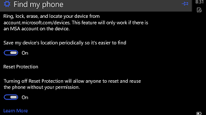
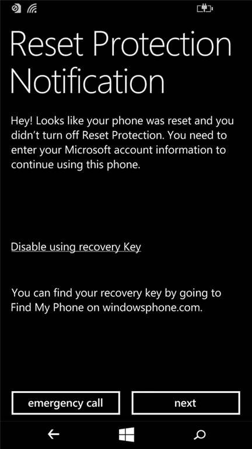
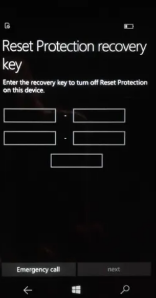
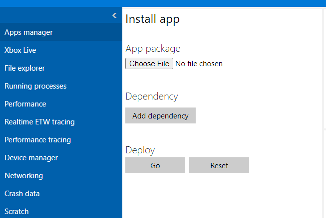
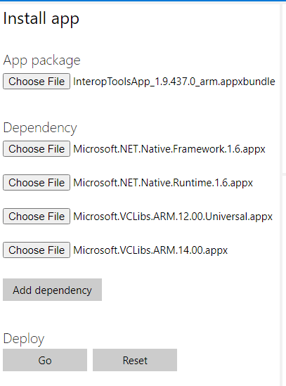
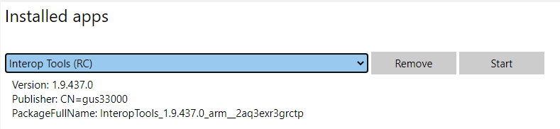

Bypassing Factory Reset Protection Microsoft Lumia 640
======================================================
The problem:

Recently I had to factory reset my Lumia 640 with Windows 10 Build 15063. However the factory reset protection cannot be turned off in settings. It will ask for password then the slider would stay on.

I proceeded with a factory reset, then I am greeted with the reset protection notification screen (no surprise)

As the back-end service for Windows Mobile has ended, I cannot turn off the protection by tapping Next and logging into my Microsoft Account here, nor could I find my recovery key in the Find My Phone section (only my Surface keys are there) on Microsoft’s web site.

The solution:

Fortunately the recovery key window has a security vulnerability. Tap on one of the five text fields on the recovery key window to bring up the touch keyboard. Long tap the &123 button on the keyboard and then tap the first menu item that looks like a gear (this is actually a security vulnerability similar to how the simplified Chinese version of Windows 2000 let you log in without a password)[https://learn.microsoft.com/en-us/security-updates/securitybulletins/2000/ms00-069]. Now you are in keyboard settings. Tab the gear icon on top left to reach Settings Home.

From Settings Home, go to Update & Security, then go to For Developers, turn on Developer Mode. Turn on (Device Portal)[https://learn.microsoft.com/en-us/security-updates/securitybulletins/2000/ms00-069], make sure Authentication is off. Write down the address under “Connect using”

On your computer, download Windows Phone Interop Tools (https://forum.xda-developers.com/t/interop-tools-a-versatile-registry-app-for-all-devices-now-on-github.3445271/). The version I downloaded is (1.9 RC3)[https://drive.google.com/file/d/1Ku58LzOLI76cSP2wiVsK5Vi-wZRe1MyZ/view] because the (most recent version)[https://github.com/gus33000/InteropTools/releases] has a lot more dependencies to deploy. Extract the downloaded zip file to a folder. Browse the extracted files for a bit and remember where the appx files are.

Visit the (Windows Phone Device Portal)[https://learn.microsoft.com/en-us/windows/uwp/debug-test-perf/device-portal-mobile] on your computer using a we browser with the address you wrote down when turning on the Device Portal. The default page would be apps manager, the left pane is Install App, which let you sideload an app.

Under App package, click Choose File and pick the InteropTools.version.xxxxx appx file you downloaded. Under dependency, add the appx files under the dependency folder in extracted files. You would only need to deploy the arm versions of appx files as Lumia 640 has an ARM CPU.

Click Go and wait for the deployment to finish. Then refresh the page. Click the drop down below Installed apps, and select Interop Tools. Click the Start button.

On the phone, the interop tools will appear. Launch the Setup Wizard app from there. On my version of Interop Tools, the steps are the following: Tap Next on welcome screens. Then tap on This Device. At the welcome page, tap the hamburger menu button on top left, then in the menu options tree, expand General, then tap Applications. Swipe left on the tabs that begins with Deployment options until you reach Package List. Tap on the Search a Package textbox, and enter wizard. Tab on the search result (the Setup Wizard app). note the setup wizard may crash, hard reset the phone again if it crashes repeatedly.

Now finish the rest of the setup process. It should be complaining about unable to turn on Factory Reset Protection, ignore it and reboot after the finishing the setup wizard. Enjoy!

If you get to the recovery key screen again when running setup wizard,

* reboot
* get into settings using the keyboard hack and remove your WIFI connection, then reboot.
* When asked to connect to a WIFI, skip
* When asked for the recovery key, wait for 10 minutes
* get into settings using the keyboard hack and add your WIFI connection back, then use the web browser on your computer to launch interop tools.
* use interop tools to launch setup wizard.

From the comments, the steps here work on Lumia 950 too.