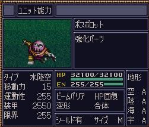
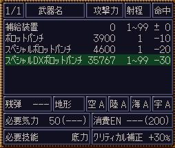

.. meta::
   :description: 目录 修改 (第四次机器人大战) 第四次金手指 第四次修改 动态修改 人物和机体修改 芯片修改 静态修改 人物修改 机体修改 精神修改 武器修改 芯片修改 第四次S金手指 用金手指添加机师的时候要注意，按照隐藏要素推荐的路线走剧情的话（这样打两遍就可以基本走完剧情），第四次的A路线到最后有59名机师，58个机体，B路线

.. _srw4_cheat:

修改 (第四次机器人大战)
==============================

.. contents::

用金手指添加机师的时候要注意，按照\ :ref:`隐藏要素 <srw4_missable>`\ 推荐的路线走剧情的话（这样打两遍就可以基本走完剧情），第四次的A路线到最后有59名机师，58个机体，B路线55名机师，52个机体(但是最多只能比真实系多增加5台，因为在超电磁或者断空我离队之前就会造成机体溢出)，C路线的话比A路线少一个机师。不管走哪条路线，都可以至少添加5名机师，6个机体。不走推荐的路线的话，也可以根据人物机体的加入离开算一下自己想走的路线最后会有多少人物和机体，用64减去最后的数量就是可以利用的空位。第四次S的话，机体和机师最多可以有80个，但是因为强制离队事件少了很多的原因，新增的空位并没有那么多。

添加机师会出的问题是一些人物有剧情强制出场。比如如果在一开头把夏亚改出来了，之后走宇宙路线夏亚登场的时候会无限失败，因为改出来的机体和机师会被划到地上分队去，导致这一话夏亚登不了场。在这一话之前把夏亚改到宇宙分队是没有用的，把夏亚改成别的人物才行。为了安全起见可以添加NPC、敌方或者你选择的路线不会入手的机师。如果改出来的是只会临时参战的人物或者机体，在参战完之后改出来的人物或者机体也会离队。

添加机体会需要连武器数量那一段数据一起改，只添加机体的代码的话，加的机体不能改造。另外游戏本身需要一些机体离队以腾出空间容纳新加入的机体，如果改掉了会中途离队的机体，可能导致机体溢出，后面人物加入时没有对应的机体或者现存人物的机体被顶掉。

-------------------
第四次金手指
-------------------

.. grid::

    .. grid-item-card:: 无限资金
      :columns: auto

      7e105795

    .. grid-item-card:: 经验值倍率最大
      :columns: auto

      7E0EE17E

    .. grid-item-card:: 1级全精神
      :columns: auto

      7e0ebaff   

    .. grid-item-card:: 精神不減
      :columns: auto

      7e0ebbff 

    .. grid-item-card:: 气合之后气力最大
      :columns: auto

      829bcffd

    .. grid-item-card:: 保持幸运效果
      :columns: auto

      c0b85b00

    .. grid-item-card:: 乘换无视系别
      :columns: auto

      c2d3be80

    .. grid-item-card:: 控制敌军
      :columns: auto

      c392cd0b

    .. grid-item-card:: 地图武器自残有经验
      :columns: auto

      c3d84800
      
    .. grid-item-card:: 最大经验
      :columns: auto

      | 7e0eda=ff
      | 7e0edbff

    .. grid-item-card:: 激怒攻击力最大
      :columns: auto

      | 不用时关掉
      | 7E0EC3FF
      | 7E0EC4FF

    .. grid-item-card:: 恋爱度
      :columns: auto

      | 7E1068F0 最大
      | 7E106800 最小

    .. grid-item-card:: 演示动画强开 
      :columns: auto
      
      | 7E1069ff
      | 7E106a40

    .. grid-item-card:: 总回合数
      :columns: auto

      | 7e105301 最小 
      | 7e105400 最小
      | 7e10530f 最大
      | 7e105427 最大

    .. grid-item-card:: 系统设置
      :columns: auto

      | 7e105840 关闭战斗画面
      | 7E105820 地图菜单显示坐标
      | 7E105860 两个同时启用
      | 7E105800 两个同时禁用

    .. grid-item-card:: 无限移动
      :columns: auto

      | 7E156644
      | 7E156844
      | 7E156a44
      | 7E156c44
      | 7E156e44
      | 7E157044
      | 7E157244

    .. grid-item-card:: 强化配件各9个
      :columns: auto

      | 7e107899
      | 7e107999
      | 7e107a99
      | 7e107b99
      | 7e107c99
      | 7e107d99
      | 7e107e99
      | 7e107f99

    .. grid-item-card:: 增加人物和机体(路线A/C)
      :columns: auto
      
      * 分歧参考（\ :ref:`隐藏要素 <srw4_missable>`\ 路线A/C）
      * 走超级系路线时也启用
      * 7E110687 增加哈曼·卡恩
      * 7e118710 哈曼编队
      * 7E1104B4 增加托特
      * 7e118510 托特编队
      * 7E110224 增加马蒂尔达
      * 7e118310 马蒂尔达编队
      * 7E1100D8 增加阿曼达拉
      * 7e118110 阿曼达拉编队
      * 7E10fea0 增加阿修罗
      * 7e117f10 阿修罗编队
      * 7e12867a 增加卡碧尼      
      * 7e140788 卡碧尼武器数量
      * 7e128440 增加丹拜因
      * 7e140588 丹拜因武器数量
      * 7e128285 增加盖马克
      * 7e140388 盖马克武器数量
      * 7e128050 增加血色宫殿      
      * 7e140188 血色宫殿武器数量
      * 武器改造段数位移
      * 7e140600 卡碧尼
      * 7e140400 丹拜因
      * 7e140200 盖马克
      * 7e140000 血色宫殿
    .. grid-item-card:: 额外增加人物和机体（路线B）
      :columns: auto

      * 分歧参考 （\ :ref:`隐藏要素 <srw4_missable>`\ 路线B）
      * 走真实系路线时禁用
      * 7e10fc82 增加莎拉
      * 7e117d10 莎拉编队
      * 7e10fa8e 增加罗莎米亚
      * 7e117b10 罗莎米亚编队
      * 7e10f83a 增加柯丝
      * 7e117910 柯丝编队
      * 7e10f67f 增加ララァ＝スン
      * 7e117710 ララァ＝スン编队
      * 7e127ee6 增加グラシドゥ＝リュ
      * 7e13ff88 グラシドゥ＝リュ武器数量
      * 7e127c8c 增加ビギナ・ギナ
      * 7e13fd88 ビギナ・ギナ武器数量      
      * 7e127adb 增加EXSガンダム
      * 7e13fb88 EXSガンダム武器数量      
      * 7e127870 增加サイコガンダムmkII(MA)
      * 7e13f988 サイコガンダムmkII(MA)武器数量
      * 7e127689 增加ヤクトドーガ（青）
      * 7e13f788 ヤクトドーガ（青）武器数量
      * 武器改造段数位移
      * 7e13fe00 グラシドゥ＝リュ
      * 7e13fc00 ビギナ・ギナ
      * 7e13fa00 ExSガンダム
      * 7e13f800 サイコガンダムmkII(MA)
      * 7e13f600 ヤクトドーガ（青）

    .. grid-item-card:: 全单位改造
      :columns: auto
      
      | 7E改成7F会使得复活这精神无效。
      | 可以关闭掉或者干脆就不用复活打
      | ……反正开了金手指也很难输
      
      | 7E12897E
      | 7E128AFF
      | 7E128B7E
      | 7E128CFF
      | 7E128D7E
      | 7E128EFF
      | 7E128F7E
      | ......
      | 7E1306FF
      | 7E13077F

    .. grid-item-card:: 全武器15段改造
      :columns: auto

      | 7E141EFF
      | 7E141FFF
      | …… （中间每个字节都是FF）
      | 7E14EBFF

    .. grid-item-card:: 出击数锁定
      :columns: auto

      | 7E0EEC18
      | 只是看着好看，
      | 比如同时可以出击两台母舰，
      | 但是总出击数量是写死的，
      | 后选的会把先选的覆盖，
      | 而且把剧情预留出击位占了会出bug，
      | 比如战场之爱击落蕾西之后
      | 她本来会重新作为友军出现，
      | 但是开了之后会作为敌军出现，
      | 安藤正树也只会作为NPC出场。

    .. grid-item-card:: 潜海斯陪沙
      :columns: auto

      | 7E1226DF 潜海斯陪沙改为萨德兰
      | 7E13a788 萨德兰武器数量 
      | 只在第一话过关时开启一次，
      | 存盘之后关闭。
      | 一开始就开启的话，
      | 不会替换掉潜海斯陪沙，
      | 导致机体栏被占用。
      | 替换掉就可以不用把阿修罗改出来了。
      | 比如可以改成7E10FE8A 增加玛瓦
      | 阿修罗的升级有点问题

    .. grid-item-card:: 妖精
      :columns: auto
      
      | 需要开局开启，
      | 第一话过关之后存盘之后关闭再读盘，
      | 因为换乘的机师代码也在同一个字节，
      | 一直锁定的话会导致改出来也没法用。
      | 7E140980 查姆
      | 7E140D80 贝露
      | 7E141180 艾露
      | 7E141580 莉莉丝
      | 7E141980 希露姬

    .. grid-item-card:: 地形适应
      :columns: auto

      * cba18601 断空我移动空陆
      * cb973c01 GP03移动空陆
      * cb973d43 GP03空A海B
      * cb973e34 GP03陆B宇A
      * CB958601 ヒュッケバイン移动空陆
      * CB958744 ヒュッケバイン空A海A
      * CB95BF44 グルンガスト空A海A
      * CBDA5BFE 必殺烈風正拳突き地形AAAB
      * CBEDFBFE 必殺烈風正拳突き改地形AAAB
      * CB9CCA05 ボスロボット移动陆地中
      * CB9CCB04 ボスロボット地形适应海
      * CB9CCC44 ボスロボット地形适应陆宇

    .. grid-item-card:: 高性能雷达
      :class-card: text-nowrap
      :columns: auto
      
      | cdf85c08 移+8
      | cdf85d12 运+18
      | cdf85e14 限+20  
      | cdf85f0A 甲+100
      | cdf8bcf4
      | cdf8bd01 HP +500
      | cdf8be04 光线护壁

    .. grid-item-card:: 米诺夫斯基飞行器
      :class-card: text-nowrap
      :columns: auto

      | cdf86008 移+8
      | cdf86112 运+18
      | cdf86214 限+20  
      | cdf8630A 甲+100
      | cdf8c0f4
      | cdf8c101 HP +500
      | cdf8be04 光线护壁

    .. grid-item-card:: 助推器
      :class-card: text-nowrap
      :columns: auto

      | cdf8640c 移+12
      | cdf86512 运+18
      | cdf86614 限+20  
      | cdf8670A 甲+100
      | cdf8c4f4
      | cdf8c501 HP +500
      | cdf8c604 光线护壁

    .. grid-item-card:: 超级助推器
      :class-card: text-nowrap
      :columns: auto

      | cdf86810 移+16
      | cdf86912 运+18
      | cdf86a14 限+20  
      | cdf86b0A 甲+100
      | cdf8c8f4
      | cdf8c901 HP +500
      | cdf8ca04 光线护壁

    .. grid-item-card:: 远地点控制发动机
      :class-card: text-nowrap
      :columns: auto

      | cdf86C08 移+8
      | cdf86D12 运+18
      | cdf86E14 限+20  
      | cdf86F0A 甲+100
      | cdf8CCf4
      | cdf8CD01 HP +500
      | cdf8cE04 光线护壁

    .. grid-item-card:: FATIMA
      :class-card: text-nowrap
      :columns: auto

      | cdf87010 移+16
      | cdf87124 运+36
      | cdf87228 限+40
      | cdf8730a 甲+100
      | cdf8d0f4
      | cdf8d101 HP +500
      | cdf8d204 光线护壁

    .. grid-item-card:: ALICE
      :class-card: text-nowrap
      :columns: auto

      | cdf87408 移+8
      | cdf8751E 运+30
      | cdf87628 限+40
      | cdf8770a 甲+100
      | cdf8d4f4
      | cdf8d501 HP +500
      | cdf8d604 光线护壁

    .. grid-item-card:: 精神力框架
      :class-card: text-nowrap
      :columns: auto

      | cdf87808 移+8
      | cdf8791C 运+28
      | cdf87a32 限+50
      | cdf87b0A 甲+100
      | cdf8d8f4
      | cdf8d901 HP +500
      | cdf8da04 光线护壁

    .. grid-item-card:: 生物传感器
      :class-card: text-nowrap
      :columns: auto

      | cdf87C08 移+8
      | cdf87D1A 运+26
      | cdf87E23 限+35
      | cdf87F0A 甲+100
      | cdf8dCf4
      | cdf8dD01 HP +500
      | cdf8dE04 光线护壁   

    .. grid-item-card:: 磁铁镀膜
      :class-card: text-nowrap
      :columns: auto

      | cdf88008 移+8
      | cdf8811A 运+26
      | cdf88223 限+35
      | cdf8830A 甲+100
      | cdf8E0f4
      | cdf8E101 HP +500
      | cdf8E204 光线护壁   

    .. grid-item-card:: I立场发生机
      :class-card: text-nowrap
      :columns: auto

      | cdf88408 移+8
      | cdf88512 运+18
      | cdf88614 限+20
      | cdf8870A 甲+100
      | cdf8E4f4
      | cdf8E501 HP +500
      | cdf8E604 光线护壁  

    .. grid-item-card:: 乔巴姆装甲
      :class-card: text-nowrap
      :columns: auto

      | cdf88808 移+8
      | cdf88912 运+18
      | cdf88a28 限+40
      | cdf88b64 甲+1000
      | cdf8E8d0
      | cdf8E907 HP+2000
      | cdf8Ea04 光线护壁

    .. grid-item-card:: 混合装甲
      :class-card: text-nowrap
      :columns: auto

      | cdf88C08 移+8
      | cdf88D12 运+18
      | cdf88E28 限+40
      | cdf88F96 甲+1500
      | cdf8ECA0
      | cdf8ED0F HP+4000
      | cdf8EE04 光线护壁

    .. grid-item-card:: 护壁发生机
      :columns: auto

      | cdf89008 移+8
      | cdf89112 运+18
      | cdf89228 限+40
      | cdf89396 甲+1500
      | cdf8F0A0
      | cdf8F10F HP+4000
      | cdf8F204 光线护壁 

    .. grid-item-card:: 反光束涂层
      :columns: auto

      | cdf89408 移+8
      | cdf89512 运+18
      | cdf89628 限+40
      | cdf89796 甲+1500
      | cdf8F4A0
      | cdf8F50F HP+4000
      | cdf8F604 光线护壁 

    .. grid-item-card:: 修理工具包
      :columns: auto

      | cdf89808 移+8
      | cdf89912 运+18
      | cdf89A28 限+40
      | cdf89B96 甲+1500
      | cdf8F8A0
      | cdf8F90F HP+4000
      | cdf8FA04 光线护壁 

    .. grid-item-card:: 螺旋桨油箱
      :columns: auto

      | cdf89C08 移+8
      | cdf89D12 运+18
      | cdf89E28 限+40
      | cdf89F96 甲+1500
      | cdf8FCA0
      | cdf8FD0F HP+4000
      | cdf8FE04 光线护壁 

    .. grid-item-card:: 推进剂荚舱
      :columns: auto

      | cdf8A008 移+8
      | cdf8A112 运+18
      | cdf8A228 限+40
      | cdf8A396 甲+1500
      | cdf900A0
      | cdf9010F HP+4000
      | cdf90204 光线护壁 

    .. grid-item-card:: 推进剂荚舱S
      :columns: auto

      | cdf8A408 移+8
      | cdf8A512 运+18
      | cdf8A628 限+40
      | cdf8A796 甲+1500
      | cdf904A0
      | cdf9050F HP+4000
      | cdf90604 光线护壁 
        
-------------------
第四次修改
-------------------

^^^^^^^^^^^^^^^^
动态修改
^^^^^^^^^^^^^^^^

基于SFC版本和Snes9x模拟器。因为内存地址在每台计算机上都可能不同，这里给出地址都是基于最容易查找的金钱数值的偏移量。

借鉴了西XX和BTSG的心得。

* 偏移(16进制)	说明	长度	建议值(16进制)	备注
* -55	下一话代码	1		参见关卡代码
* -54	当前话数	1		输入当前显示的话数+1
* -53	当前话代码	1		参见关卡代码
* 0	金钱	4	9999999（7F 96 98 00 ）最高位改成0x40会导致动画显示出错，实际上等于关动画
* -2	总回合数	2		
* +23	空闲芯片数目	14	建议值F。	每半个字节表示一种芯片的数目，只有前18种芯片有效果（有人装备金魂么？）
* +31	诞生月	1		
* +32	诞生日	1		
* +33	机师代码、合体和等级	2*64 
  * 机师代码 99（63H）或者 机师代码 227（E3H）（如果是合体机师之一）	
  * 两个字节为一组。代码在低字节，等级和状态在高字节。合体占据高字节的最高位。
  * 例如1A E3表示小介，副机师之一，等级99级(E3=0x80+0x63(99)。
  * 代码参见\ :doc:`../pilots/pilot_data_snes`\ 。
* +B3	机师分队情况	2*64
  * 小队编号*16 00	两个字节为一组。小队编号低字节，高字节数据含义未知。
  * 如10 00表示在第一小队。编号为0表示不在部队中。
* +1B3	机体代码和所属机师偏移	2*64

  *	机体代码 所属机师偏移+80	两个字节为一组。
  * 机体代码在低字节和高字节的最高位，机师偏移在高字节的低7位。
  * 驾驶员代码为0表示无人驾驶。
  * 机师偏移就是机师在内存中的编号。例如 1F80表示万能侠由（第1个机师，在前面机师部分查到代码0x55是甲儿）驾驶。
  * 机体代码参见\ :doc:`../units/unit_data_snes`\ 。
* +133  分队信息 格式为00 分队编号x16
* +233	机体改造段数	2*64	全填FF 7F就是7段改造
* +2B3	机体装备的芯片	2*64		两个字节为一组。代码参见\ :doc:`items`\ 。建议全填05 05（Fatima）。
* +333	机体武器改造段数偏移和武器数量	2*64

  * 两个字节为一组。
  * 低字节和高字节的最低位为改造段数偏移
  * 高字节的高7位为武器数量
  * 修改机体代码之后应该修改对应的武器类型，否则一些武器不能改造。
  * 建议值00 34（改造段数地址和第一个机体的改造段数地址，武器17个）。
* +3B3	妖精资料	4*5

  *	建议值 63 80 00 10
  * 四个字节为一组。含义依次是等级、和谁配对、未知、是否存在。
  * 通过修改可以把多个妖精改到同一个机师上。
  * 比如可以改成64E4001064E4001064E4001064D7002064E40010这样翔就带所有圣战士系妖精出场了。
* +3C9	武器改造段数	184（?）	F	每半个字节表示一种武器的改造段数
* +1C3DF3	武器性能	16*649		参见武器修改
* +1C04F3	机体性能	46*288		参见机体修改

偏移(16进制)	说明	长度	建议值(16进制)	备注

* -55A	武器改造段数	？	7	每半个字节表示一种武器的改造段数
* -C0	空闲芯片数目	14	建议值F。	每半个字节表示一种芯片的数目，只有前18种芯片有效果（有人装备金魂么？）
* -A2	动画演示	3	FFFFFF	
* -68	总回合数	2		
* -66	下一话代码	1		参见关卡代码
* -65	当前话代码	1		参见关卡代码
* -64	当前话数	1		输入当前显示的话数+1
* 0	金钱	4	9999999（7F 96 98 00 ）	　
* 56F	妖精资料	4*5	63 80 00 10	四个字节为一组。含义依次是等级、和谁配对、未知、是否存在。
* 584	武器改造段数			每半个字节表示一种武器的改造段数

"""""""""""""""""""""
人物和机体修改
"""""""""""""""""""""

这里给出地址都是基于最容易查找的当前SP数值的偏移量。注意，机师和机体的数据虽然是连续存放，但是是互不相关的

偏移(16进制)	说明	长度	建议值(16进制)	备注
机师数据

* -14	等级显示值	1	　	此值为精神习得状态的参照值。在进入战场时这个值会被更新
* -13	机师代码	1	　	参见\ :doc:`../pilots/pilot_data_snes`\ 
* 0	当前SP	1	FF	　
* 1	最大SP	1	FF	　
* 2	当前EN	1	FF	　
* 3	最大EN	1	FF	　
* 4	当前HP	2	FFFF	　
* 6	最大HP	2	FFFF	　
* 8	运动性	1	FF	　
* 9	气力	1	FF	　
* A	限界	1	FF	　
* B	装甲	1	FF	显示值为内部值的10倍
* C	远攻击	1	FF	　
* D	近攻击	1	FF	　
* E	技量	1	FF	　
* F	命中	1	FF	　
* 10	直感	1	FF	　
* 11	回避	1	FF	12
* 14	强化芯片	2	05 05	参见\ :doc:`items`\ 
* 16	等级	1	C4	显示值为内部值的1/2 如果机师是副机师，那么最低位是1
* 17	机师代码	1	　	参见\ :doc:`../pilots/pilot_data_snes`\ 
* 1C	击坠数	1	63	　
* 1E	机体改造	2	FE FF	　
* 20	机师序号	1	　	　
* 21	机体代码	1	　	参见\ :doc:`../units/unit_data_snes`\ 
* 22	机体代码的高位+武器数目*2	1	　	修改机体代码之后应该修改对应的武器数目，否则一些武器不能改造
* 3C	下一个机师的等级显示值	1	　	

"""""""""""""""""""""
芯片修改
"""""""""""""""""""""

芯片数据分两部分，第一部分为CDF85C开始的数据，每个芯片4字节，共96字节。

* 移动力
* 运动性
* 限界
* 装甲/10

例如高性能雷达增加ファティマ效果的代码是

| CDF85C 02
| CDF85D 12
| CDF85E 14

リペアキット增加ファティマ效果的代码是

| CDF8B0 02
| CDF8B1 12
| CDF8B2 14

第二部分为CDF8BC开始的数据，每个芯片4字节，共96字节

* HP 2字节
* 添加到装备的机体的技能 (只有护壁有效，其他技能无效)
* 不明　

修改精神力框架的HP属性会造成移动力混乱

^^^^^^^^^^^^^^^^
静态修改
^^^^^^^^^^^^^^^^

"""""""""""""""""""""
人物修改
"""""""""""""""""""""
机师数据地址可以通过查找要更改的机师的参数获得。没有默认说明的大小为1字节。

* 颜
* 登场作品

  * 0E ダイモス
  * 12 ダイターン
  * 14 ダンバイン
  * 16 ダンバインOVA
  * 18 エルガイム
  * 19 エルガイム+100
  * 1A 機動戦士ガンダム
  * 1C 機動戦士Zガンダム
  * 1D 機動戦士Zガンダム+100
  * 1E 機動戦士ZZガンダム
  * 20 機動戦士ガンダム0080
  * 22 機動戦士ガンダム0083
  * 24 ガンダムセンチネル
  * 26 逆襲のシャア？
  * 28 F91
  * 2A ライディーン
  * 30 オリジナル

* 所属+性格

  * 低位为所属
  
    * 0 モビルスーツ
    * 1 マジンガー
    * 2 オーラバトラー
    * 3 エルガイム
    * 4 ダイターン
    * 5 ザンボット
    * 6 ダンクーガ
    * 7 魔装機
    * 8 戦闘機
    * 9 ゴーショーグン
    * A ライディーン
    * B ダイモス
    * C コンバトラー
    * D ゲッター
    * E 戦艦？
    * F 固定

  * 高位为性格、性别

    *  0 弱气
    *  1 普通
    *  2 强气
    *  3 超强气
    *  4 换乘不可
    *  8 是否女性

* 击倒所获经验值
* 成长率类型

  * 低位为命中率，0-3
  * 高位为技量，0-3

* 成长率类型

  * 低位为近攻击，0-F
  * 高位为远攻击，0-F

* SP成长率类型

  * 0 普通 (+2)
  * 10 快 (+3)
  * 20 无成长
  * 30 慢 (+1)

* 成长率类型

  * 低位为回避，0-3
  * 高位为直感，0-2

* 地形适应 2字节 空海宇陆
  
  * 0 🚫
  * 1 D
  * 2 C
  * 3 B
  * 4 A 

* 近攻击
* 远攻击
* 命中
* 技量
* 回避
* 直感
* SP
* \ :doc:`sprit_command`\ /\ :doc:`pilot_specialty`\ + Lv 
  * 01-1E 精神
  * 盾 20
  * 切 28
  * 新人类 3E
  
"""""""""""""""""""""
机体修改
"""""""""""""""""""""
机体数据可以通过查找要更改的单位的参数获得。例如メタス从移动力到HP的数据为07（移动力）00（陆）0242（地形适应） 12（装甲） 25（运动性）c8（限界）96（EN）0807（HP）。

没有默认说明的大小为1字节。

* 图标
* 登场作品  

  * 0E ダイモス
  * 12 ダイターン
  * 14 ダンバイン
  * 16 ダンバインOVA
  * 18 エルガイム
  * 19 エルガイム+100
  * 1A 機動戦士ガンダム
  * 1C 機動戦士Zガンダム
  * 1D 機動戦士Zガンダム+100
  * 1E 機動戦士ZZガンダム
  * 20 機動戦士ガンダム0080
  * 22 機動戦士ガンダム0083
  * 24 ガンダムセンチネル
  * 26 逆襲のシャア？
  * 28 F91
  * 2A ライディーン
  * 30 オリジナル

* 图像 2字节
* 固定机师 

  * FA 主角专用
  * 00 可任意乘换
  * 01-FA 专属机师代码

* 所属

  * 0 モビルスーツ
  * 1 マジンガー
  * 2 オーラバトラー
  * 3 エルガイム
  * 4 ダイターン
  * 5 ザンボット
  * 6 ダンクーガ
  * 7 魔装機
  * 8 戦闘機
  * 9 ゴーショーグン
  * A ライディーン
  * B ダイモス
  * C コンバトラー
  * D ゲッター
  * E 戦艦？
  * F 固定
  * F8 只有主角和恋人可乘坐
* 大小/BGM 前半字节为大小
 
  * 00=S
  * 60=LL
  * 00=音乐1
  * 02=音乐2
  * 0D=音乐13
* 変形
* \ :doc:`unit_specialty`\ 低位

  *  02=EN恢復(小)
  *  04=HP恢復(小)
  *  08=HP恢復(大)
  *  0B=HP恢復+EN恢復(大)
  *  10=分身
  *  20=シールド防御
* \ :doc:`unit_specialty`\ 高位

  *  02=ビームコート
  *  04=Iフィールド
  *  06=オーラバリア
  *  08=ビームバリア
* 队伍
* 不明 4字节
* 经验值 
* 获得资金 2
* 修理费 2
* 移动力 
* 移动类型

  * 00 陆 （宇可）
  * 01 空陆
  * 02 空
  * 03 海陆（例：盖塔3号）
  * 04 海陆空（例：グレンダイザー (MS)）
  * 05 陆地中 （例：盖塔2号）
  * 06 空陆地中（例：ザムジード）
  * 07 海 （例：ブード）
  * 08 陆 （宇不可）（例：ボスロボット）
  * 09 宇宙 （例：GP-03ステイメン）
  * 0A 空地中 （例：ドリルスペイザー）
  * 0B 空海 （例：マリンスペイザー）
  * 0C 空（地上移动可）（例：ミデア） 
* 地形适应 2字节 空海宇陆
 
  * 0 🚫
  * 1 D
  * 2 C
  * 3 B
  * 4 A 
* 装甲/10
* 运动性
* 限界
* EN
* HP 2字节
* 武器数量
* 残弹武器标志
* 武器代码
 
  *  代码 2字节
  *  继承改造武器代码 1字节
  *  何时可用（存在性取决于代码） 0-1字节  
* 开始/结束标记（总是00 00）  2

机体数据地址

* ヒュッケバイン 0B9571
* グルンガスト 0B95A9
* ウイングガスト 0B95DE
* ガストランダー 0B9609
* νガンダム 0B9634
* F91 0B966B
* ブルーガー 0B9E85
* ダイモス 0B9EB3
* ガルバーFXⅡ 0B9EFF
* ラー・カイラム 0BBC97
* ガンダムｍｋⅡ 0BC245
* Ｇディフェンサー 0BC275
* スーパーガンダム 0BC2BF
* ヌーベルディザート 0BC423

"""""""""""""""""""""
精神修改
"""""""""""""""""""""

精神消费位于00B1BD～00B1DC。

特殊誕生日位于02CD33~02CD4E ：

* 02CD33 09 02 01　9/2 O型
* 02CD36 0C 18 04　12/24 B型
* 02CD39 06 19 08　6/25 AB型
* 02CD3C 04 1D 02　4/29 A型
* 02CD3F 03 0D 04　3/13 B型
* 02CD42 04 0B 01　4/11 O型
* 02CD45 08 0C 02　8/12 A型
* 02CD48 0B 10 08　11/16 AB型
* 02CD4B 01 1D 04　1/29 B型
* 02CD4E 02 09 02　2/9 A型
 
主人公和副主人公的精神存储在0B8FE3~0B930C

| 08 08 0A 02 0C 0A 10 0C 11 15 0D 01
| 08 0C 0A 0A 0D 01 04 20 0C 04 1C 13
| 08 10 0A 1B 0D 03 11 01 18 09 07 18　リン
| 08 0C 0A 03 0D 01 0B 16 09 09 0C 04
| 08 0A 0A 13 0E 07 0D 01 0C 09 09 03
| 08 09 0A 07 0D 01 11 02 03 21 09 0B
| 08 07 0A 0E 0D 01 11 16 0C 0B 18 09
| 08 04 0A 01 13 28 05 1F 0D 0A 18 02　ヘクトール
| 08 01 0A 15 0E 1B 0D 08 04 1E 11 04
| 08 08 0A 03 1C 27 0D 01 0C 07 0F 1C
| 08 0B 0A 05 11 14 0D 01 1A 0F 0C 03
| 08 12 0A 07 0D 01 11 0A 09 03 1B 16
| 08 03 0A 0C 10 13 0C 02 06 29 0D 01
| 08 02 0A 06 0D 04 0F 17 11 16 01 01
| 08 16 0A 02 0D 01 10 11 0C 03 13 09
| 08 15 0A 05 0D 01 09 03 1C 0F 0C 13
| 08 14 0A 11 0D 01 0C 07 11 03 01 02　ジェス
| 08 09 0A 04 0D 01 1C 05 09 02 11 0C
| 08 02 0A 13 0D 06 09 01 12 0F 0C 1B
| 08 18 0A 01 0D 01 0B 05 0C 0C 10 21
| 08 04 0A 01 0D 08 11 1F 0C 0C 0B 12　ミーナ
| 08 0E 0A 08 0D 01 0B 02 0C 05 09 0B
| 08 12 0A 03 0D 01 0B 04 18 08 0C 18
| 08 14 0A 04 0D 02 18 01 0C 18 10 0E
| 08 0C 0A 02 0D 03 10 15 0F 27 11 01
| 08 11 0A 06 0D 01 0B 08 11 03 0E 0A
| 08 0F 0A 03 0D 01 15 03 11 08 0B 09
| 08 04 0A 02 0D 01 18 0C 09 03 0C 11
| 08 0C 0A 01 0D 01 0C 09 0E 1B 05 21
| 08 15 0A 02 0D 01 09 08 0C 05 0B 04　イルム
| 08 12 0A 08 0D 02 01 04 0C 01 09 15
| 08 10 0A 0A 0D 01 0C 07 15 0E 11 1E
| 08 0A 0A 09 0D 03 0C 02 1C 01 14 2D
| 08 01 0A 12 0D 04 05 21 10 15 0C 0C
| 08 04 0A 10 0D 01 04 24 11 03 09 08
| 08 19 0A 07 0D 01 09 02 03 12 0B 03
| 08 17 0A 01 0D 06 09 03 11 0B 0C 02
| 08 14 0A 04 0D 01 0E 0C 09 03 18 02
| 08 15 0A 09 0D 01 0C 02 13 0E 1C 03
| 08 0E 0A 01 0D 08 0C 04 01 02 04 1F
| 08 0A 0A 0A 0D 01 04 16 09 02 01 03
| 08 02 0A 08 0D 01 0C 0F 10 1D 04 28　パット
| 08 07 0A 02 0D 01 0B 0A 02 0C 0C 15
| 08 0E 0A 01 0D 02 11 12 0B 09 0C 07　グレース
| 08 08 0A 04 0D 01 09 02 10 0E 04 1E
| 08 14 0A 03 0D 02 10 08 0B 01 0B 0D
| 08 03 0A 02 0D 01 09 04 0F 1E 0E 16　ウィン
| 08 06 0A 01 0D 02 06 18 0C 05 12 1E
| 0D 01 1D 0C 1E 17 11 03 0C 02 09 05　９月２日Ｏ型
| 11 01 09 02 0C 04 10 08 1C 0A 1D 1B　１２月２４日Ｂ型
| 08 01 0A 05 11 05 19 10 1D 1E 0E 2D　６月２５日ＡＢ型
| 17 01 09 05 0B 28 08 2A 1D 2D 0E 30　４月２９日Ａ型
| 09 01 0F 05 0A 14 17 1E 08 28 1E 2D　３月１３日Ｂ型
| 09 01 0C 05 0D 0A 08 14 0A 14 1E 23　４月１１日Ｏ型
| 0D 01 08 01 0E 14 1A 1E 1D 32 1E 37　８月１２日Ａ型
| 0A 03 0C 05 0D 08 19 01 08 11 1D 25　１１月１６日ＡＢ型
| 09 01 01 03 0A 09 10 10 0C 14 1E 27　１月２９日Ｂ型
| 18 01 09 08 16 0D 15 12 13 1C 1E 27　２月９日Ａ型

"""""""""""""""""""""
武器修改
"""""""""""""""""""""

武器数据可以通过查找要更改的武器的参数获得。没有特别说明为1字节。

* 种类

  * 0 远
  * 40  近
  * 80-8f 各种地图武器

    * 81 サイコブラスター
    * 87 爆导索
    * 8A 微型导弹 （真实系主人公机）
    * 8F 核弹
  * DE 修理
  * DF 补给

* 包含Ⓟ、Ⓑ、是否可切、格斗/射击和地图武器的位

  * 高位：
  
    * 20 是否可切
    * 40 是否Ⓑ
    * 80 是否Ⓟ（不是的话为80，否则为00）
  * 低位：

    * 07 超级系主人公机的粉碎光线/光线步枪
    * 0F 其他武器

* 不明
* 攻击动画 2
* 攻击力 2
* 命中补正
 
  * 有符号整型，-1存储为FF,-2存储为FE，以此类推。

* 暴击补正+改造价格
 
  * 低位为改造价格类型，从0x00-0x07
  * 高位为暴击率类型，从0到4（-10，0，+10，+20，+30）
  * 暴击率30，改造价格类型7（通常暴击率最高的武器也最贵），为 (0x47，或者十进制71）

* 最小射程
* 最大射程
* 地形适应

  * 每2位一个地形
  * 00=无，01=C，02=B，03=A
  * FF为AAAA
* 残弹
* 消费EN
* 必要气力
* 必要技能

"""""""""""""""""""""
芯片修改
"""""""""""""""""""""

芯片存储地址取决于是否有文件头，如果文件头存在则+200。未说明的数据为2字节。

* 移动力
* 运动性
* 限界
* 装甲/10
* HP 2字节
* 装备的\ :doc:`unit_specialty`\。(只有护壁有效，其他技能无效)
* 不明 （射程？移动类型？）

* 0000B850 高性能レーダー
* 0000B858 ミノフスキークラフト
* 0000B85C メガブースター
* 0000B860 アポジモーター
* 0000B864 ファティマ
* 0000B868 ALICE
* 0000B86C サイコフレーム
* 0000B870 バイオセンサー
* 0000B874　マグネットコーティング
* 0000B878　Iフィールド発生機
* 0000B87C チョバムアーマー
* 0000B880　ハイブリットアーマー
* 0000B884　バリアジェネレーター

修改精神力框架的HP属性会造成移动力混乱

-------------------
第四次S金手指
-------------------
31码是Dockstation模拟器的扩展。如果使用其他模拟器，一些一次性追加的31码金手指，比如妖精、人物、机体等，可以用30替换，但是只在游戏开始的时候启用一次，之后存盘并禁用金手指，再读盘。

.. grid::

    .. grid-item-card:: 金钱最大 
      :columns: auto
      
      901047A8 98967F 

    .. grid-item-card:: 强化芯片
      :columns: auto

      | 801046E0 0099
      | 801046E2 9999
      | 801046E4 9999
      | 801046E6 9999
      | 801046E8 9999 
      | 801046EA 9999
      | 801046EC 9999
      | 801046EE 9999
      | 301046F0 0099

    .. grid-item-card:: 全体ファティマ
      :columns: auto

      | 5000503C 00000000
      | 80102F90 00000505

    .. grid-item-card:: 战斗经验值最大
      :columns: auto

      80105162 FFFF

    .. grid-item-card:: 经验倍率最大
      :columns: auto

      30105168 007F

    .. grid-item-card:: 总回合数
      :columns: auto

      | 80104740 00000001 最小
      | 80104740 0000270F 最大

    .. grid-item-card:: 武器15段改造
      :columns: auto

      | 50007002 00000000
      | 8010424E 0000FFFF

    .. grid-item-card:: 每机武器数量

      | 5300503C 0000
      | 31102F9E 001E

    .. grid-item-card:: 气合、激励之后气力最大
      :columns: auto

      | D0137A66 00001440
      | 80137A64 00000001

    .. grid-item-card:: 改造段数
      :columns: auto

      | 会导致复活无效，战场上关闭
      | 5000503C 00000000
      | 80102F9A 0000FFFE
      | 如果DuckStation
      | 的循环支持30代码就好了

    .. grid-item-card:: SP最大
      :columns: auto

      | 50004A3C 00000000
      | 30102F7C 000000FF

    .. grid-item-card:: SP不减
      :columns: auto

      80105179 0000

    .. grid-item-card:: EN不减
      :columns: auto

      | D01255C4 1023
      | 801255C6 0040

    .. grid-item-card:: 系统设置
      :columns: auto

      | 311046F6 00000020 打开坐标显示
      | 311046F6 00000040 关闭动画
      | 301046F6 00000060 全开
      | 301046F6 00000000 全关

    .. grid-item-card:: 追加武器
      :columns: auto
      
      | ビッグブラスト・ディバイダー
      | イオン砲
      | アトミックバズーカ
      | グランダッシャー
      | 311046FD 00000087

    .. grid-item-card:: 追加武器
      :columns: auto

      | 烈風正拳突き改
      | ゴッドボイス
      | エネルギーカッター
      | 311046FE 0000001A
      

    .. grid-item-card:: 追加武器
      :columns: auto
      
      | 計都羅喉剣暗剣殺
      | 黑洞加农炮追加
      | 311046FE 00000030

    .. grid-item-card:: 精神修改
      :columns: auto

      | 双鱼座B型
      | 9004CD00 0103011E
      | 9004CD04 01140113
      | 9004CD08 01120116
      | 8月12日A型
      | 9004CD70 0113011E
      | 9004CD74 01120114
      | 9004CD78 0118010E

    .. grid-item-card:: 地形适应
      :columns: auto

      | 3004642B 0001 GP-03移动空陆
      | 8004642C 4444 GP-03地形适应全A
      | 30046276 0044 ヒュッケバイン空A海A
      | 30046275 0001 ヒュッケバイン移动空陆
      | 800462AE 4444 グルンガスト地形适应全A
      | 3004F90B 00FE 必殺烈風正拳突き地形AAAB
      | 30050CAB 00FE 必殺烈風正拳突き地形AAAB
      | 300469B9 0005 ボスロボット 移动类型陆地中
      | 800469BA 4444 ボスロボット 地形适应全A

    .. grid-item-card:: 乘换
      :columns: auto

      | 3004B4E5 0010 神宮寺乘换高达系 
      | 3004B505 0090 明日香麗乘换高达系
      | 3004B525 0080 桜野マリ乘换高达系
      | 3004B759 0010 京四郎乘换高达系
      | 3004B77B 0080 ナナ乘换高达系
      | 3004B79B 0000 デューク乘换高达系
      | 30046B79 0000 ブルーガー 乘换高达系
      | 30046BF3 0000 ガルバーＦＸⅡ 乘换高达系
      | 800467A9 0000 グレンダイザー 乘换高达系

    .. grid-item-card:: 妖精存在等级和SP
      :columns: auto

      | 31104239 000000C6 チャム
      | 3110423C 00000001
      | 3110423D 000000C6 ベル
      | 31104240 00000001
      | 31104241 000000C6 エル
      | 31104244 00000001
      | 31104245 000000C6 リリス
      | 31104248 00000001
      | 31104249 000000C6 シルキー
      | 3110424C 00000001
      | 30104716 000000FF SP最大
      | 30104718 000000FF
      | 3010471A 000000FF
      | 3010471C 000000FF
      | 3010471E 000000FF

    .. grid-item-card:: 增加机体 （\ :ref:`隐藏要素 <srw4_missable>`\ 路线A/C）
      :columns: auto

      | 8010407D 00001E8B α・アジール
      | 801040B9 00001E79 ノイエ・ジール
      | 801040F5 00001F0c ニセサイバスター
      | 80104131 00001E83 クイン・マンサ
      | 8010416D 00001E51 アトールＶ
      | 801041A9 00001E85 ゲーマルク
      | 801041E5 00001E8E ラフレシア
      | 80104221 00001E7A キュベレイ
      | 300477AD 00000001 ノイエ・ジール 移动空陆
      | 800477AE 00004444 ノイエ・ジール 地形全A 
      | 30047AF8 00000001 α・アジール 移动空陆
      | 80047AF9 00004444 α・アジール 地形全A 
      | 30047B7C 00000001 ラフレシア移动空陆
      | 80047B7D 00004444 ラフレシア地形全A 
      | 800470EE 4444 アトールＶ地形全A
      | 300470DD 0003 アトールＶ可乘换

    .. grid-item-card:: 增加人物  （\ :ref:`隐藏要素 <srw4_missable>`\ 路线A/C）
      :columns: auto

      | 30103F47 00000098 ナナイ
      | 31103F48 00000004
      | 30103F83 00000092 グレミー
      | 31103F84 00000004
      | 30103FBF 00000044 ベルナルド
      | 31103FC0 00000004
      | 30103FFB 00000036 モンド
      | 31103FFC 00000004
      | 30104037 00000099 レズン
      | 31104038 00000004
      | 30104073 000000D4 ミラウー
      | 31104074 00000004
      | 301040AF 00000037 エル
      | 311040B0 00000004
      | 301040EB 00000035 ビーチャ
      | 311040EC 00000004
      | 30104127 000000A0 あしゅら男爵
      | 31104128 00000004
      | 30104163 000000D8 アマンダラ
      | 31104164 00000004
      | 3010419F 00000024 マチルダ
      | 311041A0 00000004
      | 301041DB 0000002F ヘンケン
      | 311041DC 00000004
      | 30104217 00000087 ハマーン
      | 31104218 00000004

    .. grid-item-card:: 额外增加机体  （:ref:`隐藏要素 <srw4_missable>` 路线B）
      :columns: auto

      | 没有更换战斗机系乘换类型
      | 80103DE9 1E34 ブルーガー
      | 80103E25 1E34 ブルーガー
      | 改了战斗机系乘换类型的话
      | 80103DE9 1E61 エルメス
      | 800473AC 4444 エルメス地形适应
      | 300473AB 0001 エルメス移动类型空陆
      | 80103E25 1F04 Ｇディフェンサー 
      |
      | 80103E61 1EB0 ブブリィ
      | 80103E9D 1F26 ライネック
      | 80103ED9 1EAF バストール
      | 80103F15 1F28 ガラバ
      | 80103F51 1E21 グレンダイザー
      | 80103F8D 1F24 レプラカーン
      | 80103FC9 1E21 グレンダイザー
      | 80104005 1EAC ズワァース
      | 80104041 1F01 ガイラム
      | 30048ED9 00ED ガイラム 图像
      | 30048ED7 004c ガイラム 图标

    .. grid-item-card:: 额外增加人物  （:ref:`隐藏要素 <srw4_missable>` 路线B）
      :columns: auto

      | 30103DA3 00B4 トッド
      | 31103DA4 0006
      | 30103DDF 00B6 黒騎士
      | 31103DE0 0006
      | 30103E1B 00bc ゼット
      | 31103E1C 0006
      | 30103E57 00BE ジェリル
      | 31103E58 0006
      | 30103E93 00B5 バーン
      | 31103E94 0006
      | 30103ECF 00D9 ポセイダル
      | 31103ED0 0006
      | 30103F0B 00BB ミュージィ＝ポー
      | 31103F0C 0006
      | 3004B822 0009 ニー必中→加速
      | 3004B824 000D ニー根性→幸运
      | 3004B826 0032 ニー脱力→聖戦士
      | 3004B83C 0009 キーン偵察→加速
      | 3004B83E 000D キーン必中→幸运
      | 3004B844 0003 キーン信頼→補給
      | 3004B846 0032 キーン友情→聖戦士

    .. grid-item-card:: 高性能雷达
      :columns: auto
      
      | 9010721C 0A141208
      | 移+8 运+18
      | 限+20 甲+100     
      | 9010729C 000401F4
      | HP +500 光线护壁

    .. grid-item-card:: 米诺夫斯基飞行器
      :columns: auto

      | 90107220 0A141208 
      | 移+8 运+18
      | 限+20 甲+100
      | 901072a0 000401F4 
      | HP +500 光线护壁

    .. grid-item-card:: 助推器
      :columns: auto

      | 90107224 0A14120C
      | 移+12 运+18
      | 限+20 甲+100
      | 901072a4 000401F4 
      | HP +500 光线护壁

    .. grid-item-card:: 超级助推器
      :columns: auto

      | 90107228 0A141210
      | 移+16 运+18
      | 限+20 甲+100
      | 901072a8 000401F4
      | HP +500 光线护壁

    .. grid-item-card:: 远地点控制发动机
      :columns: auto

      | 9010722C 1014170C
      | 移+12 运+23
      | 限+20 甲+100
      | 901072aC 000401F4
      | HP +500 光线护壁

    .. grid-item-card:: FATIMA
      :columns: auto

      | 90107230 0A282410
      | 移+16 运+36
      | 限+40 甲+100
      | 901072b0 000401F4
      | HP +500 光线护壁

    .. grid-item-card:: ALICE
      :columns: auto

      | 90107234 0A281E08
      | 移+8 运+30
      | 限+40 甲+100
      | 901072b4 000401F4
      | HP +500 光线护壁      

    .. grid-item-card:: 精神力框架
      :columns: auto

      | 90107238 0A321C08
      | 移+8 运+28
      | 限+50 甲+100
      | 901072b8 000401F4
      | HP +500 光线护壁     

    .. grid-item-card:: 生物传感器
      :columns: auto

      | 9010723C 0A231A08
      | 移+8 运+26
      | 限+35 甲+100
      | 901072bC 000401F4
      | HP +500 光线护壁

    .. grid-item-card:: 磁铁镀膜
      :columns: auto

      | 90107240 0A1E1708
      | 移+8 运+23
      | 限+30 甲+100
      | 901072C0 000401F4
      | HP +500 光线护壁

    .. grid-item-card:: I立场发生机
      :columns: auto

      | 90107244 0A141208
      | 移+8 运+18
      | 限+20 甲+100
      | 901072C4 000401F4
      | HP +500 光线护壁      

    .. grid-item-card:: 乔巴姆装甲
      :columns: auto

      | 90107248 64281208
      | 移+8 运+18
      | 限+40 甲+1000
      | 901072c8 960407d0
      | HP+2000 光线护壁   

    .. grid-item-card:: 混合装甲
      :columns: auto

      | 9010724C 96281208
      | 移+8 运+18
      | 限+40 甲+1500
      | 901072cC 96040fa0
      | HP+4000 光线护壁  

    .. grid-item-card:: 护壁发生机
      :columns: auto

      | 90107250 96281208
      | 移+8 运+18
      | 限+40 甲+1500
      | 901072D0 96040fa0
      | HP+4000 光线护壁  

    .. grid-item-card:: 反光束涂层
      :columns: auto

      | 90107254 96281208
      | 移+8 运+18
      | 限+40 甲+1500
      | 901072D4 96040fa0
      | HP+4000 光线护壁  

    .. grid-item-card:: 修理工具包
      :columns: auto

      | 90107258 96281208
      | 移+8 运+18
      | 限+40 甲+1500
      | 901072D8 96040fa0
      | HP+4000 光线护壁  

    .. grid-item-card:: 螺旋桨油箱
      :columns: auto

      | 9010725C 96281208
      | 移+8 运+18
      | 限+40 甲+1500
      | 901072DC 96040fa0
      | HP+4000 光线护壁  

    .. grid-item-card:: 推进剂荚舱
      :columns: auto

      | 90107260 96281208
      | 移+8 运+18
      | 限+40 甲+1500
      | 901072e0 96040fa0
      | HP+4000 光线护壁  

    .. grid-item-card:: 推进剂荚舱S
      :columns: auto

      | 90107264 96281208
      | 移+8 运+18
      | 限+40 甲+1500
      | 901072E4 96040fa0
      | HP+4000 光线护壁  
