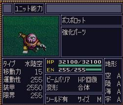
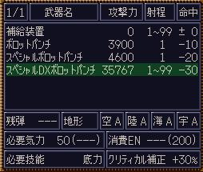

.. meta::
   :description: 修改 (第四次机器人大战) 静态修改 第四次金手指 人物修改 机体修改 芯片修改 精神修改 武器修改 变形修改 变身修改 第四次S金手指 用金手指添加机师的时候要注意，按照隐藏要素推荐的路线走剧情的话（这样打两遍就可以基本走完剧情），第四次的A路线到最后有59名机师，58个机体，B路线

.. _srw4_cheat:

修改 (第四次机器人大战)
==============================

.. contents::

作弊文件用法：把文件放到模拟器的cheat文件夹下，并改名为和游戏一样的名字（如果不确定文件名，手动输入一个作弊码之后退出模拟器）。

* :download:`下载 SLPS-00196_duckstation.cht <SLPS-00196_duckstation.cht>` 
* :download:`下载 Dai 4 Ji Super Robot Taisen (V1.1) (J)_snes9x.cht <Dai 4 Ji Super Robot Taisen (V1.1) (J)_snes9x.cht>`
* :download:`下载 Dai 4 Ji Super Robot Taisen (V1.1) (J)_bsnes.cht <Dai 4 Ji Super Robot Taisen (V1.1) (J)_bsnes.cht>`

用金手指添加机师的时候要注意，按照\ :ref:`隐藏要素 <srw4_missable>`\ 推荐的路线走剧情的话（这样打两遍就可以基本走完剧情），第四次的A路线到最后有59名机师，58个机体，B路线55名机师，52个机体(但是最多只能比真实系多增加5台，因为在\ :ref:`コンバトラーV <srw4_unit_combattler_v>`\ 或者\ :ref:`ダンクーガ <srw4_unit_dancouga>`\ 离队之前就会造成机体溢出)，C路线的话比A路线少一个机师。不管走哪条路线，都可以至少添加5名机师，6个机体。不走推荐的路线的话，也可以根据人物机体的加入离开算一下自己想走的路线最后会有多少人物和机体，用64减去最后的数量就是可以利用的空位。第四次S的话，机体和机师最多可以有80个，但是因为强制离队事件少了很多的原因，新增的空位并没有那么多。如果使用的是非官方ROM，需要打通一遍看看最后有多少机师和机体，因为非官方ROM可能会修改剧情导致加入和离队事件变化。

添加机师会出的问题是一些人物有剧情强制出场。比如如果在一开头把クワトロ改出来了，之后走宇宙路线クワトロ登场的时候会无限失败，因为改出来的机体和机师会被划到地上分队去，导致这一话クワトロ登不了场。在这一话之前把クワトロ改到宇宙分队是没有用的，把クワトロ改成别的人物才行。为了安全起见可以添加NPC、敌方或者你选择的路线不会入手的机师。如果改出来的是只会临时参战的人物或者机体，在参战完之后改出来的人物或者机体也会离队。

添加机体会需要连武器数量那一段数据一起改，只添加机体的代码的话，加的机体不能改造。另外游戏本身需要一些机体离队以腾出空间容纳新加入的机体，如果改掉了会中途离队的机体，可能导致机体溢出，后面人物加入时没有对应的机体或者现存人物的机体被顶掉。

-------------------
静态修改
-------------------

第四次的以C开头的金手指地址减去C00000即为ROM地址，至于以7开头的，因为是只在RAM里面才有的数据，所以不能够静态修改。对于第四次S，800xyyyy的x减去2再加上yyyy就是静态地址，例如8007xxxx的静态地址是0x5xxxx。

数据结构列表:

* :ref:`机体 <srw4_units_cheat>`
* :ref:`人物 <srw4_pilots_cheat>`
* :ref:`武器 <srw4_weapon_cheat>`
* :ref:`芯片 <srw4_items_cheat>`
* :ref:`改造参数 <srw4_remodeling_cheat>`
* :ref:`特殊诞生日精神和SP消耗 <srw4_mechanics_sprit_command_cheat>`

-------------------
第四次金手指
-------------------

^^^^^^^^^^^^^^^^^
全局设置
^^^^^^^^^^^^^^^^^
借鉴了西XX和BTSG的心得

.. grid::

    .. grid-item-card:: 跳关
      :columns: auto
      
      | 7E1000=xx
      | xx:下一话代码

    .. grid-item-card:: 当前话数
      :columns: auto

      | 7E1001=xx 

    .. grid-item-card:: 当前话代码
      :columns: auto

      | 7E1002=xx 

    .. grid-item-card:: 生日
      :columns: auto

      | 7E1086=xx
      | 7E1087=yy
      | xx:月 yy:日

    .. grid-item-card:: 最大\ :ref:`资金 <srw4_remodeling_cheat>`
      :columns: auto

      | 7E1055=7F
      | 7E1056=96
      | 7E1057=98
  
    .. grid-item-card:: 战斗动画关，地图坐标开
      :columns: auto

      | 7E1058=60 

    .. grid-item-card:: 战斗动画开，地图坐标关
      :columns: auto

      | 7E1058=00 

    .. grid-item-card:: 总回合数最小 
      :columns: auto

      | 7e1053=01
      | 7e1054=00

    .. grid-item-card:: 总回合数最大
      :columns: auto

      | 7e1053=0f
      | 7e1054=27

    .. grid-item-card:: :ref:`经验倍率 <srw4_exp>`
      :columns: auto

      | 7E0EE1=7E 

    .. grid-item-card:: 基础经验值
      :columns: auto

      | 7e0eda=ff 
      | 7e0edb=ff  

    .. grid-item-card:: 地图武器自残有经验
      :columns: auto

      | c3d848=00

    .. grid-item-card:: 1级全精神
      :columns: auto

      | 7e0eba=ff

    .. grid-item-card:: 精神不減
      :columns: auto

      | 7e0ebb=ff

    .. grid-item-card:: 气合效果最大
      :columns: auto

      | 829bcf=fd
      | 使用脱力时关掉
      | 击落敌军时气力会溢出
      | 255→4
      | 实际上没什么用

    .. grid-item-card:: 恒定幸運
      :columns: auto

      | c0b85b=00
      | 不用时关掉

    .. grid-item-card:: 激怒伤害最大
      :columns: auto

      | 7E0EC3=FF
      | 7E0EC4=FF

    .. grid-item-card:: 恋爱度最大
      :columns: auto

      | 7E1068=F0 

    .. grid-item-card:: 恋爱度最小
      :columns: auto

      | 7E1068=00 

    .. grid-item-card:: 演示动画开
      :columns: auto      

      | 7E1069=ff
      | 7E106a=40

    .. grid-item-card:: 控制敌军
      :columns: auto

      | c392cd=0b

    .. grid-item-card:: 控敌探宝
      :columns: auto

      | C2B07D=00

    .. grid-item-card:: 无需侦察
      :columns: auto

      | C2C23C=80

    .. grid-item-card:: 诞生月
      :columns: auto

      7e1206=xx

    .. grid-item-card:: 诞生日
      :columns: auto

      7e1207=xx

    .. grid-item-card:: 换乘无视
      :columns: auto

      | C2D3BE=80

    .. grid-item-card:: 无限移动
      :columns: auto

      | 7E1566=44
      | 7E1568=44
      | 7E156a=44
      | 7E156c=44
      | 7E156e=44
      | 7E1570=44
      | 7E1572=44

    .. grid-item-card:: 出击数锁定
      :columns: auto

      | 7E0EEC=18      
      | 比如同时可以
      | 出击两台母舰，
      | 但总出击数固定，
      | 多选的会被覆盖，
      | 而且剧情预留位
      | 占了会出bug，
      | 比如战场之爱
      | 击落蕾西之后
      | 她本来会重新
      | 作为友军增援，
      | 但是开了之后
      | 会作为敌军出击。
      | \ :ref:`マサキ·アンドー <srw4_pilot_masaki_andoh>`\  （ 
      | 安藤正树）这样本应
      | 加入的也只会
      | 作为NPC出场。

    .. grid-item-card:: 强化配件各9个
      :columns: auto

      | 7e1078=99
      | 7e1079=99
      | 7e107a=99
      | 7e107b=99
      | 7e107c=99
      | 7e107d=99
      | 7e107e=99
      | 7e107f=99

    .. grid-item-card:: 武器追加      
      :columns: auto

      | Snes9x/Bsnes支持条件启用
      | Snes9x Bug:
      | 游戏启动时无效化条件启用
      | 需要在读盘之后禁用/启用一次
      | 如果模拟器不支持，需要在开局之后开启，
      | 第一话过关之后存盘之后关闭再读盘，
      | 7E105E=00?01 
      | コン・バトラーV
      | 7E105F=00?86
      | イオン
      | アトミックバズーカ
      | グランダッシャー
      | 7E1060=00?1A
      | ダイモス
      | 7E1061=00?30
      | 計都羅喉剣暗剣殺
      | ブラックホールキャノン'
    .. grid-item-card:: 全单位改造
      :columns: auto

      | 7e1288=00?ff
      | 7e1289=00?7f
      | 7e128a=00?ff
      | 7e128b=00?7f
      | 7e128c=00?ff
      | 7e128d=00?7f
      | 7e128e=00?ff
      | 7e128f=00?7f
      | 7e1290=00?ff
      | 7e1291=00?7f
      | 7e1292=00?ff
      | 7e1293=00?7f
      | 7e1294=00?ff
      | 7e1295=00?7f
      | 7e1296=00?ff
      | 7e1297=00?7f
      | 7e1298=00?ff
      | 7e1299=00?7f
      | 7e129a=00?ff
      | 7e129b=00?7f
      | 7e129c=00?ff
      | 7e129d=00?7f
      | 7e129e=00?ff
      | 7e129f=00?7f
      | 7e12a0=00?ff
      | 7e12a1=00?7f
      | 7e12a2=00?ff
      | 7e12a3=00?7f
      | 7e12a4=00?ff
      | 7e12a5=00?7f
      | 7e12a6=00?ff
      | 7e12a7=00?7f
      | 7e12a8=00?ff
      | 7e12a9=00?7f
      | 7e12aa=00?ff
      | 7e12ab=00?7f
      | 7e12ac=00?ff
      | 7e12ad=00?7f
      | 7e12ae=00?ff
      | 7e12af=00?7f
      | 7e12b0=00?ff
      | 7e12b1=00?7f
      | 7e12b2=00?ff
      | 7e12b3=00?7f
      | 7e12b4=00?ff
      | 7e12b5=00?7f
      | 7e12b6=00?ff
      | 7e12b7=00?7f
      | 7e12b8=00?ff
      | 7e12b9=00?7f
      | 7e12ba=00?ff
      | 7e12bb=00?7f
      | 7e12bc=00?ff
      | 7e12bd=00?7f
      | 7e12be=00?ff
      | 7e12bf=00?7f
      | 7e12c0=00?ff
      | 7e12c1=00?7f
      | 7e12c2=00?ff
      | 7e12c3=00?7f
      | 7e12c4=00?ff
      | 7e12c5=00?7f
      | 7e12c6=00?ff
      | 7e12c7=00?7f
      | 7e12c8=00?ff
      | 7e12c9=00?7f
      | 7e12ca=00?ff
      | 7e12cb=00?7f
      | 7e12cc=00?ff
      | 7e12cd=00?7f
      | 7e12ce=00?ff
      | 7e12cf=00?7f
      | 7e12d0=00?ff
      | 7e12d1=00?7f
      | 7e12d2=00?ff
      | 7e12d3=00?7f
      | 7e12d4=00?ff
      | 7e12d5=00?7f
      | 7e12d6=00?ff
      | 7e12d7=00?7f
      | 7e12d8=00?ff
      | 7e12d9=00?7f
      | 7e12da=00?ff
      | 7e12db=00?7f
      | 7e12dc=00?ff
      | 7e12dd=00?7f
      | 7e12de=00?ff
      | 7e12df=00?7f
      | 7e12e0=00?ff
      | 7e12e1=00?7f
      | 7e12e2=00?ff
      | 7e12e3=00?7f
      | 7e12e4=00?ff
      | 7e12e5=00?7f
      | 7e12e6=00?ff
      | 7e12e7=00?7f
      | 7e12e8=00?ff
      | 7e12e9=00?7f
      | 7e12ea=00?ff
      | 7e12eb=00?7f
      | 7e12ec=00?ff
      | 7e12ed=00?7f
      | 7e12ee=00?ff
      | 7e12ef=00?7f
      | 7e12f0=00?ff
      | 7e12f1=00?7f
      | 7e12f2=00?ff
      | 7e12f3=00?7f
      | 7e12f4=00?ff
      | 7e12f5=00?7f
      | 7e12f6=00?ff
      | 7e12f7=00?7f
      | 7e12f8=00?ff
      | 7e12f9=00?7f
      | 7e12fa=00?ff
      | 7e12fb=00?7f
      | 7e12fc=00?ff
      | 7e12fd=00?7f
      | 7e12fe=00?ff
      | 7e12ff=00?7f
      | 7e1300=00?ff
      | 7e1301=00?7f
      | 7e1302=00?ff
      | 7e1303=00?7f
      | 7e1304=00?ff
      | 7e1305=00?7f
      | 7e1306=00?ff
      | 7e1307=00?7f

    .. grid-item-card:: 全体高性能雷达      
      :columns: auto

      | 7e1308=00
      | 7e1309=00
      | 7e130a=00
      | 7e130b=00
      | 7e130c=00
      | 7e130d=00
      | 7e130e=00
      | 7e130f=00
      | 7e1310=00
      | 7e1311=00
      | 7e1312=00
      | 7e1313=00
      | 7e1314=00
      | 7e1315=00
      | 7e1316=00
      | 7e1317=00
      | 7e1318=00
      | 7e1319=00
      | 7e131a=00
      | 7e131b=00
      | 7e131c=00
      | 7e131d=00
      | 7e131e=00
      | 7e131f=00
      | 7e1320=00
      | 7e1321=00
      | 7e1322=00
      | 7e1323=00
      | 7e1324=00
      | 7e1325=00
      | 7e1326=00
      | 7e1327=00
      | 7e1328=00
      | 7e1329=00
      | 7e132a=00
      | 7e132b=00
      | 7e132c=00
      | 7e132d=00
      | 7e132e=00
      | 7e132f=00
      | 7e1330=00
      | 7e1331=00
      | 7e1332=00
      | 7e1333=00
      | 7e1334=00
      | 7e1335=00
      | 7e1336=00
      | 7e1337=00
      | 7e1338=00
      | 7e1339=00
      | 7e133a=00
      | 7e133b=00
      | 7e133c=00
      | 7e133d=00
      | 7e133e=00
      | 7e133f=00
      | 7e1340=00
      | 7e1341=00
      | 7e1342=00
      | 7e1343=00
      | 7e1344=00
      | 7e1345=00
      | 7e1346=00
      | 7e1347=00
      | 7e1348=00
      | 7e1349=00
      | 7e134a=00
      | 7e134b=00
      | 7e134c=00
      | 7e134d=00
      | 7e134e=00
      | 7e134f=00
      | 7e1350=00
      | 7e1351=00
      | 7e1352=00
      | 7e1353=00
      | 7e1354=00
      | 7e1355=00
      | 7e1356=00
      | 7e1357=00
      | 7e1358=00
      | 7e1359=00
      | 7e135a=00
      | 7e135b=00
      | 7e135c=00
      | 7e135d=00
      | 7e135e=00
      | 7e135f=00
      | 7e1360=00
      | 7e1361=00
      | 7e1362=00
      | 7e1363=00
      | 7e1364=00
      | 7e1365=00
      | 7e1366=00
      | 7e1367=00
      | 7e1368=00
      | 7e1369=00
      | 7e136a=00
      | 7e136b=00
      | 7e136c=00
      | 7e136d=00
      | 7e136e=00
      | 7e136f=00
      | 7e1370=00
      | 7e1371=00
      | 7e1372=00
      | 7e1373=00
      | 7e1374=00
      | 7e1375=00
      | 7e1376=00
      | 7e1377=00
      | 7e1378=00
      | 7e1379=00
      | 7e137a=00
      | 7e137b=00
      | 7e137c=00
      | 7e137d=00
      | 7e137e=00
      | 7e137f=00
      | 7e1380=00
      | 7e1381=00
      | 7e1382=00
      | 7e1383=00
      | 7e1384=00
      | 7e1385=00
      | 7e1386=00
      | 7e1387=00

    .. grid-item-card:: 全武器15段改造
      :columns: auto
      
      | 7e141e=ff
      | 7e141f=ff
      | 7e1420=ff
      | 7e1421=ff
      | 7e1422=ff
      | 7e1423=ff
      | 7e1424=ff
      | 7e1425=ff
      | 7e1426=ff
      | 7e1427=ff
      | 7e1428=ff
      | 7e1429=ff
      | 7e142a=ff
      | 7e142b=ff
      | 7e142c=ff
      | 7e142d=ff
      | 7e142e=ff
      | 7e142f=ff
      | 7e1430=ff
      | 7e1431=ff
      | 7e1432=ff
      | 7e1433=ff
      | 7e1434=ff
      | 7e1435=ff
      | 7e1436=ff
      | 7e1437=ff
      | 7e1438=ff
      | 7e1439=ff
      | 7e143a=ff
      | 7e143b=ff
      | 7e143c=ff
      | 7e143d=ff
      | 7e143e=ff
      | 7e143f=ff
      | 7e1440=ff
      | 7e1441=ff
      | 7e1442=ff
      | 7e1443=ff
      | 7e1444=ff
      | 7e1445=ff
      | 7e1446=ff
      | 7e1447=ff
      | 7e1448=ff
      | 7e1449=ff
      | 7e144a=ff
      | 7e144b=ff
      | 7e144c=ff
      | 7e144d=ff
      | 7e144e=ff
      | 7e144f=ff
      | 7e1450=ff
      | 7e1451=ff
      | 7e1452=ff
      | 7e1453=ff
      | 7e1454=ff
      | 7e1455=ff
      | 7e1456=ff
      | 7e1457=ff
      | 7e1458=ff
      | 7e1459=ff
      | 7e145a=ff
      | 7e145b=ff
      | 7e145c=ff
      | 7e145d=ff
      | 7e145e=ff
      | 7e145f=ff
      | 7e1460=ff
      | 7e1461=ff
      | 7e1462=ff
      | 7e1463=ff
      | 7e1464=ff
      | 7e1465=ff
      | 7e1466=ff
      | 7e1467=ff
      | 7e1468=ff
      | 7e1469=ff
      | 7e146a=ff
      | 7e146b=ff
      | 7e146c=ff
      | 7e146d=ff
      | 7e146e=ff
      | 7e146f=ff
      | 7e1470=ff
      | 7e1471=ff
      | 7e1472=ff
      | 7e1473=ff
      | 7e1474=ff
      | 7e1475=ff
      | 7e1476=ff
      | 7e1477=ff
      | 7e1478=ff
      | 7e1479=ff
      | 7e147a=ff
      | 7e147b=ff
      | 7e147c=ff
      | 7e147d=ff
      | 7e147e=ff
      | 7e147f=ff
      | 7e1480=ff
      | 7e1481=ff
      | 7e1482=ff
      | 7e1483=ff
      | 7e1484=ff
      | 7e1485=ff
      | 7e1486=ff
      | 7e1487=ff
      | 7e1488=ff
      | 7e1489=ff
      | 7e148a=ff
      | 7e148b=ff
      | 7e148c=ff
      | 7e148d=ff
      | 7e148e=ff
      | 7e148f=ff
      | 7e1490=ff
      | 7e1491=ff
      | 7e1492=ff
      | 7e1493=ff
      | 7e1494=ff
      | 7e1495=ff
      | 7e1496=ff
      | 7e1497=ff
      | 7e1498=ff
      | 7e1499=ff
      | 7e149a=ff
      | 7e149b=ff
      | 7e149c=ff
      | 7e149d=ff
      | 7e149e=ff
      | 7e149f=ff
      | 7e14a0=ff
      | 7e14a1=ff
      | 7e14a2=ff
      | 7e14a3=ff
      | 7e14a3=ff
      | 7e14a5=ff
      | 7e14a6=ff
      | 7e14a7=ff
      | 7e14a8=ff
      | 7e14a9=ff
      | 7e14aa=ff
      | 7e14ab=ff
      | 7e14ac=ff
      | 7e14ad=ff
      | 7e14ae=ff
      | 7e14af=ff
      | 7e14b0=ff
      | 7e14b1=ff
      | 7e14b2=ff
      | 7e14b3=ff
      | 7e14b4=ff
      | 7e14b5=ff
      | 7e14b6=ff
      | 7e14b7=ff
      | 7e14b8=ff
      | 7e14b9=ff
      | 7e14ba=ff
      | 7e14bb=ff
      | 7e14bc=ff
      | 7e14bd=ff
      | 7e14be=ff
      | 7e14bf=ff
      | 7e14c0=ff
      | 7e14c1=ff
      | 7e14c2=ff
      | 7e14c3=ff
      | 7e14c4=ff
      | 7e14c5=ff
      | 7e14c6=ff
      | 7e14c7=ff
      | 7e14c8=ff
      | 7e14c9=ff
      | 7e14ca=ff
      | 7e14cb=ff
      | 7e14cc=ff
      | 7e14cd=ff
      | 7e14ce=ff
      | 7e14cf=ff
      | 7e14d0=ff
      | 7e14d1=ff
      | 7e14d2=ff
      | 7e14d3=ff
      | 7e14d4=ff
      | 7e14d5=ff
      | 7e14d6=ff
      | 7e14d7=ff
      | 7e14d8=ff
      | 7e14d9=ff
      | 7e14da=ff
      | 7e14db=ff
      | 7e14dc=ff
      | 7e14dd=ff
      | 7e14de=ff
      | 7e14df=ff
      | 7e14e0=ff
      | 7e14e1=ff
      | 7e14e2=ff
      | 7e14e3=ff
      | 7e14e4=ff
      | 7e14e5=ff
      | 7e14e6=ff
      | 7e14e7=ff
      | 7e14e8=ff
      | 7e14e9=ff
      | 7e14ea=ff
      | 7e14eb=ff

^^^^^^^^^^^^^^^^^
主人公名字修改
^^^^^^^^^^^^^^^^^

.. grid::

    .. grid-item-card:: マオ
      :columns: auto

      | D28963=F5
      | D28964=54
      | マオ→毛

    .. grid-item-card:: リン
      :columns: auto

      | D28935=F3
      | D28936=42
      | リン→林
      

^^^^^^^^^^^^^^^^^
主人公精神修改
^^^^^^^^^^^^^^^^^
具体数据格式参考\ :ref:`第四次精神修改 <srw4_mechanics_sprit_command_cheat>`\ 。

.. grid::

    .. grid-item-card:: リン
      :columns: auto

      | CB8FFF=1E
      | CB9000=01
      | CB9001=0E
      | CB9002=01
      | CB9003=13
      | CB9004=01
      | CB9005=14
      | CB9006=01
      | CB9007=16
      | CB9008=01
      | CB9009=12
      | CB900A=01

    .. grid-item-card:: ヘクトール
      :columns: auto

      | CB9045=1E
      | CB9046=01
      | CB9047=0E
      | CB9048=01
      | CB9049=13
      | CB904A=01
      | CB904B=14
      | CB904C=01
      | CB904D=16
      | CB904E=01
      | CB904F=12
      | CB9050=01

    .. grid-item-card:: ジェス
      :columns: auto

      | CB90C3=1E
      | CB90C4=01
      | CB90C5=0E
      | CB90C6=01
      | CB90C7=13
      | CB90C8=01
      | CB90C9=14
      | CB90CA=01
      | CB90CB=16
      | CB90CC=01
      | CB90CD=12
      | CB90CE=01

    .. grid-item-card:: ミーナ
      :columns: auto

      | CB90FB=1E
      | CB90FC=01
      | CB90FD=0E
      | CB90FE=01
      | CB90FF=13
      | CB9100=01
      | CB9101=14
      | CB9102=01
      | CB9103=16
      | CB9104=01
      | CB9105=12
      | CB9106=01

    .. grid-item-card:: イルム
      :columns: auto

      | CB9179=1E
      | CB917A=01
      | CB917B=0E
      | CB917C=01
      | CB917D=13
      | CB917E=01
      | CB917F=14
      | CB9180=01
      | CB9181=16
      | CB9182=01
      | CB9183=12
      | CB9184=01

    .. grid-item-card:: パット
      :columns: auto

      | CB9221=1E
      | CB9222=01
      | CB9223=0E
      | CB9224=01
      | CB9225=13
      | CB9226=01
      | CB9227=14
      | CB9228=01
      | CB9229=16
      | CB922A=01
      | CB922B=12
      | CB922C=01

    .. grid-item-card:: グレース
      :columns: auto

      | CB923D=1E
      | CB923E=01
      | CB923F=0E
      | CB9240=01
      | CB9241=13
      | CB9242=01
      | CB9243=14
      | CB9244=01
      | CB9245=16
      | CB9246=01
      | CB9247=12
      | CB9248=01

    .. grid-item-card:: ウィン
      :columns: auto

      | CB9267=1E
      | CB9268=01
      | CB9269=0E
      | CB926A=01
      | CB926B=13
      | CB926C=01
      | CB926D=14
      | CB926E=01
      | CB926F=16
      | CB9270=01
      | CB9271=12
      | CB9272=01

    .. grid-item-card:: ８月１２日Ａ型
      :columns: auto

      | CB92D7=1E
      | CB92D8=01
      | CB92D9=0E
      | CB92DA=01
      | CB92DB=13
      | CB92DC=01
      | CB92DD=14
      | CB92DE=01
      | CB92DF=16
      | CB92E0=01
      | CB92E1=12
      | CB92E2=01

^^^^^^^^^^^^^^^^^
阵容修改
^^^^^^^^^^^^^^^^^
Snes9x/Bsnes支持有条件的作弊码，即AAAAAA=BB?CC
但是Snes9x有Bug，在游戏在对应位置写入数据（例如读盘）之后，作弊码即失效。
所以此类代码需要需要在读盘之后禁用+启用一次才可以生效。

对于不支持此类作弊码的模拟器，则应改写为AAAAAA=CC，在开局之后开启，第一话过关之后存盘之后关闭作弊码，再读盘。

"""""""""""""""""""""""""""""
增加机师
"""""""""""""""""""""""""""""
因为机师数据是散列的，这里只列出首地址，特定机师的对应数据地址为序号x2+首地址。

* 7e1088xx xx为机师代号，可以在\ :ref:`机师数据 <srw4_pilots_data_snes>` \ 查到。
* 7e1089xx 等级 (0x01-0x63=99)  

  * 80位为是否副机师，所以副机师需要给等级+0x80。  

* 7E1108xx 分队情况。，每个机师2字节，低位未用。
  
  * 7E110900   表示第一个机师不在部队中。
  * 7E110910   表示第一个机师在第一小队中。
  * 7E110B00   表示第二个机师不在部队中。
  * 7E110B10   表示第二个机师在第一小队中。
  * 如下类推
  * 新增机师的话，需要设置对应分队情况。

 

.. grid::

    .. grid-item-card:: 增加机师(路线AC)
      :columns: auto

      
      | 分歧参考（\ :ref:`隐藏要素 <srw4_missable>`\ 路线A/C）      
      | 走B路线时禁用
      | 不按照路线中的选择可能造成数据溢出
      | 7E1106=36
      | 7e1187=00?10
      | \ :ref:`モンド <srw4_pilot_mondo_agake>`\ (蒙多·雅加凯) 
      | 7E1104=97
      | 7e1185=00?10
      | \ :ref:`ギュネイ <srw4_pilot_günei_gas>`\ (邱尼·盖斯) 
      | 7E1102=92 
      | 7e1183=00?10
      | \ :ref:`グレミー <srw4_pilot_glemy_toto>`\ (古利明·托托) 
      | 7E1100=7F 
      | 7e1181=00?10 
      | \ :ref:`ララァ <srw4_pilot_lala_sun>`\ (拉拉·辛) 
      | 7E10fe=4B 
      | 7e117f=00?10 
      | \ :ref:`ミチル <srw4_pilot_michiru_saotome>`\ (早乙女美智琉) 

    .. grid-item-card:: 增加机师（路线B）
      :columns: auto

      | 分歧参考 （\ :ref:`隐藏要素 <srw4_missable>`\ 路线B）
      | 走A/C路线时禁用
      | 不按照路线中的选择可能造成数据溢出
      | 7E1106=25
      | 7e1187=00?10
      | \ :ref:`セイラ <srw4_pilot_sayla_mass>`\ (莎拉·玛斯) 
      | 7E1104=98
      | 7e1185=00?10
      | \ :ref:`ナナイ <srw4_pilot_nanai_miguel>`\ (娜娜伊·米格尔) 
      | 7E1102=70
      | 7e1183=00?10
      | \ :ref:`バニング <srw4_pilot_south_burning>`\ (绍斯·巴宁格)
      | 7E1100=38 
      | 7e1181=00?10 
      | イーノ(伊诺·阿帕夫)
      | 7E10fe=4B 
      | 7e117f=00?10 
      | \ :ref:`ミチル <srw4_pilot_michiru_saotome>`\ (早乙女美智琉) 
      | 7e10fc=BC
      | 7e117d=00?10 
      | \ :ref:`ゼット <srw4_pilot_zet_light>`\ (杰特·赖特) 
      | 7e10fa=BD
      | 7e117b=00?10
      | \ :ref:`トルストール <srw4_pilot_tolstor_cheshilenko>`\
      | (特鲁斯多鲁·切基雷科) 
      | 7e10f8=3a 
      | 7e1179=00?10 
      | \ :ref:`レズン <srw4_pilot_rezun_schneider>`\ 
      | (列珍·施耐德) 
      | 7e10f6=44 
      | 7e1177=00?10 
      | \ :ref:`モンシア <srw4_pilot_bernard_monsha>`\ 
      | (巴纳德·蒙夏) 

  
    .. grid-item-card:: 增加妖精
      :columns: auto

      | 因为换乘的机师代码也在同一个字节，
      | 一直锁定的话会导致改出来也没法用。
      | 7E1409=00?80
      | チャム·ファウ
      | 7E140D=00?80
      | ベル·アール
      | 7E1411=00?80
      | エル·フィノ
      | 7E1415=00?80
      | リリス·ファウ
      | 7E1419=00?80
      | シルキー·マウ

"""""""""""""""""""""""""""""
增加机体
"""""""""""""""""""""""""""""

因为机体是散列的，这里只列出首地址，特定机体的对应数据地址为序号x2+首地址。

* 7E1208xx xx=a
* 7E1209yy yy=b+cx2+d。

  * 其中a为机体代码低8位，机体代码可以在\ :ref:`机体数据 <srw4_units_data_snes>` \ 查到。
  * 机体代码>=0x100的时候，b为1，否则b为0。
  * c为机体当前驾驶员以0开始的序数。如果没有驾驶员，则c为0。
  * 有驾驶员时d为0x80，否则为0。
  * 例如1F80表示マジンガーZ（JS）（编号1F）由第1个机师驾驶，在前面机师数据区（7e1088开始）查到第一个机师代码为0x55，所以是兜甲児驾驶。

* 7E1288FF 机体改造段数，改满为FF
* 7E12897E 机体改造段数，改满为7E
  
  * 如果锁定为7F，则为阵亡状态，可复活
  * 如果锁定为7E，则为活跃状态，即使被击落也无法复活
  * 为安全起见，可以只在过关时启用
* 7E1308xx 
* 7E1309yy 
  
  * xx和yy是芯片的\ :ref:`序号 <srw4_items>`\ 。

.. grid:: 
    
    .. grid-item-card:: 增加机体(路线AC)
      :columns: auto

      
      | 分歧参考（\ :ref:`隐藏要素 <srw4_missable>`\ 路线A/C）
      | 走B路线时禁用
      | 不按照路线中的选择可能造成数据溢出
      | 7e1287=00?01
      | 7e1286=00?1f
      | \ :ref:`ガイラム <srw4_unit_gayrahm>`\ (盖拉姆)
      | 7e1285=00?01
      | 7e1284=00?06
      | \ :ref:`Ξガンダム <srw4_unit_xi_gundam>`\ (柯西高达)
      | 7e1283=00?01
      | 7e1282=00?0C
      | \ :ref:`ニセサイバスター <srw4_unit_fake_cybuster>`\ (伪塞巴斯塔)
      | 7e1280=00?03
      | \ :ref:`ウイングガスト <srw4_unit_wing_gust>`\ (飞翼加斯特)
      | 武器改造段数数量/位移
      | 7e1407=1E 
      | 7e1406=00 
      | 7e1405=1E
      | 7e1404=00 
      | 7e1403=1E 
      | 7e1402=00 
      | 7e1401=1E
      | 7e1400=00 

    .. grid-item-card:: 增加机体(路线B)
      :columns: auto

      | 分歧参考 （\ :ref:`隐藏要素 <srw4_missable>`\ 路线B）
      | 走A/C路线时禁用
      | 不按照路线中的选择可能造成数据溢出      
      | 7e1287=00?01
      | 7e1286=00?01
      | \ :ref:`ガイラム <srw4_unit_gayrahm>`\ (盖拉姆)
      | 7e1285=00?12
      | 7e1284=00?00
      | \ :ref:`ボール <srw4_unit_ball>`\ (铁球)
      | 7e1283=00?01
      | 7e1282=00?0C
      | \ :ref:`ニセサイバスター <srw4_unit_fake_cybuster>`\ (伪塞巴斯塔)
      | 7e1280=00?03
      | \ :ref:`ウイングガスト <srw4_unit_wing_gust>`\ (飞翼加斯特)
      | 7e127f=00?01
      | 7e127e=00?28
      | \ :ref:`ガラバ(ハイパー可) <srw4_unit_gallaba_hyper_available>`\ (可巨化加拉巴)
      | 7e127d=00?01
      | 7e127c=00?26
      | \ :ref:`ライネック(ハイパー可) <srw4_unit_wryneck_hyper_available>`\ (可巨化莱内克)
      | 7e127b=00?01
      | 7e127a=00?24
      | \ :ref:`レプラカーン(ハイパー可) <srw4_unit_leprechaun_hyper_available>`\ (可巨化雷普拉刚)
      | 7e1279=00?01
      | 7e1278=00?04
      | \ :ref:`Gディフェンサー <srw4_unit_g_defender>`\ (G-防卫号)
      | 7e1276=8C
      | \ :ref:`ビギナ·ギナ <srw4_unit_vigna_ghina>`\  (比基纳·基纳)
      | 武器改造段数数量/位移      
      | 7e1407=1E 
      | 7e1406=00 
      | 7e1405=1E
      | 7e1404=00 
      | 7e1403=1E 
      | 7e1402=00 
      | 7e1401=1E
      | 7e1400=00 
      | 7e13ff=1E 
      | 7e13fe=00 
      | 7e13fd=1E
      | 7e13fc=00 
      | 7e13fb=1E 
      | 7e13fa=00 
      | 7e13f9=1E 
      | 7e13f8=00 
      | 7e13f7=1E 
      | 7e13f6=00 

^^^^^^^^^^^^^^^^^
机师修改
^^^^^^^^^^^^^^^^^

.. _srw4_cheat_pilots_snes_begin:

.. grid::

    .. grid-item-card:: エル·フィノ
      :columns: auto

      | CB7364=12
      | CB7365=01
      | 根性→激励
      | CB7368=0E
      | CB7369=01
      | 信頼→覚醒
      | CB736C=08
      | CB736D=01
      | 隠れ身→気合

    .. grid-item-card:: 隼人
      :columns: auto

      | CB743E=0D
      | CB743F=01
      | 幸運→Lv1

    .. grid-item-card:: 真吾
      :columns: auto

      | CB7471=20
      | 乘换機動戦士系

    .. grid-item-card:: レミー島田
      :columns: auto

      | CB7493=B0
      | 乘换機動戦士系

    .. grid-item-card:: キリー
      :columns: auto

      | CB74B3=10
      | 乘换機動戦士系

    .. grid-item-card:: 沙羅
      :columns: auto

      | CB756A=0D
      | CB756B=01
      | 幸運 LV25→1

    .. grid-item-card:: 南原ちづる
      :columns: auto

      | CB7630=0D
      | CB7631=01
      | 幸運 LV25→1

    .. grid-item-card:: マサキ
      :columns: auto

      | CB76B3=30
      | 乘换機動戦士系

    .. grid-item-card:: リューネ
      :columns: auto

      | CB76D3=B0
      | 乘换機動戦士系

    .. grid-item-card:: シュウ
      :columns: auto

      | CB76F3=10
      | 乘换機動戦士系
      | CB7702=0D
      | CB7703=01
      | 幸運→lv1

    .. grid-item-card:: ブライト
      :columns: auto

      | CB7745=10
      | 乘换可
      | CB774B=44
      | CB774C=44
      | 地形适应
      | CB775A=18
      | CB775B=01
      | 偵察→探索

    .. grid-item-card:: マチルダ
      :columns: auto

      | CB779B=44
      | CB779C=44
      | 地形适应
      | CB77A6=12
      | CB77A7=01
      | 根性→激励
      | CB77AE=3E
      | CB77AF=01
      | 激励→
      | ニュータイプ

    .. grid-item-card:: セイラ
      :columns: auto

      | CB77BB=44
      | CB77BC=44
      | 地形适应
      | CB77BD=6B
      | CB77BE=76
      | CB77BF=7E
      | CB77C0=70
      | CB77C1=59
      | CB77C2=55
      | 能力
      | CB77C3=50
      | SP值
      | CB77C4=08
      | CB77C5=00
      | 无→気合
      | CB77C6=3E
      | CB77C7=00
      | 无→
      | ニュータイプ

    .. grid-item-card:: ワッケイン
      :columns: auto

      | CB77D3=44
      | CB77D4=44
      | 地形适应
      | CB77DC=09
      | CB77DD=00
      | 根性→加速
      | CB77E0=3E
      | CB77E1=00
      | 加速→
      | ニュータイプ

    .. grid-item-card:: ティアンム
      :columns: auto

      | CB77ED=44
      | CB77EE=44
      | 地形适应
      | CB77F6=09
      | CB77F7=00
      | 根性→加速
      | CB77FA=11
      | CB77FB=01
      | 偵察→探索
      | CB77FC=3E
      | CB77FD=00
      | 加速→
      | ニュータイプ

    .. grid-item-card:: エマ
      :columns: auto

      | CB781E=3E
      | CB781F=01
      | シールド防御Ｌ2
      | →ニュータイプ

    .. grid-item-card:: トーレス
      :columns: auto

      | CB782D=00
      | 乘换可
      | CB783C=09
      | CB783D=01
      | 加速
      | 习得等级→1
      | CB7840=18
      | CB7841=01
      | 偵察→探索

    .. grid-item-card:: ファ
      :columns: auto

      | CB7858=0D
      | CB7859=01
      | 幸運→Lv1
      | CB7862=3E
      | CB7863=01
      | ニュータイプ→Lv1

    .. grid-item-card:: カツ
      :columns: auto

      | CB788C=3E
      | CB788D=01
      | ニュータイプ→Lv1

    .. grid-item-card:: ルー
      :columns: auto

      | CB7952=3E
      | CB7953=01
      | ニュータイプ→Lv1

    .. grid-item-card:: ビーチャ
      :columns: auto

      | CB79C2=4E
      | 颜（獣魔将軍→アキ）
      | CB79E0=3E
      | CB79E1=01
      | ニュータイプ→Lv1

    .. grid-item-card:: モンド
      :columns: auto

      | CB79ED=44
      | CB79EE=44
      | 地形适应
      | CB79FA=0D
      | CB79FB=00
      | 幸運→Lv1
      | CB7A02=3E
      | CB7A03=01
      | ニュータイプ→Lv1

    .. grid-item-card:: エル·ビアン
      :columns: auto

      | CB7A06=05
      | CB7A07=1F
      | 颜（ティターンズ兵士→
      | イザベル·クロンカイト）
      | CB7A24=3E
      | CB7A25=01
      | ニュータイプ→Lv1

    .. grid-item-card:: イーノ
      :columns: auto

      | CB7A2A=01
      | CB7A2B=1F
      | 颜（議員B→
      | 技術者、研究所員）
      | CB7A33=44
      | CB7A34=44
      | 地形适应
      | CB7A35=5B
      | CB7A36=7A
      | CB7A37=71
      | CB7A38=5F
      | CB7A39=55
      | CB7A3A=5C
      | 能力
      | CB7A3B=50
      | SP值
      | CB7A3C=12
      | CB7A3D=00
      | 无→激励
      | CB7A3E=3E
      | CB7A3F=00
      | 无→
      | ニュータイプ

    .. grid-item-card:: エマリー
      :columns: auto

      | CB7A4B=44
      | CB7A4C=44
      | 地形适应
      | CB7A4D=33
      | CB7A4E=52
      | CB7A4F=64
      | CB7A50=66
      | CB7A51=65
      | CB7A52=6D
      | 能力
      | CB7A53=50
      | SP值
      | CB7A54=03
      | CB7A55=00
      | 无→補給
      | CB7A56=3E
      | CB7A57=00
      | 无→
      | ニュータイプ

    .. grid-item-card:: クェス
      :columns: auto

      | CB7A63=44
      | CB7A64=44
      | 地形适应

    .. grid-item-card:: チェーン
      :columns: auto

      | CB7A93=44
      | CB7A94=44
      | 地形适应
      | CB7A95=33
      | CB7A96=52
      | CB7A97=64
      | CB7A98=66
      | CB7A99=65
      | CB7A9A=6D
      | 能力
      | CB7A9B=50
      | SP值
      | CB7A9C=03
      | CB7A9D=00
      | 无→補給
      | CB7A9E=3E
      | CB7A9F=00
      | 无→
      | ニュータイプ

    .. grid-item-card:: ケーラ
      :columns: auto

      | CB7AAB=44
      | CB7AAC=44
      | 地形适应
      | CB7AC0=3E
      | CB7AC1=00
      | シールド防御Ｌ4
      | →ニュータイプ

    .. grid-item-card:: ハサウェイ
      :columns: auto

      | CB7AD5=44
      | CB7AD6=44
      | 地形适应

    .. grid-item-card:: クリス
      :columns: auto

      | CB7B16=3E
      | CB7B17=00
      | シールド防御Ｌ1
      | →ニュータイプ

    .. grid-item-card:: バーニィ
      :columns: auto

      | CB7B40=3E
      | CB7B41=00
      | シールド防御Ｌ3
      | →ニュータイプ

    .. grid-item-card:: ガトー
      :columns: auto

      | CB7BA8=3E
      | CB7BA9=01
      | シールド防御Ｌ8
      | →ニュータイプ

    .. grid-item-card:: キース
      :columns: auto

      | CB7BB7=44
      | CB7BB8=44
      | 地形适应
      | CB7BC0=16
      | CB7BC1=01
      | 幸運→脱力
      | CB7BCA=3E
      | CB7BCB=00
      | 脱力→
      | ニュータイプ

    .. grid-item-card:: モンシア
      :columns: auto

      | CB7BD7=44
      | CB7BD8=44
      | 地形适应
      | CB7BEC=3E
      | CB7BED=00
      | シールド防御Ｌ2
      | →ニュータイプ

    .. grid-item-card:: さやか
      :columns: auto

      | CB7BF3=A2
      | 乘换ダンバイン系

    .. grid-item-card:: ボス
      :columns: auto

      | CB7C35=22
      | 乘换ダンバイン系
      | CB7C3B=44
      | CB7C3C=44
      | 地形适应

    .. grid-item-card:: 炎ジュン
      :columns: auto

      | CB7C57=92
      | 乘换ダンバイン系
      | CB7C5D=44
      | CB7C5E=44
      | 地形适应

    .. grid-item-card:: マリア
      :columns: auto

      | CB7C77=B2
      | 乘换ダンバイン系

    .. grid-item-card:: 牧場ひかる
      :columns: auto

      | CB7C97=82
      | 乘换ダンバイン系

    .. grid-item-card:: ミチル
      :columns: auto

      | CB7CB7=92
      | 乘换ダンバイン系
      | CB7CBD=44
      | CB7CBE=44
      | 地形适应

    .. grid-item-card:: 神宮寺
      :columns: auto

      | CB7CF7=10
      | 乘换機動戦士系
      | CB7CFD=44
      | CB7CFE=44
      | 地形适应

    .. grid-item-card:: 麗
      :columns: auto

      | CB7D17=90
      | 乘换機動戦士系
      | CB7D1D=44
      | CB7D1E=44
      | 地形适应

    .. grid-item-card:: マリ
      :columns: auto

      | CB7D37=80
      | 乘换機動戦士系
      | CB7D5D=44
      | CB7D5E=44
      | 地形适应

    .. grid-item-card:: コウ
      :columns: auto

      | CB7E31=44
      | CB7E32=44
      | 地形适应
      | CB7E46=3E
      | CB7E47=01
      | 切り払いＬ2→
      | ニュータイプ
      | CB7E3C=0D
      | CB7E3D=01
      | 幸運→Lv1

    .. grid-item-card:: 甲児
      :columns: auto

      | CB7E5F=32
      | 乘换ダンバイン系

    .. grid-item-card:: 鉄也
      :columns: auto

      | CB7F49=12
      | 乘换ダンバイン系

    .. grid-item-card:: 京四郎
      :columns: auto

      | CB7F6B=10
      | 乘换機動戦士系
      | CB7F71=44
      | CB7F72=44
      | 地形适应

    .. grid-item-card:: ナナ
      :columns: auto

      | CB7F8D=80
      | 乘换機動戦士系
      | CB7F93=44
      | CB7F94=44
      | 地形适应

    .. grid-item-card:: デューク
      :columns: auto

      | CB7FAD=02
      | 乘换ダンバイン系

    .. grid-item-card:: 洸
      :columns: auto

      | CB7FF1=10
      | 乘换機動戦士系

    .. grid-item-card:: ニー·ギブン
      :columns: auto

      | CB8036=16
      | CB8037=00
      | 根性→脱力
      | CB8038=32
      | CB8039=00
      | 脱力→聖戦士

    .. grid-item-card:: キーン
      :columns: auto

      | CB8058=32
      | CB8059=00
      | 友情→聖戦士

    .. grid-item-card:: シーラ
      :columns: auto

      | CB8065=44
      | CB8066=44
      | 地形适应

    .. grid-item-card:: エレ
      :columns: auto

      | CB8085=44
      | CB8086=44
      | 地形适应

    .. grid-item-card:: リムル
      :columns: auto

      | CB80A5=44
      | CB80A6=44
      | 地形适应
      | CB80AE=0E
      | 探索→覚醒
      | CB80B8=32
      | CB80B9=00
      | 覚醒→聖戦士

    .. grid-item-card:: 万丈
      :columns: auto

      | CB80D7=20
      | 乘换機動戦士系

    .. grid-item-card:: 一矢
      :columns: auto

      | CB80F9=20
      | 乘换機動戦士系

    .. grid-item-card:: テュッティ
      :columns: auto

      | CB814F=90
      | 乘换機動戦士系

    .. grid-item-card:: バニング
      :columns: auto

      | CB818D=44
      | CB818E=44
      | 地形适应
      | CB818F=4A
      | CB8190=4F
      | CB8191=77
      | CB8192=71
      | CB8193=70
      | CB8194=73
      | 能力
      | CB8195=50
      | SP值
      | CB8196=0A
      | CB8197=00
      | 无→熱血
      | CB8198=3E
      | CB8199=00
      | 无→
      | ニュータイプ

    .. grid-item-card:: ヤンロン
      :columns: auto

      | CB819F=20
      | 乘换機動戦士系

    .. grid-item-card:: ミオ
      :columns: auto

      | CB81D7=80
      | 乘换機動戦士系

    .. grid-item-card:: モニカ
      :columns: auto

      | CB820F=80
      | 乘换機動戦士系

    .. grid-item-card:: サフィーネ
      :columns: auto

      | CB822F=B0
      | 乘换機動戦士系

    .. grid-item-card:: ララァ
      :columns: auto

      | CB8342=90
      | 颜（メキボス→
      | アンナマリー）
      | CB834B=44
      | CB834C=44
      | 地形适应

    .. grid-item-card:: グレミー
      :columns: auto

      | CB85DC=E0
      | 颜（テリウス
      | →シャア）

    .. grid-item-card:: ナナイ
      :columns: auto

      | CB86AE=3B
      | 颜（議長→
      | ニナ）
      | CB86B7=44
      | CB86B8=44
      | 地形适应
      | CB86CA=3E
      | CB86CB=00
      | 根性→
      | ニュータイプ

    .. grid-item-card:: レズン
      :columns: auto

      | CB86E2=08
      | CB86E3=00
      | 根性→気合
      | CB86EA=3E
      | CB86EB=00
      | 気合→
      | ニュータイプ

    .. grid-item-card:: ゼット
      :columns: auto

      | 颜（秘書）
      | CB8B42=32
      | CB8B43=00
      | 切り払いＬ1 1→聖戦士

    .. grid-item-card:: トルストール
      :columns: auto

      | CB8B58=15
      | CB8B59=00
      | 根性→隠れ身
      | CB8B62=32
      | CB8B63=00
      | 隠れ身→聖戦士

    .. grid-item-card:: テリウス
      :columns: auto

      | CB9142=08
      | CB9143=00
      | 根性→気合
      | CB9144=0E
      | CB9145=00
      | ド根性→覚醒

    .. grid-item-card:: 強化兵
      :columns: auto

      | CB9148=FE
      | 颜(エリート兵
      | →エリート兵（逆）)

    .. grid-item-card:: 超人工知能
      :columns: auto

      | CB9182=F3
      | 颜(人工知能改
      | →Now Printing)

    .. grid-item-card:: 超级系男主人公
      :columns: auto

      | CB91E6=3E
      | CB91E7=00
      | 切り払いＬ1→
      | ニュータイプ

    .. grid-item-card:: 超级系女主人公
      :columns: auto

      | CB922A=3E
      | CB922B=00
      | 切り払いＬ1→
      | ニュータイプ

.. _srw4_cheat_pilots_snes_end:

^^^^^^^^^^^^^^^^^
机体修改
^^^^^^^^^^^^^^^^^

下面是修改机体性能的金手指。如果你要修改其他机体的性能，可以参考\ :ref:`机体数据 <srw4_units_data_snes>` \ 找到对应参数，根据参数搜索找到地址，然后修改。关于参数顺序和其他机体数据的相对位移，参考\ :ref:`机体修改 <srw4_units_cheat>` \ 。

.. _srw4_cheat_units_snes_begin:

.. grid::

    .. grid-item-card:: ヒュッケバイン
      :columns: auto

      | CB9575=00
      | CB9576=00
      | 乘换機動戦士系
      | CB9586=01
      | 移动空陆
      | CB9587=44
      | CB9588=44
      | 地形适应全A
      | CB9591=4F
      | CB9592=06
      | ６０ミリバルカン
      | →ブーストナックル
      | CB9594=50
      | プラズマソ－ド
      | →オメガレーザー
      | CB959A=53
      | ロシュセイバ－→
      | グルンガストビ－ム

    .. grid-item-card:: グルンガスト
      :columns: auto

      | CB95AD=00
      | CB95AE=00
      | 乘换機動戦士系
      | CB95BF=44
      | CB95C0=44
      | 地形适应全A
      | CB95CC=4D
      | オメガレーザー→
      | リープスラッシャー

    .. grid-item-card:: ウイングガスト
      :columns: auto

      | CB95E2=00
      | CB95E3=00
      | 乘换機動戦士系
      | CB961F=44
      | CB9620=44
      | 地形适应全A

    .. grid-item-card:: ガストランダー
      :columns: auto

      | CB960D=00
      | CB960E=00
      | 乘换機動戦士系
      | CB961F=44
      | CB9620=44
      | 地形适应全A

    .. grid-item-card:: νガンダム
      :columns: auto

      | CB9660=2D
      | CB9661=00
      | ミサイルランチャ－
      | →ヴェスバー

    .. grid-item-card:: F-91
      :columns: auto

      | CB9694=2B
      | メガマシンキャノン→
      | フィンファンネル

    .. grid-item-card:: NT-1アレックス
      :columns: auto

      | CB96C5=2B
      | ガトリングガン→
      | フィンファンネル

    .. grid-item-card:: GP-01Fb
      :columns: auto

      | CB96F3=4A
      | CB96F4=0D
      | ビームガン
      | →ビット

    .. grid-item-card:: GP-03
      :columns: auto

      | CB973C=01
      | 移动空陆
      | CB973D=44
      | CB973E=44
      | 地形适应全A
      | CB9756=12
      | 集中ミサイル→
      | バルカン
      | (GP-02A)
      | CB9759=2F
      | マイクロミサイル
      | アトミックバズ－カ
      | CB9750=4A
      | CB9751=0D
      | CB9784=4A
      | CB9785=0D
      | CBC7E8=4A
      | CBC7E9=0D
      | フォ－ルディング
      | バズ－カ
      | →ビット

    .. grid-item-card:: ガンキャノン
      :columns: auto

      | CB97AF=4A
      | CB97B0=0D
      | ２４０ミリキャノン
      | →ビット

    .. grid-item-card:: ガンタンク
      :columns: auto

      | CB97D4=4A
      | CB97D5=05
      | １２０ミリキャノン
      | →ビット

    .. grid-item-card:: ボール
      :columns: auto

      | CB97F1=01
      | 移动类型空陆
      | CB97F2=44
      | CB97F3=44
      | 地形适应全A

    .. grid-item-card:: ネモ
      :columns: auto

      | CB9827=4A
      | CB9828=09
      | ビームライフル
      | →ビット

    .. grid-item-card:: GM III
      :columns: auto

      | CB9889=4A
      | CB988A=11
      | ミサイルランチャ－
      | →ビット

    .. grid-item-card:: ジェガン
      :columns: auto

      | CB9855=4A
      | CB9856=0D
      | 小型ミサイル
      | →ビット

    .. grid-item-card:: リ·ガズィ
      :columns: auto

      | CB9895=08
      | リ·ガズィ（MA）→
      | リ·ガズィ（MS）
      | CB98C0=09
      | リ·ガズィ（MS）→
      | リ·ガズィ（MA）
      | CB98A3=01
      | 移动空陆
      | CB98A4=44
      | CB98A5=44
      | CB98CF=44
      | CB98D0=44
      | 地形适应全A
      | CB98B1=4A
      | CB98B2=0D
      | ビームキャノン
      | →ビット
      | CB98AE=1F
      | CB98AF=00
      | メガビ－ムキャノン️      →
      | ハイパ－メガランチャ－️
      | CB98E2=4A
      | CB98E3=0D
      | グレネ－ドランチャ－
      | →ビット

    .. grid-item-card:: マジンガーZ
      :columns: auto

      | CB9A00=00
      | CB9A01=02
      | 乘换ダンバイン系
      | CB9A25=28
      | ミサイル(5E)→
      | ミサイル(28)

    .. grid-item-card:: マジンガーZ（JS）
      :columns: auto

      | CB9A34=00
      | CB9A35=02
      | 乘换ダンバイン系
      | CB9A4B=B4
      | 限界→180
      | CB9A5C=28
      | ミサイル(5E)→
      | ミサイル(28)

    .. grid-item-card:: グレートマジンガー
      :columns: auto

      | CB9A74=00
      | CB9A75=02
      | 乘换ダンバイン系
      | CB9A8A=B4
      | 限界→180

    .. grid-item-card:: グレンダイザー
      :columns: auto

      | CB9ABA=00
      | CB9ABB=02
      | 乘换ダンバイン系
      | CB9AD0=B4
      | 限界→180
      | CB9AD9=35
      | ショルダ－ブ－メラン
      | →マイクロミサイル

    .. grid-item-card:: スペイザー
      :columns: auto

      | CB9AEE=00
      | CB9AEF=00
      | 乘换機動戦士系
      | CB9B04=B4
      | 限界→180

    .. grid-item-card:: ダブルスペイザー
      :columns: auto

      | CB9B28=00
      | CB9B29=02
      | 乘换ダンバイン系

    .. grid-item-card:: ドリルスパイザー
      :columns: auto

      | CB9B53=00
      | CB9B54=02
      | 乘换ダンバイン系

    .. grid-item-card:: マリンスペイザー
      :columns: auto

      | CB9B7E=00
      | CB9B7F=02
      | 乘换ダンバイン系

    .. grid-item-card:: グレンダイザー (WS)
      :columns: auto

      | CB9BBF=B4
      | 限界→180
      | CB9BC8=35
      | ショルダ－ブ－メラン
      | →マイクロミサイル

    .. grid-item-card:: グレンダイザー （DS)
      :columns: auto

      | CB9BFC=B4
      | 限界→180
      | CB9C05=35
      | ショルダ－ブ－メラン
      | →マイクロミサイル

    .. grid-item-card:: グレンダイザー （MS)
      :columns: auto

      | CB9C39=B4
      | 限界→180
      | CB9C42=35
      | ショルダ－ブ－メラン
      | →マイクロミサイル

    .. grid-item-card:: アフロダイA
      :columns: auto

      | CB9C60=00
      | CB9C61=02
      | 乘换ダンバイン系

    .. grid-item-card:: ダイアナンA
      :columns: auto

      | CB9C8B=00
      | CB9C8C=02
      | 乘换ダンバイン系
      | CB9CA1=B4
      | 限界→180

    .. grid-item-card:: ボスボロット
      :columns: auto

      | CB9CB9=00
      | CB9CBA=02
      | 乘换ダンバイン系
      | CB9CCA=01
      | 移动类型空陆
      | CB9CCB=44
      | CB9CCC=44
      | 地形适应全A
      | CB9CCF=B4
      | 限界→180

    .. grid-item-card:: ビューナスA
      :columns: auto

      | CB9CE7=00
      | CB9CE8=02
      | 乘换ダンバイン系
      | CB9CFD=B4
      | 限界→180

    .. grid-item-card:: ライディーン
      :columns: auto

      | CB9E40=00
      | CB9E41=00
      | 乘换機動戦士系

    .. grid-item-card:: ブルーガー
      :columns: auto

      | CB9E8A=00
      | CB9E8B=00
      | 乘换機動戦士系
      | CB9E9A=01
      | 移动空陆
      | CB9E9B=44
      | CB9E9C=44
      | 地形适应全A

    .. grid-item-card:: ダイモス
      :columns: auto

      | CB9EB7=00
      | CB9EB8=00
      | 乘换機動戦士系

    .. grid-item-card:: ガルバーFXⅡ
      :columns: auto

      | CB9F04=00
      | 乘换機動戦士系
      | CB9F14=01
      | 移动空陆
      | CB9F15=44
      | CB9F16=44
      | 地形适应全A

    .. grid-item-card:: ダイターン3
      :columns: auto

      | CB9F2E=00
      | CB9F2F=00
      | CB9F68=00
      | CB9F69=00
      | CB9F96=00
      | CB9F97=00
      | 乘换機動戦士系

    .. grid-item-card:: ビルバイン
      :columns: auto

      | CBA0FE=33
      | CBA0FF=0A
      | オーラキャノン→
      | ハイパ－オ－ラキャノン

    .. grid-item-card:: ゴーショーグン
      :columns: auto

      | CBA150=44
      | CBA151=44
      | 地形适应全A
      | CBA13E=00
      | CBA13F=00
      | 乘换機動戦士系

    .. grid-item-card:: ダンク－ガ
      :columns: auto

      | CBA186=01
      | 移动空陆

    .. grid-item-card:: サイバスター
      :columns: auto

      | CBA418=00
      | CBA419=00
      | 乘换機動戦士系
      | CBA434=1E
      | CBA435=01
      | ディスカッター→
      | グランワ－ムソ－ド
      | CBA437=1F
      | CBA438=05
      | カロリックミサイル
      | →グラビトロンカノン
      | CBA43D=21
      | CBA43E=09
      | ハイファミリア→
      | ブラックホ－ルクラスタ－
      | CBA440=1C
      | CBA441=0D

    .. grid-item-card:: サイバード
      :columns: auto

      | CBA44C=00
      | CBA44D=00
      | 乘换機動戦士系
      | CBA45D=01
      | 移动空陆
      | CBA45E=44
      | CBA45F=44
      | 地形适应全A
      | CBA468=1F
      | CBA469=05
      | カロリックミサイル→
      | グラビトロンカノン
      | CBA46E=21
      | CBA46F=09
      | ハイファミリア→
      | ブラックホ－ルクラスタ－

    .. grid-item-card:: グランゾン
      :columns: auto

      | CBA477=00
      | CBA478=00
      | 乘换機動戦士系
      | CBA499=1A
      | CBA49A=01
      | ワ－ムスマッシャ－
      | →サイフラッシュ

    .. grid-item-card:: ネオ·グランゾン
      :columns: auto

      | CBA4A5=00
      | CBA4A6=00
      | 乘换機動戦士系
      | CBA4C7=20
      | CBA4C8=01
      | ワ－ムスマッシャ－
      | 弹药槽 2→0
      | CBA4CA=3A
      | CBA4CB=09
      | ブラックホ－ルクラスタ－
      | 弹药槽 3→2
      | CBA4CD=22
      | CBA4CE=0D
      | 縮退砲
      | 弹药槽 4→3

    .. grid-item-card:: ヴァルシオーネR
      :columns: auto

      | CBA4D6=00
      | CBA4D7=00
      | 乘换機動戦士系

    .. grid-item-card:: ザムジード
      :columns: auto

      | CBA507=00
      | CBA508=00
      | 乘换機動戦士系

    .. grid-item-card:: グランヴェール
      :columns: auto

      | CBA538=00
      | CBA539=00
      | 乘换機動戦士系

    .. grid-item-card:: ガッデス
      :columns: auto

      | CBA56C=00
      | CBA56D=00
      | 乘换機動戦士系

    .. grid-item-card:: ウィーゾル改
      :columns: auto

      | CBA59A=00
      | CBA59B=00
      | 乘换機動戦士系

    .. grid-item-card:: ノルス·レイ
      :columns: auto

      | CBA5C5=00
      | CBA5C6=00
      | 乘换機動戦士系
      | CBA5D7=44
      | CBA5D8=44
      | 地形适应全A
      | CBA5DF=05
      | CBA5E0=04
      | 武器/残弹槽数量
      | CBA5E1=E9
      | CBA5E2=00
      | 修理装置→
      | イビルアイ
      | CBA5E4=E6
      | CBA5E5=04
      | ブラスナックル
      | 弹药槽再编号
      | CBA5E7=39
      | CBA5E8=09
      | イビルアイ→
      | ニュートロンビーム

    .. grid-item-card:: ガディフォール
      :columns: auto

      | CBA5F0=00
      | CBA5F1=00
      | 乘换機動戦士系
      | CBA60C=E9
      | CBA60D=00
      | ディスカッター
      | →イビルアイ
      | CBA60F=E6
      | CBA610=04
      | ギガソートカノン
      | →ブラスナックル
      | CBA612=39
      | CBA613=09
      | ビームキャノン→
      | ニュートロンビーム

    .. grid-item-card:: ゲシュペンスト（リアル）
      :columns: auto

      | CBA632=01
      | 移动空陆
      | CBA633=44
      | CBA634=44
      | 地形适应全A
      | CBA621=00
      | CBA622=00
      | 乘换機動戦士系
      | CBA63D=E9
      | CBA63E=00
      | プラズマカッター
      | →イビルアイ
      | CBA640=E6
      | CBA641=04
      | スプリットミサイル
      | →ブラスナックル

    .. grid-item-card:: ザク改
      :columns: auto

      | CBA66B=4A
      | CBA66C=05
      | ザクバズーカ
      | →ビット

    .. grid-item-card:: サイコガンダム (MS)
      :columns: auto

      | CBA7E8=57
      | ビーム砲→
      | レフレクタ－ビット

    .. grid-item-card:: サイコガンダム (MA)
      :columns: auto

      | CBA813=57
      | ビーム砲→
      | レフレクタ－ビット

    .. grid-item-card:: バイアラン
      :columns: auto

      | CBA841=50
      | メガ粒子砲→
      | 小型メガビーム砲

    .. grid-item-card:: ガブスレイ (MS)
      :columns: auto

      | CBA86C=4A
      | CBA86D=09
      | CBA894=4A
      | CBA895=09
      | フェダ－インライフル️
      | →ビット

    .. grid-item-card:: バウンド·ドック (MS)
      :columns: auto

      | CBA8BC=555
      | ビームライフル→
      | フェダ－インライフル️

    .. grid-item-card:: 百式
      :columns: auto

      | CBA965=FD
      | バルカン→
      | メガ拡散ビ－ム砲️
      | （サイコガンダム Mk-II）
      | CBA968=58
      | ビームサーベル→
      | サイコミュ式ビ－ムソ－ド
      | （サイコガンダム Mk-II）
      | CBA96B=FE
      | ビームライフル→
      | メガビーム砲
      | （サイコガンダム Mk-II）
      | CBA96E=57
      | クレイバズーカ→
      | サイコミュ式ビ－ムソ－ド

    .. grid-item-card:: メタス (MS)
      :columns: auto

      | CBA99C=4A
      | CBA9C4=4A
      | アームビームガン
      | →ビット

    .. grid-item-card:: ブラウ·ブロ
      :columns: auto

      | CBA9DD=0F
      | CBA9DE=01
      | 移动类型/力
      | CBA9DF=44
      | CBA9E0=44
      | 地形适应 A
      | CBA9E9=4A
      | サイコミュ式メガ粒子砲
      | →ビット

    .. grid-item-card:: ノイエ·ジール
      :columns: auto

      | CBAABE=01
      | 移动空陆
      | CBAABF=40
      | CBAAC0=40
      | 地形空A宇A
      | CBAACF=48
      | メガ粒子砲
      | →メガ粒子砲
      | (ヤクト·ドーガ)
      | CBAAD2=06
      | CBAAD3=00
      | 大型ミサイルランチャ－
      | →ヒームサーベル
      | (キュベレイ)
      | CBAAD5=6C
      | CBAAD6=0D
      | 小型ミサイルランチャ－
      | →ファンネル

    .. grid-item-card:: キュベレイ
      :columns: auto

      | CBAB00=48
      | CBAB01=01
      | ビームガン→
      | メガ粒子砲
      | (ヤクト·ドーガ)

    .. grid-item-card:: キュベレイ Mk-II
      :columns: auto

      | CBAB28=06
      | ビームサーベル
      | →ビームサーベル
      | （ キュベレイ）
      | CBAB2B=48
      | CBAB2C=01
      | ビームガン
      | →メガ粒子砲
      | (ヤクト·ドーガ)
      | CBAB2E=6C
      | ファンネル
      | →ファンネル
      | （ キュベレイ）

    .. grid-item-card:: ラフレシア
      :columns: auto

      | CBAE8D=01
      | 移动空陆
      | CBAE8E=44
      | CBAE8F=44
      | 地形全A

    .. grid-item-card:: ゲシュペンスト（スーパー）
      :columns: auto

      | CBB4AB=01
      | 移动空陆
      | CBB49A=00
      | CBB49B=00
      | 乘换機動戦士系

    .. grid-item-card:: コロンブス
      :columns: auto

      | CBB957=B8
      | CBB958=00
      | 图像→トロイホース

    .. grid-item-card:: パゾグ
      :columns: auto

      | CBB97F=7F
      | CBB980=00
      | 图像→ミデア

    .. grid-item-card:: トロイホース
      :columns: auto

      | CBBA09=00
      | 乘换機動戦士系
      | CBBA19=01
      | 移动类型空陆
      | CBBA1A=40
      | CBBA1B=40
      | 地形适应 空A宇A

    .. grid-item-card:: グラーフ·ツェッペリン
      :columns: auto

      | CBBA47=01
      | 移动类型空陆
      | CBBA48=40
      | CBBA49=40
      | 地形适应 空A宇A

    .. grid-item-card:: Sガンダム
      :columns: auto

      | CBBA8F=07
      | ミサイル→
      | ファンネル
      | (α·アジール)

    .. grid-item-card:: アレキサンドリア
      :columns: auto

      | CBBAD1=01
      | 移动类型空陆
      | CBBAD2=44
      | CBBAD3=44
      | 地形适应 A
      | CBBADC=413
      | １２０ミリ機関砲
      | →バルカン
      | (Sガンダム)
      | CBBAE2=81
      | メインメガ粒子砲→
      | ビ－ムスマ－トガン️
      | (Sガンダム)
      | CBBAE5=82
      | サブメガ粒子砲
      | →ビームカノン
      | (Sガンダム)

    .. grid-item-card:: ＥｘＳガンダム
      :columns: auto

      | CBBBA6=07
      | ミサイル→
      | ファンネル

    .. grid-item-card:: Gクルーザー (EXS)
      :columns: auto

      | CBBBD1=07
      | ミサイル→
      | ファンネル

    .. grid-item-card:: アーガマ
      :columns: auto

      | CBBB19=00
      | 乘换機動戦士系
      | CBBB2A=01
      | 移动类型空陆
      | CBBB2B=44
      | CBBB2C=44
      | 地形适应 A

    .. grid-item-card:: アイリッシュ
      :columns: auto

      | CBBB5B=01
      | 移动类型空陆
      | CBBB5C=44
      | CBBB5D=44
      | 地形适应 A

    .. grid-item-card:: ネェル·アーガマ
      :columns: auto

      | CBBBDB=00
      | 乘换機動戦士系
      | CBBBEB=01
      | 移动类型空陆
      | CBBBEC=44
      | CBBBED=44
      | 地形适应 A

    .. grid-item-card:: エンドラ
      :columns: auto

      | CBBC1C=01
      | 移动类型空陆
      | CBBC1D=44
      | CBBC1E=44
      | 地形适应 A

    .. grid-item-card:: サダラーン
      :columns: auto

      | CBBC4A=01
      | 移动类型空陆
      | CBBC4B=44
      | CBBC4C=44
      | 地形适应 A

    .. grid-item-card:: ラー·カイラム
      :columns: auto

      | CBBC9C=00
      | 乘换機動戦士系
      | CBBCDD=01
      | 移动类型空陆
      | CBBCDE=44
      | CBBCDF=44
      | 地形适应 A

    .. grid-item-card:: ザムス·ガル
      :columns: auto

      | CBBCDD=01
      | 移动类型空陆
      | CBBCDE=44
      | CBBCDF=44
      | 地形适应 A

    .. grid-item-card:: オージェ
      :columns: auto

      | CBBFDA=EA
      | ハンドランチャー
      | →スロウランサー
      | (オージェ)

    .. grid-item-card:: アシュラテンプル
      :columns: auto

      | CBC00E=EA
      | リバースボマー
      | →スロウランサー
      | (オージェ)

    .. grid-item-card:: サロンズ
      :columns: auto

      | CBC0DA=EA
      | 图标→バッシュ
      | CBC0DC=57
      | CBC0DD=00
      | 图像→バッシュ

    .. grid-item-card:: 机体0xF9
      :columns: auto

      | CBC10E=EA
      | 图标→バッシュ
      | CBC110=57
      | CBC111=00
      | 图像→バッシュ

    .. grid-item-card:: 机体0xFA
      :columns: auto

      | CBC13C=EA
      | 图标→バッシュ
      | CBC13E=57
      | CBC13F=00
      | 图像→バッシュ

    .. grid-item-card:: 真·ゲッター3
      :columns: auto

      | CBC1E0=73
      | ゲッタ－ミサイル(0277)→
      | ゲッタ－ミサイル(0273)

    .. grid-item-card:: ガイラム
      :columns: auto

      | CBC1E8=06
      | 图标→グライア
      | CBC1EA=ED
      | 图像→グライア
      | CBC206=201
      | 武器数量
      | CBC20B=E7
      | パワーランチャー
      | (ガイラム)→
      | パワーランチャー
      | (エルガイム Mk-II)

    .. grid-item-card:: ガンダム
      :columns: auto

      | CBC239=4A
      | CBC23A=0D
      | ハイパーバズーカ
      | →ビット

    .. grid-item-card:: ガンダム Mk-II
      :columns: auto

      | CBC26A=4A
      | CBC26B=0D
      | ハイパーバズーカ
      | →ビット

    .. grid-item-card:: スーパーガンダム
      :columns: auto

      | CBC2AF=01
      | 移动类型空陆
      | CBC2B0=44
      | CBC2B1=44
      | 地形适应 A
      | CBC2C3=35
      | CBC2C4=0C
      | ハイパーバズーカ→
      | マイクロミサイル
      | CBC2C6=4A
      | CBC2C7=11
      | ミサイルランチャ－
      | →ビット

    .. grid-item-card:: Ξガンダム
      :columns: auto

      | CBC2D1=F7
      | 图标→
      | スーパーガンダム
      | CBC2D3=29
      | 图像→
      | スーパーガンダム
      | CBC2E5=0F
      | CBC2E6=01
      | 移动类型/力
      | CBC2E7=44
      | CBC2E8=44
      | 地形适应 A
      | CBC2E9=93
      | 装甲
      | CBC2EA=63
      | CBC2EB=F0
      | 限界/运动性
      | CBC2F1=6B
      | CBC2F2=11
      | メガカノン砲
      | 残弹槽设置

    .. grid-item-card:: サーバイン
      :columns: auto

      | CBC33F=03
      | CBC340=01
      | 武器/残弹槽数量
      | CBC344=34
      | CBC345=06
      | オーラ斬り→
      | ハイパ－オ－ラキャノン

    .. grid-item-card:: ズワウス
      :columns: auto

      | CBC36A=03
      | CBC36B=01
      | 武器/残弹槽数量
      | CBC36F=34
      | CBC370=06
      | オーラ斬り→
      | ハイパ－オ－ラキャノン

    .. grid-item-card:: ナイチンゲール
      :columns: auto

      | CBC3FB=81
      | 图标→
      | サザビー
      | CBC3FD=CA
      | 图像→
      | サザビー
      | CBC40F=0F
      | CBC410=01
      | 移动类型/力
      | CBC411=44
      | CBC412=44
      | 地形适应 A
      | CBC413=94
      | 装甲
      | CBC414=63
      | CBC415=F0
      | 限界/运动性
      | CBC419=04
      | CBC41A=03
      | 武器/残弹槽数量
      | CBC41B=7E
      | CBC41C=06
      | ギガブラスター

    .. grid-item-card:: ヌーベルディザード
      :columns: auto

      | CBC440=7E
      | CBC441=06
      | セイバー→
      | ギガブラスター
      | CBC443=E3
      | CBC444=09
      | Ｓマイン
      | 弹药槽再编号
      | CBC446=DD
      | CBC447=01
      | パワーランチャー
      | →セイバー

    .. grid-item-card:: Ζガンダム
      :columns: auto

      | CBC4EC=08
      | CBC4ED=01
      | ビームサーベルｰ
      | →突撃
      | CBC4EF=06
      | CBC4F0=06
      | ビームライフルｰ
      | →ファンネル

    .. grid-item-card:: ウェイブライダー
      :columns: auto

      | CBC520=08
      | CBC521=01
      | ビームガンｰ
      | →突撃
      | CBC523=06
      | CBC524=06
      | ビームライフルｰ
      | →ファンネル

    .. grid-item-card:: ZΖガンダム
      :columns: auto

      | CBC551=06
      | CBC552=0E
      | ダブルキャノンｰ
      | →ファンネル

    .. grid-item-card:: G-フォートレス
      :columns: auto

      | CBC582=06
      | CBC583=0E
      | ダブルキャノンｰ
      | →ファンネル

    .. grid-item-card:: ボチューン
      :columns: auto

      | CBC725=04
      | CBC726=02
      | 武器/残弹槽数量
      | CBC72A=634
      | オーラバルカン
      | →ハイパ－オ－ラキャノン

    .. grid-item-card:: ドゴス·ギア
      :columns: auto

      | CBC74A=01
      | 移动类型空陆
      | CBC74B=4040
      | 地形适应 空A宇A

    .. grid-item-card:: アウドムラ
      :columns: auto

      | CBC77B=01
      | 移动类型空陆
      | CBC77C=40
      | CBC77D=40
      | 地形适应 空A宇A

    .. grid-item-card:: ス－ドリ
      :columns: auto

      | CBC7A9=01
      | 移动类型空陆
      | CBC7AA=40
      | CBC7AB=40
      | 地形适应 空A宇A

.. _srw4_cheat_units_snes_end:

^^^^^^^^^^^^^^^^^
武器修改
^^^^^^^^^^^^^^^^^
在添加机体之后，需要修改机体武器数量，否则机体武器无法升级。

这里只列出首地址，特定武器的对应数据地址为序号x2+首地址。

* 7E1388xx xx=a
* 7E1389yy yy=b+cx2

  * 其中a为机体的武器改造段数位移低8位
  * b为武器改造段数位移高1位，机体的武器改造段数位>=0x100的时候，b为1，否则b为0。
  * c为机体武器数量。

武器数据的格式参考\ :ref:`武器修改 <srw4_weapon_cheat>`。

.. _srw4_cheat_weapons_snes_begin:

.. grid::

    .. grid-item-card:: フィンファンネル
      :columns: auto

      | CBD11C=08
      | 弹数→8

    .. grid-item-card:: マイクロミサイル
      :columns: auto

      | CBD1BC=10
      | 弹数→16

    .. grid-item-card:: 修理装置
      :columns: auto

      | CBD7AC=1E
      | 弹数→30
      | CBD7AA=03
      | 射程→3
      | CBE40C=1E
      | 弹数→30
      | CBE40A=03
      | 射程→3

    .. grid-item-card:: ネーブルミサイル
      :columns: auto

      | （グレートマジンガー）
      | CBD533=1F
      | CBD534=00
      | 战斗动画→
      | ネーブルミサイル
      | の色違い(未使用)

    .. grid-item-card:: ボロットパンチ
      :columns: auto

      | CBD6BA=02
      | 射程→2

    .. grid-item-card:: スペシャルボロットパンチ
      :columns: auto

      | CBD6CA=03
      | 射程→3

    .. grid-item-card:: スペシャルＤＸボロットパンチ
      :columns: auto

      | CBD6DA=04
      | 射程→4

    .. grid-item-card:: 修理装置
      :columns: auto

      | CBD7A7=05
      | 射程→5

    .. grid-item-card:: 必殺烈風正拳突き
      :columns: auto

      | CBDA5B=FE
      | 地形AAAB
      | CBEDFB=FE
      | 突き改
      | 地形AAAB

    .. grid-item-card:: オーラ斬り
      :columns: auto

      | CBDD2A=03
      | 射程→3

    .. grid-item-card:: ハイパ－オ－ラ斬り
      :columns: auto

      | CBDD3A=02
      | 射程→2

    .. grid-item-card:: 突撃
      :columns: auto

      | CBDEC3=23
      | 战斗动画→
      | ゲッターシャインスパーク
      | CBDEC5=C6
      | CBDEC6=11
      | 伤害 4550
      | CBDEC9=02
      | CBDECA=04
      | 射程2~4

    .. grid-item-card:: ハイファミリア
      :columns: auto

      | CBDFFC=08
      | サイバスター 弹数→8
      | CBE0FC=08
      | ザムジード 弹数→8
      | CBE15C=08
      | グランヴェール 弹数→8
      | CBE18C=08
      | ガッデス 弹数→8

    .. grid-item-card:: ビット
      :columns: auto

      | CBE2E2=04
      | 台词→
      | フィンファンネル
      | CBE2E5=FC
      | CBE2E6=08
      | 伤害→2300
      | CBE2EA=09
      | 射程→9

    .. grid-item-card:: レフレクタ－ビット
      :columns: auto

      | CBE3B2=04
      | 台词→
      | フィンファンネル
      | CBE3B5=FC
      | CBE3B6=08
      | 伤害→2300
      | CBE3BA=09
      | 射程→9

    .. grid-item-card:: 補給装置
      :columns: auto

      | CBEDDC=1E
      | 弹数→30
      | CBEDDA=05
      | 射程→5
      | CBEDD1=0F
      | →Ⓟ

    .. grid-item-card:: パワーランチャー
      :columns: auto

      | CBEC8C=0A
      | CBEC9C=0A
      | CBECAC=0A
      | CBECBC=0A
      | 弹数→10

    .. grid-item-card:: ドリルテンペスト
      :columns: auto

      | （真·ゲッター2）
      | CBF56B=FF
      | 地形适应

.. _srw4_cheat_weapons_snes_end:

^^^^^^^^^^^^^^^^^
芯片修改
^^^^^^^^^^^^^^^^^
数据格式参考\ :ref:`芯片修改 <srw4_items_cheat>`。

.. _srw4_cheat_chips_snes_begin: 

.. grid::

    .. grid-item-card:: 高性能雷达
      :columns: auto

      | CDF85C=08
      | CDF85D=1E
      | 移8 运30
      | CDF85E=3F
      | CDF85F=00
      | 限63 甲100
      | CDF8DC=88
      | CDF8DD=13
      | HP5000
      | CDF8DE=04
      | 光线护壁

    .. grid-item-card:: 米诺夫斯基飞行器
      :columns: auto

      | CDF860=08
      | CDF861=12
      | 移8 运18
      | CDF862=14
      | CDF863=0A
      | 限20 甲100
      | CDF8E0=F4
      | CDF8E1=01
      | HP500
      | CDF8E2=04
      | 光线护壁

    .. grid-item-card:: 助推器
      :columns: auto

      | CDF864=0C
      | CDF865=12
      | 移12 运18
      | CDF866=14
      | CDF867=0A
      | 限20 甲100
      | CDF8E4=F4
      | CDF8E5=01
      | HP500
      | CDF8E6=04
      | 光线护壁

    .. grid-item-card:: 超级助推器
      :columns: auto

      | CDF868=10
      | CDF869=12
      | 移16 运18
      | CDF86A=14
      | CDF86B=0A
      | 限20 甲100
      | CDF8E8=F4
      | CDF8E9=01
      | HP500
      | CDF8EA=04
      | 光线护壁

    .. grid-item-card:: 远地点控制发动机
      :columns: auto

      | CDF86C=0C
      | CDF86D=17
      | 移12 运23
      | CDF86E=14
      | CDF86F=10
      | 限20 甲100
      | CDF8EC=F4
      | CDF8ED=01
      | HP500
      | CDF8EE=04
      | 光线护壁

    .. grid-item-card:: FATIMA
      :columns: auto

      | CDF870=10
      | CDF871=24
      | 移16 运36
      | CDF872=28
      | CDF873=0A
      | 限40 甲100
      | CDF8F0=F4
      | CDF8F1=01
      | HP500
      | CDF8F2=04
      | 光线护壁

    .. grid-item-card:: ALICE
      :columns: auto

      | CDF874=08
      | CDF875=1E
      | 移8 运30
      | CDF876=28
      | CDF877=0A
      | 限40 甲100
      | CDF8F4=F4
      | CDF8F5=01
      | HP500
      | CDF8F6=04
      | 光线护壁

    .. grid-item-card:: 精神力框架
      :columns: auto

      | CDF878=08
      | CDF879=1C
      | 移8 运28
      | CDF87A=32
      | CDF87B=0A
      | 限50 甲100
      | CDF8F8=F4
      | CDF8F9=01
      | HP500
      | CDF8FA=04
      | 光线护壁

    .. grid-item-card:: 生物传感器
      :columns: auto

      | CDF87C=08
      | CDF87D=1A
      | 移8 运26
      | CDF87E=23
      | CDF87F=0A
      | 限35 甲100
      | CDF8FC=F4
      | CDF8FD=01
      | HP500
      | CDF8FE=04
      | 光线护壁

    .. grid-item-card:: 磁铁镀膜
      :columns: auto

      | CDF880=08
      | CDF881=17
      | 移8 运23
      | CDF882=1E
      | CDF883=0A
      | 限30 甲100
      | CDF900=F4
      | CDF901=01
      | HP500
      | CDF902=04
      | 光线护壁

    .. grid-item-card:: I立场发生机
      :columns: auto

      | CDF884=08
      | CDF885=12
      | 移8 运18
      | CDF886=14
      | CDF887=0A
      | 限20 甲100
      | CDF904=F4
      | CDF905=01
      | HP500
      | CDF906=04
      | 光线护壁

    .. grid-item-card:: 乔巴姆装甲
      :columns: auto

      | CDF888=08
      | CDF889=12
      | 移8 运18
      | CDF88A=28
      | CDF88B=64
      | 限40 甲1000
      | CDF908=D0
      | CDF909=07
      | HP2000
      | CDF90A=04
      | 光线护壁

    .. grid-item-card:: 混合装甲
      :columns: auto

      | CDF88C=08
      | CDF88D=12
      | 移8 运18
      | CDF88E=28
      | CDF88F=96
      | 限40 甲1500
      | CDF90C=A0
      | CDF90D=0F
      | HP4000
      | CDF90E=04
      | 光线护壁

    .. grid-item-card:: 护壁发生机
      :columns: auto

      | CDF890=08
      | CDF891=12
      | 移8 运18
      | CDF892=28
      | CDF893=96
      | 限40 甲1500
      | CDF910=F4
      | CDF911=01
      | HP500
      | CDF912=04
      | 光线护壁

    .. grid-item-card:: 反光束涂层
      :columns: auto

      | CDF894=08
      | CDF895=12
      | 移8 运18
      | CDF896=28
      | CDF897=96
      | 限40 甲1500
      | CDF914=F4
      | CDF915=01
      | HP500
      | CDF916=04
      | 光线护壁

    .. grid-item-card:: 修理工具包
      :columns: auto

      | CDF898=08
      | CDF899=12
      | 移8 运18
      | CDF89A=28
      | CDF89B=96
      | 限40 甲1500
      | CDF918=F4
      | CDF919=01
      | HP500
      | CDF91A=04
      | 光线护壁

    .. grid-item-card:: 螺旋桨油箱
      :columns: auto

      | CDF89C=08
      | CDF89D=12
      | 移8 运18
      | CDF89E=28
      | CDF89F=96
      | 限40 甲1500
      | CDF91C=F4
      | CDF91D=01
      | HP500
      | CDF91E=04
      | 光线护壁

    .. grid-item-card:: 推进剂荚舱
      :columns: auto

      | CDF8A0=08
      | CDF8A1=12
      | 移8 运18
      | CDF8A2=28
      | CDF8A3=96
      | 限40 甲1500
      | CDF920=F4
      | CDF921=01
      | HP500
      | CDF922=04
      | 光线护壁

    .. grid-item-card:: 推进剂荚舱S
      :columns: auto

      | CDF8A4=08
      | CDF8A5=12
      | 移8 运18
      | CDF8A6=28
      | CDF8A7=96
      | 限40 甲1500
      | CDF924=F4
      | CDF925=01
      | HP500
      | CDF926=04
      | 光线护壁

.. _srw4_cheat_chips_snes_end: 

^^^^^^^^^^^^^^^^^
机体特殊技能修改
^^^^^^^^^^^^^^^^^

如果你需要添加自己的修改，可以参考\ :ref:`机体特殊技能数据据格式 <srw4_unit_specialty>`\ 。

.. _srw4_unit_specialty_cheat_snes:

.. _srw4_cheat_unit_specialty_snes_begin:

""""""""""""
機動戦士变形
""""""""""""

.. grid::

    .. grid-item-card:: GP-03变形
      :columns: auto

      | CB96FF=18
      | GP-02A → GP-03D
      | CB972E=19
      | GP-03D → GP-03S
      | CB9765=1A
      | GP-03S → GP-02A
      | CB9716=08
      | CB9717=07
      | CB9745=08
      | CB9746=07
      | CB977C=08
      | CB977D=07
      | 武器/残弹槽数量
      | CB9749=04
      | CB974C=01
      | CB974F=02
      | CB9752=05
      | CB9755=06
      | CB9758=00
      | CB975B=03
      | GP-03D
      | 武器再编号
      | CB9780=01
      | CB9783=02
      | CB9786=05
      | GP-03S
      | 武器再编号
      | CB9748=10
      | CB9751=14
      | CB9754=18
      | CB9757=04
      | CB975A=0C
      | GP-03D
      | 弹药槽再编号
      | CB9785=14
      | GP-03S
      | 弹药槽再编号

    .. grid-item-card:: バイアラン变形
      :columns: auto

      | CBA7CF=18
      | サイコガンダム(MS)
      | →サイコガンダム(MA)
      | CBA7FA=19
      | サイコガンダム(MA)
      | →バイアラン
      | CBA825=1A
      | バイアラン→
      | サイコガンダム(MS)
      | CBA7E6=04
      | CBA7E7=03
      | CBA811=04
      | CBA812=03
      | CBA83C=04
      | CBA83D=03
      | 武器/残弹槽数量
      | CBA840=03
      | バイアラン
      | 武器再编号
      | CBA842=09
      | バイアラン
      | 弾药槽再编号

    .. grid-item-card:: 百式变形
      :columns: auto

      | CBA8F3=18
      | サイコガンダム Mk-II(MS)
      | →サイコガンダム Mk-II(MA)
      | CBA921=19
      | サイコガンダム Mk-II(MA)
      | →百式
      | CBA94C=1A
      | 百式→
      | サイコガンダム Mk-II(MS)
      | CBA90A=05
      | CBA90B=03
      | CBA938=05
      | CBA939=03
      | CBA963=05
      | CBA964=03
      | 武器/残弹槽数量
      | CBA967=01
      | CBA96A=03
      | CBA96D=00
      | CBA970=02
      | 百式武器再编号
      | CBA966=09
      | CBA96C=05
      | CBA96F=0D
      | 百式弾药槽再编号

    .. grid-item-card:: メタス变形
      :columns: auto

      | CBA97D=18
      | メタス (MS)
      | →メタス (MA)
      | CBA9A8=19
      | メタス (MA)
      | →ブラウ·ブロ
      | CBA9D0=1A
      | ブラウ·ブロ→
      | メタス (MS)
      | CBA9EB=02
      | ブラウ·ブロ
      | 武器再编号
      | CBA9EA=09
      | ブラウ·ブロ
      | 弾药槽再编号

    .. grid-item-card:: キュベレイmkII变形
      :columns: auto

      | CBAAB0=18
      | ノイエ·ジール
      | →キュベレイ
      | CBAAE4=19
      | キュベレイ
      | →キュベレイmkII
      | CBAB0F=1A
      | キュベレイmkII
      | →ノイエ·ジール
      | CBAAC7=06
      | CBAAC8=03
      | CBAAFB=06
      | CBAAFC=03
      | CBAB26=06
      | CBAB27=03
      | 武器/残弹槽数量
      | CBAAFF=03
      | CBAB02=02
      | CBAB05=04
      | キュベレイ
      | 武器再编号
      | CBAB2A=03
      | CBAB2D=02
      | CBAB30=04
      | キュベレイmkII
      | 武器再编号
      | CBAB04=0D
      | キュベレイ
      | 弾药槽再编号
      | CBAB2F=0D
      | キュベレイmkII
      | 弾药槽再编号

    .. grid-item-card:: ビギナ·ギナ变形
      :columns: auto

      | CBAE29=18
      | ビギナ·ギナ→
      | ベルガ·ギロス
      | CBAE54=19
      | ベルガ·ギロス
      | →ラフレシア
      | CBAE7F=1A
      | ラフレシア→
      | ビギナ·ギナ
      | CBAE40=05
      | CBAE41=03
      | CBAE6B=05
      | CBAE6C=03
      | CBAE96=05
      | CBAE97=03
      | 武器/残弹槽数量
      | CBAE42=89
      | CBAE43=01
      | CBAE6D=89
      | CBAE6E=01
      | ビームサーベル
      | →ﾃﾝﾀｸﾗｰﾛｯﾄﾞ
      | CBAE45=8B
      | CBAE46=05
      | CBAE70=8B
      | CBAE71=05
      | ビームライフル
      | →バグ
      | CBAE73=FD
      | CBAE74=09
      | CBAE75=03
      | CBAE76=00
      | ベルガ·ギロス
      | ショットランサー
      | →ﾒｶﾞ拡散ﾋﾞｰﾑ
      | CBAE9B=8B
      | CBAE9C=05
      | メガ拡散ビ－ム砲️
      | →バグ
      | CBAE9E=08
      | CBAE9F=02
      | メガビ－ムキャノン️
      | →メガビ－ムランチャ－️
      | CBAEA1=FD
      | CBAEA2=09
      | バグ→
      | メガ拡散ビ－ム砲️
      | CBAEA4=8A
      | CBAEA5=0D
      | メガ粒子砲
      | →メガビ－ムキャノン️

    .. grid-item-card:: Sガンダム变形
      :columns: auto

      | CBBA67=18
      | Sガンダム→
      | Gクルーザー (S)
      | CBBA9B=19
      | Gクルーザー (S)→
      | アレキサンドリア
      | CBBAC3=1A
      | アレキサンドリア
      | →Sガンダム
      | CBBA7E=07
      | CBBA7F=06
      | CBBAB2=07
      | CBBAB3=06
      | CBBADA=07
      | CBBADB=06
      | 武器数量
      | CBBAE1=05
      | CBBAE4=02
      | CBBAE7=03
      | アレキサンドリア
      | 武器再编号
      | CBBADD=04
      | CBBAE0=16
      | CBBAE3=0A
      | CBBAE6=0E
      | アレキサンドリア
      | 弾药槽再编号

    .. grid-item-card:: ネェル·アーガマ变形
      :columns: auto

      | CBBBDD=18
      | ネェル·アーガマ
      | →エンドラ
      | CBBC0E=19
      | エンドラ → サダラーン
      | ネェル·アーガマ
      | CBBC3C=1A
      | サダラーン→
      | ネェル·アーガマ
      | CBBC25=405
      | エンドラ
      | 武器/残弹槽数量
      | CBBC29=02
      | CBBC2C=03
      | CBBC2F=00
      | CBBC32=01
      | エンドラ
      | 武器再编号
      | CBBC57=02
      | CBBC5A=03
      | CBBC5D=00
      | CBBC60=01
      | サダラーン
      | 武器再编号
      | CBBC28=0E
      | CBBC2B=12
      | CBBC2E=06
      | CBBC31=0A
      | エンドラ
      | 弾药槽再编号
      | CBBC56=0E
      | CBBC59=12
      | CBBC5C=06
      | CBBC5F=0A
      | サダラーン
      | 弾药槽再编号

""""""""""""""""""""
重戦机エルガイム变形
""""""""""""""""""""

.. grid::

    .. grid-item-card:: アシュラテンプル变形
      :columns: auto

      | CBBF8D=18
      | オージェ
      | →オージ(奥津)
      | CBBFBB=19
      | オージ→
      | アシュラテンプル
      | CBBFEF=1A
      | アシュラテンプル
      | →オージェ
      | CBBFA4=07
      | CBBFA5=04
      | CBBFD2=07
      | CBBFD3=04
      | CBC006=07
      | CBC007=04
      | 武器/残弹槽数量
      | CBC013=06
      | CBC016=03
      | CBC019=04
      | アシュラテンプル
      | 武器再编号
      | CBC012=11
      | CBC015=09
      | アシュラテンプル
      | 弾药槽再编号

    .. grid-item-card:: ヌーベルディザード变形
      :columns: auto

      | CBC402=08
      | ナイチンゲール→
      | →ヌーベルディザード
      | CBC427=09
      | ヌーベルディザード
      | →ニセサイバスター
      | CBC419=03
      | CBC41A=02
      | CBC43E=03
      | CBC43F=02
      | 武器/残弹槽数量

""""""""""""""
オリジナル变形
""""""""""""""

.. grid::

    .. grid-item-card:: ヒュッケバイン变形
      :columns: auto

      | CB9578=08
      | ヒュッケバイン→
      | グルンガスト
      | CB95B0=09
      | グルンガスト→
      | ヒュッケバイン
      | CB95E5=08
      | ウイングガスト→
      | ガストランダー
      | CB9610=09
      | ガストランダー
      | →ウイングガスト
      | CB958F=0A
      | CB9590=06
      | ヒュッケバイン
      | 武器/残弹槽数量
      | CB9599=07
      | CB959F=08
      | CB95A2=89
      | ヒュッケバイン
      | 武器再编号
      | CB9595=0A
      | CB9598=16
      | CB959E=1A
      | ヒュッケバイン
      | 弹药槽再编号
      | CB95CE=08
      | ウイングガスト
      | 武器再编号
      | CB95CD=1A
      | ウイングガスト
      | 弹药槽再编号

    .. grid-item-card:: サイバスター变形
      :columns: auto

      | CBA41B=18
      | サイバスター→
      | サイバード
      | CBA44F=19
      | サイバード
      | グランゾン
      | CBA47A=1A
      | グランゾン
      | →サイバスター
      | CBA491=06
      | CBA492=04
      | 武器/残弹槽数量

    .. grid-item-card:: ザムジード变形
      :columns: auto

      | CBA4A8=18
      | ネオ·グランゾン→
      | ヴァルシオーネR
      | CBA4D9=19
      | ヴァルシオーネR
      | →ザムジード
      | CBA50A=1A
      | ザムジード→
      | ヴァルシオーネR
      | CBA4BF=05
      | CBA4C0=03
      | CBA4F0=05
      | CBA4F1=03
      | CBA521=05
      | CBA522=03
      | 武器/残弹槽数量
      | CBA4FA=02
      | CBA4FD=03
      | ヴァルシオーネR
      | 武器再编号
      | CBA52B=04
      | CBA531=02
      | ザムジード
      | 武器再编号
      | CBA52A=09
      | CBA52D=0D
      | ザムジード
      | 弹药槽再编号

    .. grid-item-card:: ガッデス变形
      :columns: auto

      | CBA53B=18
      | グランヴェール
      | →ガッデス
      | CBA56F=19
      | ガッデス→
      | ウィーゾル改
      | CBA59D=1A
      | ウィーゾル改→
      | グランヴェール
      | CBA552=06
      | CBA553=03
      | CBA586=06
      | CBA587=03
      | CBA5B4=06
      | CBA5B5=03
      | 武器/残弹槽数量
      | CBA590=03
      | CBA593=02
      | ガッデス
      | 武器再编号
      | CBA5BE=03
      | ウィーゾル改
      | 武器再编号

    .. grid-item-card:: ゲシュペンスト变形
      :columns: auto

      | CBA5C8=18
      | ノルス·レイ→
      | ガディフォール
      | CBA5F3=19
      | ガディフォール→
      | ゲシュペンスト（R）
      | CBA624=1A
      | ゲシュペンスト（R）
      | →ノルス·レイ
      | CBA5DF=05
      | CBA5E0=04
      | CBA60A=05
      | CBA60B=04
      | CBA63B=05
      | CBA63C=04
      | 武器/残弹槽数量

""""""""""""""""""""
グレンダイザー合体可
""""""""""""""""""""

.. grid::

    .. grid-item-card:: マジンガーZ（JS）
      :columns: auto

      | CB9A37=A8
      | 可被合体

    .. grid-item-card:: グレートマジンガー
      :columns: auto

      | CB9A77=A8
      | 可被合体

""""""""
二段变身
""""""""

.. grid::

    .. grid-item-card:: ブラッドテンプル
      :columns: auto

      | CBA3BE=42

    .. grid-item-card:: アトールV/ゴッドネロス
      :columns: auto

      | CBA3F2=40

    .. grid-item-card:: サイバスター
      :columns: auto

      | CBA41D=40

    .. grid-item-card:: サイバ－ド
      :columns: auto

      | CBA451=40

    .. grid-item-card:: ネオ·グランゾン(真·古兰森)
      :columns: auto

      | CBA4AA=44

    .. grid-item-card:: ヴァルシオ－ネＲ
      :columns: auto

      | CBA4DB=40

    .. grid-item-card:: ノルス・レイ
      :columns: auto

      | CBA5CA=40

    .. grid-item-card:: ガディフォ－ル
      :columns: auto

      | CBA5F5=40

    .. grid-item-card:: ドム
      :columns: auto

      | CBA682=40

    .. grid-item-card:: エルメス
      :columns: auto

      | CBA6B0=40
      | CBA6BC=01

    .. grid-item-card:: マラサイ
      :columns: auto

      | CBA6D8=60

    .. grid-item-card:: バーザム
      :columns: auto

      | CBA703=40

    .. grid-item-card:: ハンブラビ
      :columns: auto

      | CBA72E=40
      | ハンブラビ (MS)
      | CBA75C=40
      | ハンブラビ (MA)

    .. grid-item-card:: アッシマー
      :columns: auto

      | CBA784=40
      | アッシマー (MS)

    .. grid-item-card:: サイコガンダム
      :columns: auto

      | CBA7D1=40
      | サイコガンダム (MS)
      | CBA7FC=40
      | サイコガンダム (MA)

    .. grid-item-card:: ガブスレイ
      :columns: auto

      | CBA84F=40

    .. grid-item-card:: バウンド·ドック
      :columns: auto

      | CBA8A2=40
      | バウンド·ドック (MS)

    .. grid-item-card:: サイコガンダム Mk-II
      :columns: auto

      | CBA8F5=64
      | CBA923=44

    .. grid-item-card:: ビグロ
      :columns: auto

      | CBA9F7=40

    .. grid-item-card:: ケンプファー
      :columns: auto

      | CBAA22=40

    .. grid-item-card:: ヴァル·ヴァロ
      :columns: auto

      | CBAA56=40
      | CBAA62=01

    .. grid-item-card:: ガーベラ·テトラ
      :columns: auto

      | CBAA87=40

    .. grid-item-card:: ガルスJ
      :columns: auto

      | CBAB3C=40
      | CBAB51=04
      | CBAB52=03

    .. grid-item-card:: ズサ
      :columns: auto

      | CBAB67=40

    .. grid-item-card:: ハンマ·ハンマ
      :columns: auto

      | CBAB8F=60

    .. grid-item-card:: R·ジャジャ
      :columns: auto

      | CBABBA=40
      | CBABCF=04
      | CBABD0=03

    .. grid-item-card:: バウ
      :columns: auto

      | CBABE5=40
      | バウ (MS)
      | CBAC13=40
      | バウ (MA)

    .. grid-item-card:: クイン·マンサ
      :columns: auto

      | CBAC6C=44
      | CBAC81=609

    .. grid-item-card:: ドーベンウルフ
      :columns: auto

      | CBAC97=40

    .. grid-item-card:: ゲーマルク
      :columns: auto

      | CBACD4=40

    .. grid-item-card:: ギラ·ドーガ（绿）
      :columns: auto

      | CBAD0E=40

    .. grid-item-card:: ギラ·ドーガ（强化）
      :columns: auto

      | CBAD3C=40

    .. grid-item-card:: ヤクト·ドーガ（青）
      :columns: auto

      | CBAD6A=60

    .. grid-item-card:: α·アジール
      :columns: auto

      | CBADFD=44

    .. grid-item-card:: メカザウルス·サキ (机械恐龙·萨基)
      :columns: auto

      | CBAEB2=40

    .. grid-item-card:: メカザウルス·バド(机械恐龙·巴德)
      :columns: auto

      | CBAEDA=40

    .. grid-item-card:: メカザウルス·ザイ(机械恐龙·扎伊)
      :columns: auto

      | CBAF02=40

    .. grid-item-card:: 機械獣ガラダK７(机械兽镰刀兽K7)
      :columns: auto

      | CBAFD0=40

    .. grid-item-card:: ラインX1(莱茵X1)
      :columns: auto

      | CBB023=40

    .. grid-item-card:: 機械獣スパルタンK5(机械兽斯巴达人K5)
      :columns: auto

      | CBB073=40

    .. grid-item-card:: グール
      :columns: auto

      | CBB0C3=40

    .. grid-item-card:: ブード
      :columns: auto

      | CBB0F1=40
      | CBB0FD=01

    .. grid-item-card:: マザーバーン (圆盘母舰)
      :columns: auto

      | CBB1A0=40

    .. grid-item-card:: 円盤獣ギルギル (圆盘兽基鲁基鲁)
      :columns: auto

      | CBB1CB=40
      | CBB1E0=03
      | CBB1E1=02

    .. grid-item-card:: 円盤獣ゴスゴス (圆盘兽格斯格斯)
      :columns: auto

      | CBB1F6=40

    .. grid-item-card:: ピクドロン
      :columns: auto

      | CBB25E=03
      | CBB25F=02
      | CBB249=40

    .. grid-item-card:: メカギルギルガン
      :columns: auto

      | CBB299=44

    .. grid-item-card:: ヴァルシオン
      :columns: auto

      | CBB2EF=44

    .. grid-item-card:: ドラムロ
      :columns: auto

      | CBB317=56

    .. grid-item-card:: レプラカーン
      :columns: auto

      | CBB33F=56

    .. grid-item-card:: ズワァース
      :columns: auto

      | CBB37C=56
      | CBB391=06
      | CBB392=03

    .. grid-item-card:: ビアレス
      :columns: auto

      | CBB3AD=56
      | CBB3C2=06
      | CBB3C3=03

    .. grid-item-card:: ライネック
      :columns: auto

      | CBB3DB=56

    .. grid-item-card:: ブブリィ
      :columns: auto

      | CBB440=56

    .. grid-item-card:: ガラバ
      :columns: auto

      | CBB471=56

    .. grid-item-card:: グラン·ガラン
      :columns: auto

      | CBB4C8=10

    .. grid-item-card:: ゴラオン
      :columns: auto

      | CBB4F3=11

    .. grid-item-card:: ウィル·ウィプス
      :columns: auto

      | CBB520=C6

    .. grid-item-card:: ゲア·ガリング
      :columns: auto

      | CBB548=C6

    .. grid-item-card:: スプリガン
      :columns: auto

      | CBB570=C6

    .. grid-item-card:: ガンテ(岩手)
      :columns: auto

      | CBB5BD=40

    .. grid-item-card:: 化石獣バストドン
      :columns: auto

      | CBB5E8=40

    .. grid-item-card:: 巨大シャーキン
      :columns: auto

      | CBB635=40

    .. grid-item-card:: メカブースト·ガビタン（空）
      :columns: auto

      | CBB6B3=40

    .. grid-item-card:: 赤騎士デスカイン
      :columns: auto

      | CBB6DB=40

    .. grid-item-card:: バンドック
      :columns: auto

      | CBB72B=44

    .. grid-item-card:: メカ戦士ギメリア
      :columns: auto

      | CBB77E=40

    .. grid-item-card:: マグマ獣ガルムス
      :columns: auto

      | CBB7D8=40

    .. grid-item-card:: マグマ獣デモン
      :columns: auto

      | CBB800=40

    .. grid-item-card:: ビッグガルーダ
      :columns: auto

      | CBB82E=40

    .. grid-item-card:: ブンドル艦
      :columns: auto

      | CBB859=44

    .. grid-item-card:: カットナル艦
      :columns: auto

      | CBB887=44

    .. grid-item-card:: ケルナグール艦
      :columns: auto

      | CBB8B5=44

    .. grid-item-card:: ザンジバル
      :columns: auto

      | CBB90B=C0

    .. grid-item-card:: ミデア
      :columns: auto

      | CBB936=40

    .. grid-item-card:: コロンブス
      :columns: auto

      | CBB95E=40
      | CBB96A=01

    .. grid-item-card:: パゾグ
      :columns: auto

      | CBB986=40
      | CBB992=01

    .. grid-item-card:: ガウ
      :columns: auto

      | CBB9AB=C0
      | CBB9B7=01

    .. grid-item-card:: ダブデ
      :columns: auto

      | CBB9DC=40

    .. grid-item-card:: トロイホース
      :columns: auto

      | CBBA0B=10
      | 分离前机体

    .. grid-item-card:: グラーフ·ツェッペリン
      :columns: auto

      | CBBA39=11
      | 分离后机体

    .. grid-item-card:: ムサイ改
      :columns: auto

      | CBBAF3=C0

    .. grid-item-card:: アーガマ
      :columns: auto

      | CBBB1C=10

    .. grid-item-card:: アイリッシュ
      :columns: auto

      | CBBB4D=11

    .. grid-item-card:: レウルーラ
      :columns: auto

      | CBBC6F=C0

    .. grid-item-card:: ラー·カイラム
      :columns: auto

      | CBBCA0=10

    .. grid-item-card:: ザムス·ガル
      :columns: auto

      | CBBCCF=11

    .. grid-item-card:: ガロイカ
      :columns: auto

      | CBBD02=40

    .. grid-item-card:: ゼラニオ
      :columns: auto

      | CBBDE5=40
      | CBBDFA=06
      | CBBDFB=05

    .. grid-item-card:: ゲイオス＝グルード
      :columns: auto

      | CBBE13=40
      | CBBE28=06
      | CBBE29=05

    .. grid-item-card:: バラン＝シュナイル(巴兰·修奈尔)
      :columns: auto

      | CBBE78=40

    .. grid-item-card:: ゲシュペンスト Mk-II
      :columns: auto

      | CBBEA6=42

    .. grid-item-card:: アトール
      :columns: auto

      | CBC087=62

    .. grid-item-card:: グルーン
      :columns: auto

      | CBC0B2=42

    .. grid-item-card:: サロンズ
      :columns: auto

      | CBC0E3=42

    .. grid-item-card:: 机体F9
      :columns: auto

      | CBC117=42

    .. grid-item-card:: アロ－ン
      :columns: auto

      | 同机体FA
      | CBC145=62

    .. grid-item-card:: 真・ゲッタ－１
      :columns: auto

      | CBC16D=40

    .. grid-item-card:: 真・ゲッタ－２
      :columns: auto

      | CBC19B=50

    .. grid-item-card:: 旧ザク
      :columns: auto

      | CBC2FF=40

    .. grid-item-card:: サーバイン
      :columns: auto

      | CBC328=10

    .. grid-item-card:: ズワウス
      :columns: auto

      | CBC353=11

    .. grid-item-card:: アッザム
      :columns: auto

      | CBC3AE=40

    .. grid-item-card:: 暗黒大将軍
      :columns: auto

      | CBC454=40

    .. grid-item-card:: ハーディアス
      :columns: auto

      | CBC47F=40

    .. grid-item-card:: ドレイドウ
      :columns: auto

      | CBC4AA=40

    .. grid-item-card:: Ｚガンダム
      :columns: auto

      | CBC4D5=60

    .. grid-item-card:: 円盤獣ジンジン
      :columns: auto

      | CBC593=40

    .. grid-item-card:: 円盤獣デキデキ
      :columns: auto

      | CBC5BE=40

    .. grid-item-card:: 戦闘獣ダンテ
      :columns: auto

      | CBC5E9=40

    .. grid-item-card:: 獣魔将軍
      :columns: auto

      | CBC63C=40

    .. grid-item-card:: グレイドン
      :columns: auto

      | CBC667=40

    .. grid-item-card:: ガルンロール
      :columns: auto

      | CBC692=40
      | CBC6A7=608

    .. grid-item-card:: グライア
      :columns: auto

      | CBC6BD=40

    .. grid-item-card:: メカザウルス·ズー
      :columns: auto

      | CBC6E5=40

    .. grid-item-card:: ボチューン
      :columns: auto

      | CBC710=56

    .. grid-item-card:: ドゴス·ギア
      :columns: auto

      | CBC73E=C0

    .. grid-item-card:: アウドムラ
      :columns: auto

      | CBC76F=C0

    .. grid-item-card:: スードリ
      :columns: auto

      | CBC79D=C0

.. _srw4_cheat_unit_specialty_snes_end:      

-------------------
第四次S金手指
-------------------
53、81和31开头的代码是Dockstation模拟器的扩展。如果使用只支持标准GameShark码的其他模拟器，一些一次性追加的31码金手指，比如妖精、人物、机体等，可以用30替换，但是只在游戏开始的时候启用一次，之后存盘并禁用金手指，再读盘。这样的代码我会打上星号（*）。但是53开头的批量写入代码只能改写成一个一个写入的50代码。

^^^^^^^^^^^^^^
全局设置
^^^^^^^^^^^^^^
.. grid::

    .. grid-item-card:: 最大\ :ref:`资金 <srw4_remodeling_cheat>`
      :columns: auto

      | 801047A8 967F
      | 301047AA 0098

    .. grid-item-card:: 战斗画面关，地图坐标开
      :columns: auto

      | 301046F6 0060

    .. grid-item-card:: 战斗画面开，地图坐标关
      :columns: auto     

      | 301046F6 0000

    .. grid-item-card:: 总回合数最小
      :columns: auto

      | 80104740 0001 

    .. grid-item-card:: 总回合数最大
      :columns: auto

      | 80104740 270F 

    .. grid-item-card::  :ref:`经验倍率 <srw4_exp>`
      :columns: auto

      | 30105168 007F

    .. grid-item-card:: 基础经验值
      :columns: auto

      | 80105162 FFFF

    .. grid-item-card:: EN不减
      :columns: auto

      | D01255C4 1023
      | 801255C6 0040

    .. grid-item-card:: 精神不減
      :columns: auto

    .. grid-item-card:: SP最大
      :columns: auto

      | 50004A3C 0000
      | 30102F7C 00FF

    .. grid-item-card:: SP不减
      :columns: auto

      80105179 0000
    .. grid-item-card:: 气力效果最大
      :columns: auto

      | D0137A66 1440
      | 80137A64 0001  

    .. grid-item-card:: 武器15段改造
      :columns: auto

      | 50007002 0000
      | 8010424E FFFF

    .. grid-item-card:: 改造段数最大
      :columns: auto

      | 5000503C 0000
      | 80102F9A FFFE

    .. grid-item-card:: 改造段数最小
      :columns: auto

      | 5000503C 0000
      | 80102F9A 0000

    .. grid-item-card:: 改造段数最大
      :columns: auto

      | DuckStation版
      | 53000050 003c0000 
      | 81102F9A fffe

    .. grid-item-card:: 改造段数最小
      :columns: auto

      | DuckStation版
      | 53000050 003c0000 
      | 81102F9A 0000

    .. grid-item-card:: 强化芯片x9
      :columns: auto

      | 50000901 0000
      | 301046E8 0099

    .. grid-item-card:: 全体高性能雷达
      :columns: auto

      | 5000503C 0000
      | 80102F90 0000

    .. grid-item-card:: 全体无强化芯片
      :columns: auto

      | 5000503C 0000
      | 80102F90 ffff

    .. grid-item-card:: 妖精SP
      :columns: auto

      | 80104716 FFFF 
      | チャム/ベル
      | 80104718 FFFF
      | エル/リリス
      | 3010471A 00FF
      | シルキー 
      

    .. grid-item-card:: 全体幸运
      :columns: auto

      | DuckStation版
      | 53000050 003c0000 
      | 31102F73 0008

    .. grid-item-card:: 全体已侦察
      :columns: auto

      | DuckStation版
      | 53000050 003c0000 
      | 31102F71 0080

      
    .. grid-item-card:: 追加武器1
      :columns: auto

      | E01046FC 0000
      | 301046FC 0001
      | ツインランサー
      | Ｖレーザー
      | ビッグブラスト
      | ·ディバイダー

    .. grid-item-card:: 追加武器2
      :columns: auto
      
      | E01046FD 0000
      | 301046FD 0086
      | イオン砲
      | アトミック
      | ·バズーカ
      | グランダッシャー      

    .. grid-item-card:: 追加武器3
      :columns: auto

      | E01046FE 0000
      | 301046FE 001A
      | ダイモシャフト
      | ドリルアンカー
      | 烈風正拳突き改
      | ゴッドボイス
      | ゴーガンソード
      | エネルギー
      | カッター      

    .. grid-item-card:: 追加武器4
      :columns: auto
      
      | E01046FF 0000
      | 301046FF 0030
      | 計都羅喉剣
      | ·暗剣殺
      | ブラックホール
      | ·キャノン

    .. grid-item-card:: 每机武器数量
      :columns: auto

      | 游戏本身武器数量设置错误
      | 以至于一些武器
      | 在特定加入顺序时
      | 无法改造
      | DuckStation版
      | 53000050 003c0000 
      | 31102F9E 0024
      | 因为会造成挂起
      | 只在过关时开启然后存盘
      | 关闭之后再读盘。

^^^^^^^^^^^^^^^^^
主人公修改
^^^^^^^^^^^^^^^^^
具体精神数据格式参考\ :ref:`第四次精神修改 <srw4_mechanics_sprit_command_cheat>`\ 。

.. grid::

    .. grid-item-card:: リン
      :columns: auto

      | 8004CA98 011E
      | 8004CA9A 010E
      | 8004CA9C 0113
      | 8004CA9E 0114
      | 8004CAA0 0116
      | 8004CAA2 0112
      | 精神
      | 80074A70 54F5
      | 姓→毛
      | 80074A9E 42F3
      | 名→林      
      | 80074AC0 42F3
      | 呼号→林

    .. grid-item-card:: ヘクトール
      :columns: auto

      | 8004CADE 011E
      | 8004CAE0 010E
      | 8004CAE2 0113
      | 8004CAE4 0114
      | 8004CAE6 0116
      | 8004CAE8 0112
      | 精神
      | 80074A60 0BF3
      | 80074A62 0000
      | 30074A64 0000
      | 姓→張
      | 80074A8A 9EF3
      | 80074A8C 3BF4
      | 30074A8E 0000
      | 名→翼徳
      | 80074AB2 8BF0
      | 80074AB4 0000
      | 30074AB6 0000
      | 呼号→飛

    .. grid-item-card:: ジェス
      :columns: auto

      | 8004CB5C 011E
      | 8004CB5E 010E
      | 8004CB60 0113
      | 8004CB62 0114
      | 8004CB64 0116
      | 8004CB66 0112
      | 精神
      | 80074A47 4DF2
      | 80074A49 0000
      | 80074A4B 0000
      | 姓→関
      | 80074A73 CDF3
      | 80074A75 9AF0
      | 80074A77 0000
      | 名→雲長
      | 80074AA1 DFF4
      | 30074AA3 0000
      | 呼号→羽

    .. grid-item-card:: ミーナ
      :columns: auto 

      | 8004CB94 011E
      | 8004CB96 010E
      | 8004CB98 0113
      | 8004CB9A 0114
      | 8004CB9C 0116
      | 8004CB9E 0112    
      | 精神
      | 80074A66 75F5
      | 30074A68 0000
      | 姓→曹
      | 80074A90 A1F4
      | 80074A92 0000
      | 80074A94 0000
      | 名→節
      | 80074AB8 A1F4
      | 30074ABA 0000
      | 呼号→節

    .. grid-item-card:: イルム
      :columns: auto 

      | 8004CC12 011E
      | 8004CC14 010E
      | 8004CC16 0113
      | 8004CC18 0114
      | 8004CC1a 0116
      | 8004CC1c 0112
      | 精神
      | 80074A54 DDF4
      | 80074A56 0000
      | 80074A58 0000
      | 姓→劉
      | 80074A80 CBF5
      | 80074A82 3BF4
      | 名→旋徳
      | 80074AA9 FEF1
      | 30074AAB 0000
      | 呼号→備

    .. grid-item-card:: パット
      :columns: auto 

      | 8004CCBA 011E
      | 8004CCBC 010E
      | 8004CCBE 0113
      | 8004CCC0 0114
      | 8004CCC2 0116
      | 8004CCC4 0112
      | 精神
      | 80074A4E 75F5
      | 80074A50 0000
      | 30074A52 0000
      | 姓→曹
      | 80074A7A 7CF1
      | 80074A7C 0000
      | 30074A7E 0000
      | 名→ 憲
      | 80074AA5 7CF1
      | 30074AA7 0000
      | 呼号→憲

    .. grid-item-card:: グレース
      :columns: auto 

      | 8004CCD6 011E
      | 8004CCD8 010E
      | 8004CCDA 0113
      | 8004CCDC 0114
      | 8004CCDE 0116
      | 8004CCE0 0112
      | 精神
      | 80074A5b 6CF0
      | 80074A5d 0000
      | 姓→黄
      | 80074A85 95F0
      | 80074A87 12F3
      | 名→月英
      | 80074AAD 95F0
      | 80074AAF 12F3
      | 呼号→月英

    .. grid-item-card:: ウィン
      :columns: auto

      | 8004CD00 011E
      | 8004CD02 010E
      | 8004CD04 0113
      | 8004CD06 0114
      | 8004CD08 0116
      | 8004CD0A 0112
      | 精神
      | 80074A6A 9BF1
      | 80074A6C 7DF5
      | 30074A6E 0000
      | 姓→諸葛
      | 80074A97 7EF5
      | 80074A99 33F0
      | 80074A9B 0000
      | 名→孔明
      | 80074ABC 22F4
      | 30074ABE 0000
      | 呼号→亮

    .. grid-item-card:: 8月12日A
      :columns: auto

      | 如需修改其他特殊诞生日精神
      | 参考\ :ref:`第四次精神修改 <srw4_mechanics_sprit_command_cheat>`
      | 8004CD70 011E
      | 8004CD72 0113
      | 8004CD74 0114
      | 8004CD76 0112
      | 8004CD78 010E
      | 8004CD7A 0103

^^^^^^^^^^^^^^^^^
阵容修改
^^^^^^^^^^^^^^^^^

"""""""""""""""""""""""""""""
增加机师
"""""""""""""""""""""""""""""

因为数据是散列的，这里只列出首地址，特定机师的对应数据地址为 序号 x 0x3C+首地址。

* 30102F68 00xx 显示用等级
* 30102F69 00xx 机师底层代码。可以在\ :ref:`机师数据 <srw4_pilots_data_ps>` \ 查到。例如当机师代码为主角（0xFA）时，真实系男的底层代码为0xF8。
* 30102F7C 00xx 当前SP
* 30102F7D 00xx 最大SP
* 30102F85 00xx 气力
* 30102F86 00xx 限界
* 30102F88 00xx 远攻击
* 30102F89 00xx 近攻击
* 30102F8A 00xx 技量
* 30102F8B 00xx 命中
* 30102F8C 00xx 直感
* 30102F8D 00xx 回避
* 30102F92 xx=a+b*2 
  
  * a为是否副机师，如果是的话为1，否则为0。
  * b为机师等级。
  
* D0102F93 0000
* 80102F93 xx04
* xx为机师代码，可以在\ :ref:`机师数据 <srw4_pilots_data_ps>` \ 查到。 
* 因为分队信息和是否存在信息在同一个地址，所以得用D0码先判断此位置是否有数据，如果没有的再用80码进行写入。
* 如果要修改对应的机师信息，去掉前面的D0码。但是分队信息可能失效。
* 30102F98 00xx击坠数

.. grid::
  
    .. grid-item-card:: 增加人物(路线A/C)
      :columns: auto
      
      | 分歧参考（\ :ref:`隐藏要素 <srw4_missable>`\ 路线A/C）
      | 路线B禁用
      | 不按照路线中的选择可能造成数据溢出
      | D0103F47 0000
      | 80103F47 0438
      | イーノ
      | D0103F83 0000
      | 80103F83 0492      
      | グレミー
      | D0103FBF 0000
      | 80103FBF 0444
      | モンシア
      | D0103FFB 0000
      | 80103FFB 0436
      | モンド
      | D0104037 0000
      | 80104037 0499
      | レズン
      | D0104073 0000
      | 80104073 04D4
      | キャオ
      | D01040AF 0000
      | 801040AF 0437
      | エル
      | D01040EB 0000
      | 801040EB 0435
      | ビーチャ
      | D0104127 0000
      | 80104127 044B
      | 早乙女ミチル
      | D0104163 0000
      | 80104163 0497    
      | ギュネイ·ガス
      | D010419F 0000
      | 8010419F 0425
      | セイラ·マス
      | D01041DB 0000
      | 801041DB 0498
      | ナナイ·ミゲル
      | D0104217 0000
      | 80104217 047f
      | ララァ

    .. grid-item-card:: 额外增加人物（路线B）
      :columns: auto

      | 分歧参考 （\ :ref:`隐藏要素 <srw4_missable>`\ 路线B）
      | 走A/C路线时禁用
      | 不按照路线中的选择可能造成数据溢出
      | D0103DA3 0000
      | 80103DA3 0670
      | バニング
      | D0103DDF 0000
      | 80103DDF 0624
      | マチルダ
      | D0103E1B 0000
      | 80103E1B 06bc
      | ゼット
      | D0103E57 0000
      | 80103E57 0627
      | ティアンム提督
      | D0103E93 0000
      | 80103E93 06BD
      | トルストール
      | ·チェシレンコ
      | D0103ECF 0000
      | 80103ECF 0626
      | ワッケイン
      | D0103F0B 0000
      | 80103F0B 06EC
      | テリウス·
      | ビルセイア

    .. grid-item-card:: 妖精存在等级
      :columns: auto

      | E0104239 0000
      | 30104239 00C6
      | E0104238 0000
      | 30104238 0001
      | チャム
      | E010423D 0000
      | 3010423D 00C6
      | E010423C 0000
      | 3010423C 0001
      | ベル
      | E0104241 0000
      | 30104241 00C6
      | E0104240 0000
      | 30104240 0001
      | エル
      | E0104245 0000
      | 30104245 00C6
      | E0104244 0000
      | 30104244 0001
      | リリス
      | E0104249 0004
      | 30104249 00C6
      | E0104248 0000
      | 30104248 0001
      | シルキー

"""""""""""""""""""""""""""""
增加机体
"""""""""""""""""""""""""""""

因为机体数据是散列的，这里只列出首地址，特定机体的对应数据地址为 序号 x 0x3C+首地址。

* 30102F7E 00xx 当前EN
* 30102F7F 00xx 最大EN
* 80102F80 xxyy 当前HP
* 80102F82 xxyy 最大HP
* 30102F84 00xx 运动性
* 30102F86 00xx 限界
* 30102F87 00xx 装甲/10
* 80102F90 xxyy
* 这里xx和yy是机体装备的\ :ref:`芯片 <srw4_items>`\ 的代码。
* 80102F9A FFFE 改造段数
* 30102F9C 机体当前机师序号
* 30102F9D 机体代码低8位 参见\ :ref:`机体数据<srw4_units_data_ps>`\ 。
* 30102F9E 00xx
  
  * xx=a + b x 2
  * a为机体代码的高字节，如果是1的话为1，否则为0。
  * b为机体的武器数量
  * 修改机体代码之后应该修改对应的武器数目，否则一些武器不能改造。

.. grid::

    .. grid-item-card:: 增加机体（路线AC）
      :columns: auto

      | :ref:`隐藏要素 <srw4_missable>`
      | 路线A、C通用
      | 路线B禁用
      | D010407D 0000
      | 8010407D 2412
      | \ :ref:`ボール <srw4_unit_ball>`\ 
      | D01040B9 0000
      | 801040B9 1F01
      | \ :ref:`ガイラム <srw4_unit_gayrahm>`\ 
      | D01040F5 0000
      | 801040F5 2506
      | \ :ref:`Ξガンダム <srw4_unit_xi_gundam>`\ 
      | D0104131 0000
      | 80104131 2403
      | \ :ref:`ウイングガスト <srw4_unit_wing_gust>`\
      | (飞翼加斯特)
      | D010416D 0000
      | 8010416D 247B
      | \ :ref:`キュベレイ Mk-II <srw4_unit_qubeley_mk_ii>`\ 
      | (卡碧尼 Mk-II)
      | D01041A9 0000
      | 801041A9 250C
      | \ :ref:`ニセサイバスター <srw4_unit_fake_cybuster>`\ 
      | (伪塞巴斯塔)
      | D01041E5 0000
      | 801041E5 24D5
      | \ :ref:`Sガンダム <srw4_unit_s_gundam>`\ 
      | (S高达)
      | D0104221 0000
      | 80104221 2489
      | \ :ref:`ヤクト·ドーガ（赤） <srw4_unit_jagd_doga_red>`\ 
      | (亚克·多加柯丝号)

    .. grid-item-card:: 增加机体(路线B)
      :columns: auto

      | :ref:`隐藏要素 <srw4_missable>`
      | 路线B限定
      | D010407D 0000
      | 8010407D 2412
      | \ :ref:`ボール <srw4_unit_ball>`\ 
      | (铁球)
      | D01040B9 0000
      | 801040B9 24F3
      | \ :ref:`アシュラテンプル <srw4_unit_ashura_temple>`\ 
      | (阿修罗神殿)
      | D01040F5 0000
      | 801040F5 2506
      | \ :ref:`Ξガンダム <srw4_unit_xi_gundam>`\ 
      | (柯西高达)
      | D0104131 0000
      | 80104131 2403
      | \ :ref:`ウイングガスト <srw4_unit_wing_gust>`\
      | (飞翼加斯特)
      | D010416D 0000
      | 8010416D 247B
      | \ :ref:`キュベレイ Mk-II <srw4_unit_qubeley_mk_ii>`\ 
      | (卡碧尼 Mk-II)
      | D01041A9 0000
      | 801041A9 250C
      | \ :ref:`ニセサイバスター <srw4_unit_fake_cybuster>`\ 
      | (伪塞巴斯塔)
      | D01041E5 0000
      | 801041E5 24D5
      | \ :ref:`Sガンダム <srw4_unit_s_gundam>`\ 
      | (S高达)
      | D0104221 0000
      | 80104221 2489
      | \ :ref:`ヤクト·ドーガ（赤） <srw4_unit_jagd_doga_red>`\ 
      | (亚克·多加柯丝号)
      | D0103DE9 0000
      | 80103DE9 246B
      | \ :ref:`ガブスレイ (MS) <srw4_unit_gabthley_ms>`\ 
      | (卡普司利)
      | D0103E25 0000
      | 80103E25 2455
      | \ :ref:`グランゾン <srw4_unit_granzon>`\ 
      | (古兰森)
      | D0103E61 0000
      | 80103E61 245B
      | \ :ref:`ウィーゾル改 <srw4_unit_weesol_kai>`\
      | (维佐尔·改)
      | D0103E9D 0000
      | 80103E9D 245C
      | \ :ref:`ノルス·レイ <srw4_unit_nors_ray>`\ 
      | (诺鲁斯·改)
      | D0103ED9 0000
      | 80103ED9 2528
      | \ :ref:`ガラバ(ハイパー可) <srw4_unit_gallaba_hyper_available>`\ 
      | (可巨化加拉巴)
      | D0103F15 0000
      | 80103F15 24E6
      | \ :ref:`グラシドゥ＝リュ <srw4_unit_grassidow_ryu>`\ 
      | (古拉西德·琉)
      | D0103F51 0000
      | 80103F51 24C4
      | \ :ref:`メカ戦士ギメリア <srw4_unit_mecha_warrior_gimeria>`\ 
      | (机械战士基梅利亚)
      | D0103F8D 0000
      | 80103F8D 24DB
      | | \ :ref:`ExSガンダム <srw4_unit_ex_s_gundam>`\ 
      | (ExS高达)
      | D0103FC9 0000
      | 80103FC9 2524
      | \ :ref:`レプラカーン(ハイパー可) <srw4_unit_leprechaun_hyper_available>`\ 
      | (可巨化雷普拉刚)
      | D0104005 0000
      | 80104005 248C
      | \ :ref:`ビギナ·ギナ <srw4_unit_vigna_ghina>`\ 
      | (比基纳·基纳)🛡
      | D0104041 0000
      | 80104041 2504
      | \ :ref:`Gディフェンサー <srw4_unit_g_defender>`\ 
      | (G-防卫号)

^^^^^^^^^^^^^^^^^
机师修改
^^^^^^^^^^^^^^^^^
.. _srw4_cheat_pilots_ps_begin:

.. grid::    

    .. grid-item-card:: エル·フィノ
      :columns: auto

      | 8004AB52 0112
      | 根性→激励
      | 8004AB56 010E
      | 信頼→覚醒
      | 8004AB5A 0108
      | 隠れ身→気合

    .. grid-item-card:: 隼人
      :columns: auto

      | 8004AC2C 010D
      | 幸運→Lv1

    .. grid-item-card:: 真吾
      :columns: auto

      | 3004AC5F 0020
      | 乘换機動戦士系

    .. grid-item-card:: レミー島田	
      :columns: auto

      | 3004AC81 00B0
      | 乘换機動戦士系

    .. grid-item-card:: キリー
      :columns: auto

      | 3004ACA1 0010
      | 乘换機動戦士系

    .. grid-item-card:: 沙羅
      :columns: auto

      | 8004AD58 010D
      | 幸運 LV25→1
    
    .. grid-item-card:: 南原ちづる
      :columns: auto

      | 8004AE1E 010D
      | 幸運 LV25→1

    .. grid-item-card:: マサキ
      :columns: auto  

      | 3004AEA1 0030
      | 乘换機動戦士系

    .. grid-item-card:: リューネ
      :columns: auto

      | 3004AEC1 00B0
      | 乘换機動戦士系

    .. grid-item-card:: シュウ
      :columns: auto  

      | 3004AEE1 0010
      | 乘换機動戦士系
      | 8004AEF0 010D
      | 幸運→lv1

    .. grid-item-card:: ブライト
      :columns: auto

      | 3004AF33 0010
      | 乘换可
      | 8004AF39 4444
      | 地形适应
      | 8004AF48 0118
      | 偵察→探索

    .. grid-item-card:: マチルダ
      :columns: auto

      | 8004AF89 4444
      | 地形适应
      | 8004AF94 0112
      | 根性→激励
      | 8004AF9C 013E
      | 激励→
      | ニュータイプ

    .. grid-item-card:: セイラ
      :columns: auto

      | 8004AFA9 4444
      | 地形适应
      | 8004AFAB 766B
      | 8004AFAD 707E
      | 8004AFAF 5559
      | 能力
      | 3004AFB1 0050
      | SP值
      | 8004AFB2 0008     
      | 无→気合
      | 8004AFB4 003E
      | 无→
      | ニュータイプ

    .. grid-item-card:: ワッケイン
      :columns: auto

      | 8004AFC1 4444
      | 地形适应
      | 8004AFCA 0009
      | 根性→加速
      | 8004AFCE 003E
      | 加速→
      | ニュータイプ 

    .. grid-item-card:: ティアンム
      :columns: auto

      | 8004AFDB 4444
      | 地形适应
      | 8004AFE4 0009      
      | 根性→加速
      | 8004AFE8 0111
      | 偵察→探索
      | 8004AFEA 003E
      | 加速→
      | ニュータイプ

    .. grid-item-card:: エマ
      :columns: auto

      | 8004B00C 013E
      | シールド防御Ｌ2
      | →ニュータイプ

    .. grid-item-card:: トーレス
      :columns: auto

      | 3004B01B 0000
      | 乘换可
      | 8004B02A 0109
      | 加速
      | 习得等级→1
      | 8004B02E 0118
      | 偵察→探索

    .. grid-item-card:: ファ
      :columns: auto

      | 8004B046 010D
      | 幸運→Lv1
      | 8004B050 013E
      | ニュータイプ→Lv1

    .. grid-item-card:: カツ
      :columns: auto

      | 8004B07A 013E
      | ニュータイプ→Lv1

    .. grid-item-card:: ルー
      :columns: auto

      | 8004B140 013E
      | ニュータイプ→Lv1

    .. grid-item-card:: ビーチャ
      :columns: auto

      | 3004B1B0 004E
      | 颜（\ :ref:`獣魔将軍 <srw4_pilot_beast_demon_general>`\ →アキ）
      | 8004B1CE 013E
      | ニュータイプ→Lv1

    .. grid-item-card:: モンド
      :columns: auto

      | 8004B1DB 4444
      | 地形适应
      | 8004B1E8 000D
      | 幸運→Lv1
      | 8004B1F0 013E
      | ニュータイプ→Lv1

    .. grid-item-card:: エル·ビアン
      :columns: auto

      | 8004B1F4 1f05
      | 颜（\ :ref:`ティターンズ兵士 <srw4_pilot_titans_soldier>`\ →
      | イザベル·クロンカイト）
      | 8004B212 013E
      | ニュータイプ→Lv1

    .. grid-item-card:: イーノ
      :columns: auto

      | 8004B218 1f01
      | 颜（議員B→
      | 技術者、研究所員）
      | 8004B221 4444
      | 地形适应
      | 8004B223 7a5b
      | 8004B225 5f71
      | 8004B227 5c55
      | 能力
      | 3004B229 0050
      | SP值
      | 8004B22A 0012
      | 无→激励
      | 8004B22C 003E      
      | 无→
      | ニュータイプ

    .. grid-item-card:: エマリー     
      :columns: auto

      | 8004B239 4444
      | 地形适应
      | 8004B23B 5233
      | 8004B23D 6664
      | 8004B23F 6d65
      | 能力
      | 3004B241 0050
      | SP值
      | 8004B242 0003
      | 无→補給 
      | 8004B244 003E      
      | 无→
      | ニュータイプ

    .. grid-item-card:: クェス
      :columns: auto

      | 8004B251 4444
      | 地形适应

    .. grid-item-card:: チェーン
      :columns: auto

      | 8004B281 4444
      | 地形适应
      | 8004B283 5233
      | 8004B285 6664
      | 8004B287 6d65
      | 能力
      | 3004B289 0050
      | SP值
      | 8004B28A 0003
      | 无→補給 
      | 8004B28C 003E      
      | 无→
      | ニュータイプ

    .. grid-item-card:: ケーラ
      :columns: auto

      | 8004B299 4444
      | 地形适应
      | 8004B2AE 003E
      | シールド防御Ｌ4
      | →ニュータイプ

    .. grid-item-card:: ハサウェイ
      :columns: auto

      | 8004B2C3 4444
      | 地形适应

    .. grid-item-card:: クリス
      :columns: auto  

      | 8004B304 003E
      | シールド防御Ｌ1
      | →ニュータイプ

    .. grid-item-card:: バーニィ
      :columns: auto

      | 8004B32E 003E
      | シールド防御Ｌ3
      | →ニュータイプ

    .. grid-item-card:: ガトー
      :columns: auto

      | 8004B396 013E
      | シールド防御Ｌ8
      | →ニュータイプ

    .. grid-item-card:: キース
      :columns: auto

      | 8004B3A5 4444
      | 地形适应
      | 8004B3AE 0116
      | 幸運→脱力
      | 8004B3B8 003E
      | 脱力→
      | ニュータイプ

    .. grid-item-card:: モンシア
      :columns: auto

      | 8004B3C5 4444
      | 地形适应
      | 8004B3DA 003E
      | シールド防御Ｌ2
      | →ニュータイプ

    .. grid-item-card:: さやか
      :columns: auto

      | 3004B3E1 00A2
      | 乘换ダンバイン系

    .. grid-item-card:: ボス
      :columns: auto

      | 3004B423 0022
      | 乘换ダンバイン系
      | 8004B429 4444
      | 地形适应

    .. grid-item-card:: 炎ジュン
      :columns: auto

      | 3004B445 0092
      | 乘换ダンバイン系
      | 8004B44B 4444
      | 地形适应

    .. grid-item-card:: マリア
      :columns: auto

      | 3004B465 00B2
      | 乘换ダンバイン系

    .. grid-item-card:: 牧場ひかる
      :columns: auto

      | 3004B485 0082
      | 乘换ダンバイン系

    .. grid-item-card:: ミチル
      :columns: auto

      | 3004B4A5 0092
      | 乘换ダンバイン系
      | 8004B4AB 4444
      | 地形适应      

    .. grid-item-card:: 神宮寺
      :columns: auto

      | 3004B4E5 0010
      | 乘换機動戦士系
      | 8004B4EB 4444
      | 地形适应

    .. grid-item-card:: 麗
      :columns: auto

      | 3004B505 0090
      | 乘换機動戦士系
      | 8004B50B 4444
      | 地形适应

    .. grid-item-card:: マリ
      :columns: auto

      | 3004B525 0080
      | 乘换機動戦士系 
      | 8004B54B 4444
      | 地形适应

    .. grid-item-card:: コウ
      :columns: auto

      | 8004B61F 4444
      | 地形适应
      | 8004B634 013E
      | 切り払いＬ2→
      | ニュータイプ
      | 8004B62A 010D
      | 幸運→Lv1

    .. grid-item-card:: 甲児
      :columns: auto

      | 3004B64D 0032
      | 乘换ダンバイン系

    .. grid-item-card:: 鉄也
      :columns: auto

      | 3004B737 0012
      | 乘换ダンバイン系

    .. grid-item-card:: 京四郎
      :columns: auto

      | 3004B759 0010
      | 乘换機動戦士系
      | 8004B75F 4444
      | 地形适应

    .. grid-item-card:: ナナ
      :columns: auto

      | 3004B77B 0080
      | 乘换機動戦士系
      | 8004B781 4444
      | 地形适应

    .. grid-item-card:: デューク
      :columns: auto

      | 3004B79B 0002
      | 乘换ダンバイン系

    .. grid-item-card:: 洸
      :columns: auto

      | 3004B7DF 0010
      | 乘换機動戦士系

    .. grid-item-card:: ニー·ギブン
      :columns: auto

      | 8004B824 0016
      | 根性→脱力
      | 8004B826 0032
      | 脱力→聖戦士

    .. grid-item-card:: キーン
      :columns: auto

      | 8004B846 0032 
      | 友情→聖戦士

    .. grid-item-card:: シーラ
      :columns: auto

      | 8004B853 4444
      | 地形适应

    .. grid-item-card:: エレ
      :columns: auto

      | 8004B873 4444
      | 地形适应

    .. grid-item-card:: リムル
      :columns: auto

      | 8004B893 4444
      | 地形适应
      | 3004B89C 000E
      | 探索→覚醒
      | 8004B8A6 0032
      | 覚醒→聖戦士

    .. grid-item-card:: 万丈
      :columns: auto

      | 3004B8C5 0020
      | 乘换機動戦士系

    .. grid-item-card:: 一矢
      :columns: auto

      | 3004B8E7 0020
      | 乘换機動戦士系

    .. grid-item-card:: テュッティ
      :columns: auto

      | 3004B93D 0090
      | 乘换機動戦士系

    .. grid-item-card:: バニング
      :columns: auto

      | 8004B97B 4444
      | 地形适应
      | 8004B97D 4F4A
      | 8004B97F 7177
      | 8004B981 7370
      | 能力
      | 3004B983 0050
      | SP值
      | 8004B984 000A      
      | 无→熱血
      | 8004B986 003E
      | 无→
      | ニュータイプ

    .. grid-item-card:: ヤンロン
      :columns: auto

      | 3004B98D 0020
      | 乘换機動戦士系

    .. grid-item-card:: ミオ
      :columns: auto

      | 3004B9C5 0080
      | 乘换機動戦士系

    .. grid-item-card:: モニカ
      :columns: auto

      | 3004B9FD 0080
      | 乘换機動戦士系

    .. grid-item-card:: サフィーネ
      :columns: auto

      | 3004BA1D 00B0
      | 乘换機動戦士系

    .. grid-item-card:: ララァ
      :columns: auto

      | 3004BB30 0090
      | 颜（\ :ref:`メキボス <srw4_pilot_mekibos_bolverde>`\ →
      | \ :ref:`アンナマリー <srw4_pilot_anna_marie_bruges>`\ ）
      | 8004BB39 4444
      | 地形适应

    .. grid-item-card:: グレミー
      :columns: auto

      | 3004BDCA 00E0
      | 颜（\ :ref:`テリウス<srw4_pilot_telius_bilseia>`\ 
      | →シャア）

    .. grid-item-card:: ナナイ
      :columns: auto

      | 3004BE9C 003b
      | 颜（議長→\ 
      | :ref:`ニナ <srw4_pilot_nina_purpleton>`\ ）
      | 8004BEA5 4444
      | 地形适应
      | 8004BEB8 003E
      | 根性→
      | ニュータイプ

    .. grid-item-card:: レズン
      :columns: auto

      | 8004BED0 0008
      | 根性→気合
      | 8004BED8 003E
      | 気合→
      | ニュータイプ

    .. grid-item-card:: ゼット
      :columns: auto

      | 颜（秘書）
      | 8004C330 0032
      | 切り払いＬ1 1→聖戦士

    .. grid-item-card:: トルストール
      :columns: auto

      | 8004C346 0015
      | 根性→隠れ身
      | 8004C350 0032
      | 隠れ身→聖戦士

    .. grid-item-card:: テリウス
      :columns: auto

      | 8004C930 0008
      | 根性→気合
      | 8004C932 000E
      | ド根性→覚醒

    .. grid-item-card:: 強化兵
      :columns: auto

      | 3004C936 00FE
      | 颜(\ :ref:`エリート兵 <srw4_pilot_elite_soldier>`\ 
      | →エリート兵（逆）)

    .. grid-item-card:: 超人工知能
      :columns: auto

      | 3004C970 00F3
      | 颜(人工知能改\ 
      | →Now Printing)

    .. grid-item-card:: 超级系男主人公
      :columns: auto
      
      | 8004C9d4 003E
      | 切り払いＬ1→
      | ニュータイプ

    .. grid-item-card:: 超级系女主人公
      :columns: auto
      
      | 8004CA18 003E
      | 切り払いＬ1→
      | ニュータイプ

^^^^^^^^^^^^^^^^^
机体修改
^^^^^^^^^^^^^^^^^
  
.. grid::

    .. grid-item-card:: \ :ref:`ヒュッケバイン <srw4_unit_huckebein>`\ 
      :columns: auto

      | 80046264 0000
      | 乘换機動戦士系
      | 30046275 0001
      | 移动空陆
      | 80046276 4444
      | 地形适应全A    
      | 80046280 064F
      | ６０ミリバルカン
      | →ブーストナックル
      | 30046283 0050
      | プラズマソ－ド
      | →オメガレーザー
      | 30046289 0053
      | ロシュセイバ－→
      | グルンガストビ－ム

    .. grid-item-card:: \ :ref:`グルンガスト <srw4_unit_grungust>`\ 
      :columns: auto  

      | 8004629C 0000
      | 乘换機動戦士系
      | 800462AE 4444
      | 地形适应全A
      | 300462BB 004D
      | オメガレーザー→
      | リープスラッシャー

    .. grid-item-card:: \ :ref:`ウイングガスト <srw4_unit_wing_gust>`\ 
      :columns: auto  

      | 800462D1 0000
      | 乘换機動戦士系
      | 8004630E 4444
      | 地形适应全A

    .. grid-item-card:: \ :ref:`ガストランダー <srw4_unit_gust_lander>`\ 
      :columns: auto  

      | 800462FC 0000
      | 乘换機動戦士系
      | 8004630E 4444
      | 地形适应全A
      

    .. grid-item-card:: \ :ref:`νガンダム <srw4_unit_nu_gundam>`\ 
      :columns: auto  

      | 8004634F 002D
      | ミサイルランチャ－
      | →ヴェスバー

    .. grid-item-card:: \ :ref:`F-91 <srw4_unit_f_91>`\ 
      :columns: auto  

      | 30046383 002B
      | メガマシンキャノン→
      | フィンファンネル

    .. grid-item-card:: \ :ref:`NT-1アレックス <srw4_unit_nt_1_alex>`\ 
      :columns: auto 

      | 300463B4 002B
      | ガトリングガン→
      | フィンファンネル

    .. grid-item-card:: \ :ref:`GP-01Fb <srw4_unit_gp_01fb>`\ 
      :columns: auto

      | 800463E2 0D4A
      | ビームガン
      | →ビット

    .. grid-item-card:: \ :ref:`GP-03 <srw4_unit_gp_03_dendrobium>`\ 
      :columns: auto

      | 3004642B 0001 
      | 移动空陆
      | 8004642C 4444
      | 地形适应全A
      | 30046445 0012
      | 集中ミサイル→
      | バルカン
      | (GP-02A)
      | 30046448 002F
      | マイクロミサイル 
      | アトミックバズ－カ 
      | 8004643F 0D4A
      | 80046473 0D4A
      | 800494D7 0D4A
      | フォ－ルディング
      | バズ－カ
      | →ビット      

    .. grid-item-card:: \ :ref:`ガンキャノン <srw4_unit_gun_cannon>`\ 
      :columns: auto

      | 8004649E 0D4A
      | ２４０ミリキャノン
      | →ビット

    .. grid-item-card:: \ :ref:`ガンタンク <srw4_unit_gun_tank>`\ 
      :columns: auto

      | 800464C3 054A
      | １２０ミリキャノン      
      | →ビット

    .. grid-item-card:: \ :ref:`ボール <srw4_unit_ball>`\ 
      :columns: auto  

      | 300464E0 0001
      | 移动类型空陆
      | 800464E1 4444
      | 地形适应全A

    .. grid-item-card:: ネモ
      :columns: auto  

      | 80046516 094A
      | ビームライフル
      | →ビット

    .. grid-item-card:: \ :ref:`GM III <srw4_unit_gm_iii>`\ 
      :columns: auto

      | 80046578 114A
      | ミサイルランチャ－
      | →ビット

    .. grid-item-card:: \ :ref:`ジェガン <srw4_unit_jegan>`\ 
      :columns: auto

      | 80046544 0D4A
      | 小型ミサイル
      | →ビット

    .. grid-item-card:: \ :ref:`リ·ガズィ <srw4_unit_ri_gazi_ma>`\ 
      :columns: auto

      | 30046584 0008
      | リ·ガズィ（MA）→
      | リ·ガズィ（MS）
      | 300465AF 0009
      | リ·ガズィ（MS）→
      | リ·ガズィ（MA）
      | 30046592 0001
      | 移动空陆
      | 80046593 4444
      | 800465BE 4444
      | 地形适应全A
      | 800465A0 0D4A
      | ビームキャノン
      | →ビット
      | 8004659D 001F
      | メガビ－ムキャノン️	→
      | ハイパ－メガランチャ－️
      | 800465D1 0D4A
      | グレネ－ドランチャ－
      | →ビット
    
    .. grid-item-card:: \ :ref:`マジンガーZ <srw4_unit_mazinger_z>`\ 
      :columns: auto

      | 800466EF 0200      
      | 乘换ダンバイン系
      | 30046714 0028
      | ミサイル(5E)→
      | ミサイル(28)

    .. grid-item-card:: \ :ref:`マジンガーZ（JS） <srw4_unit_mazinger_z_js>`\ 
      :columns: auto

      | 80046723 0200      
      | 乘换ダンバイン系
      | 3004673A 00B4
      | 限界→180
      | 3004674B 0028
      | ミサイル(5E)→
      | ミサイル(28)

    .. grid-item-card:: グレートマジンガー
      :columns: auto

      | 80046763 0200      
      | 乘换ダンバイン系
      | 30046779 00B4
      | 限界→180

    .. grid-item-card:: \ :ref:`グレンダイザー <srw4_unit_grendizer>`\  
      :columns: auto

      | 800467A9 0200
      | 乘换ダンバイン系
      | 300467BF 00B4
      | 限界→180
      | 300467C8 0035
      | ショルダ－ブ－メラン
      | →マイクロミサイル

    .. grid-item-card:: \ :ref:`スペイザー <srw4_unit_spacer>`\  
      :columns: auto

      | 800467DD 0000
      | 乘换機動戦士系
      | 300467F3 00B4
      | 限界→180

    .. grid-item-card:: ダブルスペイザー	
      :columns: auto

      | 80046817 0200
      | 乘换ダンバイン系

    .. grid-item-card:: ドリルスパイザー	
      :columns: auto

      | 80046842 0200
      | 乘换ダンバイン系

    .. grid-item-card:: マリンスペイザー	
      :columns: auto

      | 8004686D 0200
      | 乘换ダンバイン系

    .. grid-item-card:: グレンダイザー (WS)	
      :columns: auto

      | 300468AE 00B4
      | 限界→180
      | 300468B7 0035
      | ショルダ－ブ－メラン
      | →マイクロミサイル

    .. grid-item-card:: グレンダイザー （DS)	
      :columns: auto

      | 300468EB 00B4
      | 限界→180
      | 300468F4 0035
      | ショルダ－ブ－メラン
      | →マイクロミサイル

    .. grid-item-card:: グレンダイザー （MS)	
      :columns: auto

      | 30046928 00B4
      | 限界→180
      | 30046931 0035
      | ショルダ－ブ－メラン
      | →マイクロミサイル

    .. grid-item-card:: アフロダイA
      :columns: auto

      | 8004694F 0200
      | 乘换ダンバイン系

    .. grid-item-card:: ダイアナンA
      :columns: auto

      | 8004697A 0200
      | 乘换ダンバイン系
      | 30046990 00B4
      | 限界→180 

    .. grid-item-card:: \ :ref:`ボスボロット<srw4_unit_boss_borot>`\  
      :columns: auto  

      | 800469A8 0200
      | 乘换ダンバイン系
      | 300469B9 0001 
      | 移动类型空陆
      | 800469BA 4444
      | 地形适应全A
      | 300469BE 00B4
      | 限界→180

    .. grid-item-card:: ビューナスA
      :columns: auto

      | 800469D6 0200
      | 乘换ダンバイン系
      | 300469EC 00B4
      | 限界→180

    .. grid-item-card:: ライディーン
      :columns: auto

      | 80046B2F 0000
      | 乘换機動戦士系

    .. grid-item-card:: \ :ref:`ブルーガー <srw4_unit_bluegar>`\ 
      :columns: auto

      | 80046B79 0000
      | 乘换機動戦士系
      | 30046B89 0001
      | 移动空陆
      | 80046B8A 4444
      | 地形适应全A

    .. grid-item-card:: ダイモス
      :columns: auto

      | 80046BA6 0000
      | 乘换機動戦士系

    .. grid-item-card:: \ :ref:`ガルバーFXⅡ <srw4_unit_galva_fx_ii>`\ 
      :columns: auto

      | 30046BF3 0000
      | 乘换機動戦士系
      | 30046C03 0001
      | 移动空陆
      | 80046C04 4444
      | 地形适应全A

    .. grid-item-card:: ダイターン3
      :columns: auto    

      | 80046C1D 0000 
      | 80046C57 0000 
      | 80046C85 0000 
      | 乘换機動戦士系      

    .. grid-item-card:: \ :ref:`ビルバイン <srw4_unit_bilvine>`\  
      :columns: auto

      | 80046DED 0A33
      | オーラキャノン→
      | ハイパ－オ－ラキャノン

    .. grid-item-card:: ゴーショーグン
      :columns: auto

      | 80046E3F 4444
      | 地形适应全A
      | 80046E2D 0000
      | 乘换機動戦士系

    .. grid-item-card:: ダンク－ガ
      :columns: auto

      | 30046E75 0001
      | 移动空陆

    .. grid-item-card:: サイバスター
      :columns: auto

      | 80047107 0000
      | 乘换機動戦士系
      | 80047123 011E
      | ディスカッター→
      | グランワ－ムソ－ド
      | 80047126 051F
      | カロリックミサイル
      | →グラビトロンカノン
      | 8004712C 0921
      | ハイファミリア→
      | ブラックホ－ルクラスタ－
      | 8004712F 0D1C   

    .. grid-item-card:: サイバード
      :columns: auto

      | 8004713B 0000
      | 乘换機動戦士系
      | 3004714C 0001
      | 移动空陆
      | 8004714D 4444
      | 地形适应全A
      | 80047157 051F
      | カロリックミサイル→
      | グラビトロンカノン
      | 8004715D 0921
      | ハイファミリア→
      | ブラックホ－ルクラスタ－

    .. grid-item-card:: グランゾン
      :columns: auto

      | 80047166 0000
      | 乘换機動戦士系
      | 80047188 011A
      | ワ－ムスマッシャ－
      | →サイフラッシュ

    .. grid-item-card:: ネオ·グランゾン
      :columns: auto

      | 80047194 0000
      | 乘换機動戦士系
      | 800471B6 0120
      | ワ－ムスマッシャ－
      | 弹药槽 2→0
      | 800471B9 093A
      | ブラックホ－ルクラスタ－
      | 弹药槽 3→2
      | 800471BC 0D22
      | 縮退砲
      | 弹药槽 4→3

    .. grid-item-card:: ヴァルシオーネR
      :columns: auto

      | 800471C5 0000
      | 乘换機動戦士系

    .. grid-item-card:: ザムジード
      :columns: auto

      | 800471F6 0000
      | 乘换機動戦士系

    .. grid-item-card:: グランヴェール
      :columns: auto

      | 80047227 0000
      | 乘换機動戦士系

    .. grid-item-card:: ガッデス
      :columns: auto

      | 8004725B 0000
      | 乘换機動戦士系

    .. grid-item-card:: ウィーゾル改
      :columns: auto

      | 80047289 0000
      | 乘换機動戦士系
    
    .. grid-item-card:: \ :ref:`ノルス·レイ <srw4_unit_nors_ray>`\ 
      :columns: auto

      | 800472B4 0000
      | 乘换機動戦士系
      | 800472C6 4444
      | 地形适应全A
      | 800472CE 0405
      | 武器/残弹槽数量
      | 800472D0 00E9
      | 修理装置→
      | イビルアイ
      | 800472D3 04E6
      | ブラスナックル
      | 弹药槽再编号
      | 800472D6 0939
      | イビルアイ→
      | ニュートロンビーム

    .. grid-item-card:: \ :ref:`ガディフォール <srw4_unit_gadifal>`\ 
      :columns: auto

      | 800472DF 0000
      | 乘换機動戦士系
      | 800472FB 00E9
      | ディスカッター
      | →イビルアイ
      | 800472FE 04E6
      | ギガソートカノン
      | →ブラスナックル
      | 80047301 0939
      | ビームキャノン→
      | ニュートロンビーム

    .. grid-item-card:: \ :ref:`ゲシュペンスト（リアル） <srw4_unit_gespenst_real>`\ 
      :columns: auto

      | 30047321 0001
      | 移动空陆
      | 80047322 4444
      | 地形适应全A
      | 80047310 0000
      | 乘换機動戦士系
      | 8004732C 00E9
      | プラズマカッター
      | →イビルアイ
      | 8004732F 04E6
      | スプリットミサイル
      | →ブラスナックル

    .. grid-item-card:: \ :ref:`ザク改 <srw4_unit_zaku_kai>`\ 
      :columns: auto

      | 8004735A 054A
      | ザクバズーカ
      | →ビット

    .. grid-item-card:: \ :ref:`サイコガンダム (MS) <srw4_unit_psycho_gundam_ms>`\ 
      :columns: auto

      | 300474D7 0057
      | ビーム砲→
      | レフレクタ－ビット

    .. grid-item-card:: \ :ref:`サイコガンダム (MA) <srw4_unit_psycho_gundam_ma>`\ 
      :columns: auto

      | 30047502 0057
      | ビーム砲→
      | レフレクタ－ビット

    .. grid-item-card:: \ :ref:`バイアラン <srw4_unit_byarlant>`\  
      :columns: auto

      | 30047530 0050
      | メガ粒子砲→
      | 小型メガビーム砲

    .. grid-item-card:: \ :ref:`ガブスレイ (MS) <srw4_unit_gabthley_ms>`\  
      :columns: auto

      | 8004755B 094A
      | 80047583 094A
      | フェダ－インライフル️
      | →ビット

    .. grid-item-card:: \ :ref:`バウンド·ドック (MS) <srw4_unit_baund_doc_ms>`\ 
      :columns: auto

      | 300475AB 0555
      | ビームライフル→ 
      | フェダ－インライフル️

    .. grid-item-card:: \ :ref:`百式 <srw4_unit_hyaku_shiki>`\ 
      :columns: auto

      | 30047654 00FD
      | バルカン→
      | メガ拡散ビ－ム砲️
      | （サイコガンダム Mk-II）
      | 30047657 0058
      | ビームサーベル→
      | サイコミュ式ビ－ムソ－ド
      | （サイコガンダム Mk-II）
      | 3004765A 00FE
      | ビームライフル→
      | メガビーム砲
      | （サイコガンダム Mk-II）        
      | 3004765D 0057
      | クレイバズーカ→
      | サイコミュ式ビ－ムソ－ド

    .. grid-item-card:: \ :ref:`メタス (MS) <srw4_unit_methuss_ms>`\ 
      :columns: auto 

      | 3004768B 004A
      | 300476B3 004A
      | アームビームガン
      | →ビット

    .. grid-item-card:: \ :ref:`ブラウ·ブロ <srw4_unit_braw_bro>`\ 
      :columns: auto 

      | 800476CC 010F
      | 移动类型/力
      | 800476CE 4444
      | 地形适应 A
      | 300476D8 004A
      | サイコミュ式メガ粒子砲
      | →ビット

    .. grid-item-card:: \ :ref:`ノイエ·ジール <srw4_unit_neue_ziel>`\ 
      :columns: auto  

      | 300477AD 0001
      | 移动空陆
      | 800477AE 4040
      | 地形空A宇A
      | 300477BE 0048
      | メガ粒子砲
      | →メガ粒子砲
      | (ヤクト·ドーガ)
      | 800477C1 0006
      | 大型ミサイルランチャ－
      | →ヒームサーベル
      | (キュベレイ)
      | 800477C4 0D6C
      | 小型ミサイルランチャ－
      | →ファンネル

    .. grid-item-card:: \ :ref:`キュベレイ <srw4_unit_qubeley>`\ 
      :columns: auto

      | 800477EF 0148
      | ビームガン→
      | メガ粒子砲
      | (ヤクト·ドーガ)

    .. grid-item-card:: \ :ref:`キュベレイ Mk-II <srw4_unit_qubeley_mk_ii>`\ 
      :columns: auto

      | 30047817 0006 
      | ビームサーベル 
      | →ビームサーベル
      | （ キュベレイ）
      | 8004781A 0148
      | ビームガン
      | →メガ粒子砲
      | (ヤクト·ドーガ)
      | 3004781D 006C
      | ファンネル
      | →ファンネル
      | （ キュベレイ）

     
    .. grid-item-card:: \ :ref:`ラフレシア <srw4_unit_rafflesia>`\ 
      :columns: auto  

      | 30047B7C 0001
      | 移动空陆
      | 80047B7D 4444
      | 地形全A 
      
    .. grid-item-card:: \ :ref:`ゲシュペンスト（スーパー） <srw4_unit_gespenst_super>`\ 
      :columns: auto

      | 3004819A 0001
      | 移动空陆
      | 80048189 0000
      | 乘换機動戦士系     

    .. grid-item-card:: \ :ref:`コロンブス <srw4_unit_columbus>`\ 
      :columns: auto  
            
      | 80048646 00B8
      | 图像→トロイホース

    .. grid-item-card:: \ :ref:`パゾグ <srw4_unit_pazock>`\ 
      :columns: auto  

      | 8004866E 007F
      | 图像→ミデア  

    .. grid-item-card:: \ :ref:`トロイホース <srw4_unit_trojan_horse>`\ 
      :columns: auto

      | 300486F8 0000
      | 乘换機動戦士系
      | 30048708 0001
      | 移动类型空陆
      | 80048709 4040
      | 地形适应 空A宇A

    .. grid-item-card:: \ :ref:`グラーフ·ツェッペリン <srw4_unit_graf_zeppelin>`\ 
      :columns: auto 

      | 30048736 0001
      | 移动类型空陆
      | 80048737 4040
      | 地形适应 空A宇A

    .. grid-item-card:: \ :ref:`Sガンダム <srw4_unit_s_gundam>`\ 
      :columns: auto

      | 3004877E 0007
      | ミサイル→
      | ファンネル
      | (α·アジール)

    .. grid-item-card:: \ :ref:`アレキサンドリア <srw4_unit_alexandria>`\ 
      :columns: auto 

      | 300487C0 0001
      | 移动类型空陆
      | 800487C1 4444 
      | 地形适应 A
      | 300487CB 0413
      | １２０ミリ機関砲
      | →バルカン
      | (Sガンダム)
      | 300487D1 0081
      | メインメガ粒子砲→
      | ビ－ムスマ－トガン️
      | (Sガンダム)
      | 300487D4 0082
      | サブメガ粒子砲
      | →ビームカノン
      | (Sガンダム)

    .. grid-item-card:: \ :ref:`ＥｘＳガンダム <srw4_unit_ex_s_gundam>`\ 
      :columns: auto

      | 30048895 0007
      | ミサイル→
      | ファンネル

    .. grid-item-card:: \ :ref:`Gクルーザー (EXS) <srw4_unit_g_cruiser_ex_s>`\ 
      :columns: auto

      | 300488C0 0007
      | ミサイル→
      | ファンネル

    .. grid-item-card:: アーガマ
      :columns: auto

      | 30048808 0000
      | 乘换機動戦士系
      | 30048819 0001
      | 移动类型空陆
      | 8004881A 4444
      | 地形适应 A

    .. grid-item-card:: アイリッシュ
      :columns: auto

      | 3004884A 0001
      | 移动类型空陆
      | 8004884B 4444
      | 地形适应 A

    .. grid-item-card:: ネェル·アーガマ
      :columns: auto

      | 300488CA 0000
      | 乘换機動戦士系
      | 300488DA 0001
      | 移动类型空陆
      | 800488DB 4444
      | 地形适应 A

    .. grid-item-card:: エンドラ
      :columns: auto

      | 3004890B 0001
      | 移动类型空陆
      | 8004890C 4444
      | 地形适应 A

    .. grid-item-card:: サダラーン
      :columns: auto 

      | 30048939 0001
      | 移动类型空陆
      | 8004893A 4444
      | 地形适应 A

    .. grid-item-card:: ラー·カイラム
      :columns: auto

      | 3004898B 0000
      | 乘换機動戦士系
      | 300489CC 0001
      | 移动类型空陆
      | 800489CD 4444
      | 地形适应 A

    .. grid-item-card:: \ :ref:`ザムス·ガル <srw4_unit_zamouth_garr>`\ 
      :columns: auto 

      | 300489CC 0001
      | 移动类型空陆
      | 800489CD 4444
      | 地形适应 A

    .. grid-item-card:: \ :ref:`オージェ <srw4_unit_auger>`\ 	
      :columns: auto

      | 30048CC9 00EA
      | ハンドランチャー
      | →スロウランサー
      | (オージェ)
      

    .. grid-item-card:: \ :ref:`アシュラテンプル <srw4_unit_ashura_temple>`\ 
      :columns: auto

      | 30048CFD 00EA
      | リバースボマー 
      | →スロウランサー
      | (オージェ)    

    .. grid-item-card:: \ :ref:`サロンズ <srw4_unit_salonz>`\ 
      :columns: auto 

      | 30048DC9 00EA
      | 图标→バッシュ
      | 80048DCB 0057
      | 图像→バッシュ

    .. grid-item-card:: 机体0xF9
      :columns: auto 

      | 30048DFD 00EA
      | 图标→バッシュ
      | 80048DFF 0057
      | 图像→バッシュ

    .. grid-item-card:: 机体0xFA
      :columns: auto 

      | 30048E2B 00EA
      | 图标→バッシュ
      | 80048E2D 0057
      | 图像→バッシュ
     
    .. grid-item-card::  \ :ref:`真·ゲッター3 <srw4_unit_shin_getter_3>`\ 
      :columns: auto
      
      | 30048ECF 0073
      | ゲッタ－ミサイル(0277)→
      | ゲッタ－ミサイル(0273)

    .. grid-item-card:: \ :ref:`ガイラム <srw4_unit_gayrahm>`\ 
      :columns: auto

      | 30048ED7 0006
      | 图标→グライア
      | 30048ED9 00ED
      | 图像→グライア
      | 30048EF5 0201
      | 武器数量
      | 30048EFA 00E7
      | パワーランチャー
      | (ガイラム)→
      | パワーランチャー
      | (エルガイム Mk-II)

    .. grid-item-card:: \ :ref:`ガンダム <srw4_unit_gundam>`\  
      :columns: auto 

      | 80048F28 0D4A
      | ハイパーバズーカ
      | →ビット

    .. grid-item-card:: \ :ref:`ガンダム Mk-II <srw4_unit_gundam_mk_ii>`\ 
      :columns: auto 

      | 80048F59 0D4A
      | ハイパーバズーカ
      | →ビット

    .. grid-item-card:: \ :ref:`スーパーガンダム <srw4_unit_super_gundam>`\ 
      :columns: auto 

      | 30048F9E 0001
      | 移动类型空陆
      | 80048F9F 4444
      | 地形适应 A
      | 80048FB2 0C35
      | ハイパーバズーカ→
      | マイクロミサイル 
      | 80048FB5 114A
      | ミサイルランチャ－
      | →ビット
      

    .. grid-item-card:: \ :ref:`Ξガンダム <srw4_unit_xi_gundam>`\ 
      :columns: auto 

      | 30048FC0 00F7
      | 图标→
      | スーパーガンダム
      | 30048FC2 0029
      | 图像→
      | スーパーガンダム
      | 80048FD4 010F   
      | 移动类型/力 
      | 80048FD6 4444
      | 地形适应 A
      | 30048FD8 0093
      | 装甲
      | 80048FD9 F063
      | 限界/运动性
      | 80048FE0 116b
      | メガカノン砲
      | 残弹槽设置

    .. grid-item-card:: \ :ref:`サーバイン <srw4_unit_sirbine>`\ 
      :columns: auto       

      | 8004902E 0103
      | 武器/残弹槽数量
      | 80049033 0634
      | オーラ斬り→
      | ハイパ－オ－ラキャノン

    .. grid-item-card:: \ :ref:`ズワウス <srw4_unit_zwuath>`\ 
      :columns: auto

      | 80049059 0103
      | 武器/残弹槽数量
      | 8004905E 0634
      | オーラ斬り→ 
      | ハイパ－オ－ラキャノン

    .. grid-item-card:: \ :ref:`ナイチンゲール <srw4_unit_nightingale>`\ 
      :columns: auto     

      | 300490EA 0081
      | 图标→
      | サザビー
      | 300490EC 00CA
      | 图像→
      | サザビー
      | 800490FE 010F   
      | 移动类型/力   
      | 80049100 4444
      | 地形适应 A
      | 30049102 0094
      | 装甲
      | 80049103 F063
      | 限界/运动性
      | 80049108 0304
      | 武器/残弹槽数量
      | 8004910A 067E
      | ギガブラスター

    .. grid-item-card:: ヌーベルディザード
      :columns: auto  

      | 8004912F 067E
      | セイバー→ 
      | ギガブラスター
      | 80049132 09E3
      | Ｓマイン
      | 弹药槽再编号
      | 80049135 01DD
      | パワーランチャー
      | →セイバー

    .. grid-item-card::  \ :ref:`Ζガンダム <srw4_unit_z_gundam>`\ 
      :columns: auto 

      | 800491DB 0108
      | ビームサーベルｰ
      | →突撃    
      | 800491DE 0606
      | ビームライフルｰ
      | →ファンネル  

    .. grid-item-card::  \ :ref:`ウェイブライダー <srw4_unit_wave_rider>`\ 
      :columns: auto 

      | 8004920F 0108
      | ビームガンｰ
      | →突撃
      | 80049212 0606
      | ビームライフルｰ
      | →ファンネル

    .. grid-item-card::  \ :ref:`ZΖガンダム <srw4_unit_zz_gundam>`\ 
      :columns: auto 

      | 80049240 0E06
      | ダブルキャノンｰ
      | →ファンネル

    .. grid-item-card::  \ :ref:`G-フォートレス <srw4_unit_g_fortress>`\ 
      :columns: auto 

      | 80049271 0E06
      | ダブルキャノンｰ
      | →ファンネル

    .. grid-item-card::  \ :ref:`ボチューン <srw4_unit_botune>`\ 
      :columns: auto

      | 80049414 0204
      | 武器/残弹槽数量
      | 30049419 0634
      | オーラバルカン
      | →ハイパ－オ－ラキャノン

    .. grid-item-card::  ドゴス·ギア
      :columns: auto

      | 30049439 0001
      | 移动类型空陆
      | 3004943A 4040
      | 地形适应 空A宇A

    .. grid-item-card:: アウドムラ
      :columns: auto

      | 3004946A 0001
      | 移动类型空陆
      | 8004946B 4040
      | 地形适应 空A宇A

    .. grid-item-card:: ス－ドリ
      :columns: auto

      | 30049498 0001
      | 移动类型空陆
      | 80049499 4040
      | 地形适应 空A宇A

.. _srw4_cheat_pilots_ps_end:

^^^^^^^^^^^^^^^^^^^^^
武器修改
^^^^^^^^^^^^^^^^^^^^^
.. _srw4_weapon_cheat_ps:

武器数据的格式参考\ :ref:`武器修改 <srw4_weapon_cheat>`。

.. _srw4_cheat_weapon_ps_begin:

.. grid::
  
    .. grid-item-card::  フィンファンネル
      :columns: auto 

      | 3004EFCC 0008
      | 弹数→8

    .. grid-item-card::  マイクロミサイル
      :columns: auto 

      | 3004F06C 0010
      | 弹数→16

    .. grid-item-card::  修理装置
      :columns: auto 
      
      | 3004F65C 001E
      | 弹数→30
      | 3004F65A 0003
      | 射程→3
      | 300502BC 001E
      | 弹数→30
      | 300502BA 0003
      | 射程→3

    .. grid-item-card::  ネーブルミサイル
      :columns: auto 

      | （グレートマジンガー）
      | 8004F3E3 001F
      | 战斗动画→
      | ネーブルミサイル
      | の色違い(未使用)

    .. grid-item-card::  ボロットパンチ
      :columns: auto 

      | 3004F56a 0002
      | 射程→2

    .. grid-item-card::  スペシャルボロットパンチ
      :columns: auto 

      | 3004F57a 0003
      | 射程→3

    .. grid-item-card::  スペシャルＤＸボロットパンチ
      :columns: auto 

      | 3004F58a 0004
      | 射程→4

    .. grid-item-card::  修理装置
      :columns: auto 

      | 3004F657 0005
      | 射程→5

    .. grid-item-card:: 必殺烈風正拳突き
      :columns: auto  

      | 3004F90B 00FE
      | 地形AAAB
      | 30050CAB 00FE
      | 突き改
      | 地形AAAB

    .. grid-item-card::  オーラ斬り
      :columns: auto

      | 3004FBDA 0003
      | 射程→3

    .. grid-item-card::  ハイパ－オ－ラ斬り
      :columns: auto

      | 3004FBEA 0002
      | 射程→2

    .. grid-item-card::  突撃
      :columns: auto

      | 3004FD73 0023
      | 战斗动画→
      | ゲッターシャインスパーク
      | 8004FD75 11C6
      | 伤害 4550
      | 8004FD79 0402
      | 射程2~4

    .. grid-item-card::  ハイファミリア
      :columns: auto 
      
      | 3004FEAC 0008
      | サイバスター 弹数→8
      | 3004FFAC 0008
      | ザムジード 弹数→8
      | 3005000C 0008
      | グランヴェール 弹数→8
      | 3005003C 0008
      | ガッデス 弹数→8

    .. grid-item-card::  ビット
      :columns: auto

      | 30050192 0004
      | 台词→
      | フィンファンネル
      | 80050195 08FC
      | 伤害→2300
      | 3005019A 0009
      | 射程→9

    .. grid-item-card::  レフレクタ－ビット
      :columns: auto

      | 30050262 0004
      | 台词→
      | フィンファンネル
      | 80050265 08FC
      | 伤害→2300
      | 3005026A 0009
      | 射程→9

    .. grid-item-card::  補給装置
      :columns: auto

      | 30050C8C 001E
      | 弹数→30
      | 30050C8A 0005
      | 射程→5
      | 30050C81 000F
      | →Ⓟ

    .. grid-item-card::  パワーランチャー
      :columns: auto

      | 30050B3C 000A
      | 30050B4C 000A
      | 30050B5C 000A
      | 30050B6C 000A
      | 弹数→10

    .. grid-item-card::  ドリルテンペスト
      :columns: auto

      | （\ :ref:`真·ゲッター2 <srw4_unit_shin_getter_2>`\ ）
      | 3005141B 00FF
      | 地形适应

.. _srw4_cheat_weapon_ps_end:

^^^^^^^^^^^^^^^^^
芯片修改
^^^^^^^^^^^^^^^^^
.. _srw4_items_cheat_ps:

.. _srw4_cheat_chip_ps_begin: 

.. grid::

   .. grid-item-card:: 高性能雷达
      :columns: auto
      
      | 8010721C 1E08
      | 移8 运30
      | 8010721E 003F
      | 限63 甲100
      | 8010729C 1388
      | HP5000 
      | 3010729E 0004
      | 光线护壁

   .. grid-item-card:: 米诺夫斯基飞行器
      :columns: auto

      | 80107220 1208 
      | 移8 运18
      | 80107222 0A14      
      | 限20 甲100
      | 801072a0 01F4 
      | HP500
      | 301072a2 0004
      | 光线护壁

   .. grid-item-card:: 助推器
      :columns: auto

      | 80107224 120C
      | 移12 运18
      | 80107226 0A14
      | 限20 甲100
      | 801072a4 01F4 
      | HP500
      | 301072a6 0004
      | 光线护壁

   .. grid-item-card:: 超级助推器
      :columns: auto

      | 80107228 1210
      | 移16 运18
      | 8010722A 0A14
      | 限20 甲100
      | 801072a8 01F4
      | HP500 
      | 301072aa 0004
      | 光线护壁

   .. grid-item-card:: 远地点控制发动机
      :columns: auto

      | 8010722C 170C
      | 移12 运23
      | 8010722E 1014
      | 限20 甲100
      | 801072aC 01F4
      | HP500 
      | 301072aE 0004
      | 光线护壁

   .. grid-item-card:: FATIMA
      :columns: auto

      | 80107230 2410
      | 移16 运36
      | 80107232 0A28
      | 限40 甲100
      | 801072b0 01F4
      | HP500 
      | 301072b2 0004
      | 光线护壁

   .. grid-item-card:: ALICE
      :columns: auto

      | 80107234 1E08
      | 移8 运30
      | 80107236 0A28
      | 限40 甲100
      | 801072b4 01F4
      | HP500 
      | 301072b6 0004
      | 光线护壁 

   .. grid-item-card:: 精神力框架
      :columns: auto

      | 80107238 1C08
      | 移8 运28
      | 8010723A 0A32
      | 限50 甲100
      | 801072b8 01F4
      | HP500 
      | 301072bA 0004
      | 光线护壁 

   .. grid-item-card:: 生物传感器
      :columns: auto

      | 8010723C 1A08
      | 移8 运26
      | 8010723E 0A23
      | 限35 甲100
      | 801072bC 01F4
      | HP500 
      | 301072bE 0004
      | 光线护壁

   .. grid-item-card:: 磁铁镀膜
      :columns: auto

      | 80107240 1708
      | 移8 运23
      | 80107242 0A1E
      | 限30 甲100
      | 801072C0 01F4
      | HP500
      | 301072C2 0004
      | 光线护壁

   .. grid-item-card:: I立场发生机
      :columns: auto

      | 80107244 1208
      | 移8 运18
      | 80107246 0A14
      | 限20 甲100
      | 801072C4 01F4
      | HP500
      | 301072C6 0004
      | 光线护壁      

   .. grid-item-card:: 乔巴姆装甲
      :columns: auto

      | 80107248 1208
      | 移8 运18
      | 8010724A 6428
      | 限40 甲1000
      | 801072c8 07d0
      | HP2000
      | 301072cA 0004
      | 光线护壁   

   .. grid-item-card:: 混合装甲
      :columns: auto

      | 8010724C 1208
      | 移8 运18
      | 8010724E 9628
      | 限40 甲1500
      | 801072cC 0fa0
      | HP4000
      | 301072cE 0004
      | 光线护壁  

   .. grid-item-card:: 护壁发生机
      :columns: auto

      | 80107250 1208
      | 移8 运18
      | 80107252 9628
      | 限40 甲1500
      | 801072D0 01F4
      | HP500
      | 301072D2 0004
      | 光线护壁  

   .. grid-item-card:: 反光束涂层
      :columns: auto

      | 80107254 1208
      | 移8 运18
      | 80107256 9628
      | 限40 甲1500
      | 801072D4 01F4
      | HP500
      | 301072D6 0004
      | 光线护壁  

   .. grid-item-card:: 修理工具包
      :columns: auto

      | 80107258 1208
      | 移8 运18
      | 8010725A 9628
      | 限40 甲1500
      | 801072D8 01F4
      | HP500
      | 301072DA 0004
      | 光线护壁  

   .. grid-item-card:: 螺旋桨油箱
      :columns: auto

      | 8010725C 1208
      | 移8 运18
      | 8010725E 9628
      | 限40 甲1500
      | 801072DC 01F4
      | HP500
      | 301072DE 0004
      | 光线护壁  

   .. grid-item-card:: 推进剂荚舱
      :columns: auto

      | 80107260 1208
      | 移8 运18
      | 80107262 9628
      | 限40 甲1500
      | 801072e0 01F4
      | HP500
      | 301072e2 0004
      | 光线护壁  

   .. grid-item-card:: 推进剂荚舱S
      :columns: auto

      | 80107264 1208
      | 移8 运18
      | 80107266 9628
      | 限40 甲1500
      | 801072E4 01F4
      | HP500
      | 301072E6 0004
      | 光线护壁  

.. _srw4_cheat_chip_ps_end: 

^^^^^^^^^^^^^^^^^^^^^^^^^^
机体特殊技能修改
^^^^^^^^^^^^^^^^^^^^^^^^^^
.. _srw4_unit_specialty_cheat_ps:

如果你需要添加自己的修改，可以参考\ :ref:`机体特殊技能数据据格式 <srw4_unit_specialty>`\ 。

.. _srw4_cheat_unit_specialty_ps_begin:

"""""""""""""""""""""""""""""
機動戦士变形
"""""""""""""""""""""""""""""

.. grid::  

    .. grid-item-card:: GP-03变形
      :columns: auto

      | 300463EE 0018
      | GP-02A → GP-03D 
      | 3004641D 0019
      | GP-03D → GP-03S 
      | 30046454 001A
      | GP-03S → GP-02A 
      | 80046405 0708
      | 80046434 0708
      | 8004646B 0708
      | 武器/残弹槽数量
      | 30046438 0004
      | 3004643B 0001
      | 3004643E 0002
      | 30046441 0005
      | 30046444 0006
      | 30046447 0000
      | 3004644A 0003
      | GP-03D
      | 武器再编号
      | 3004646F 0001
      | 30046472 0002
      | 30046475 0005
      | GP-03S
      | 武器再编号
      | 30046437 0010
      | 30046440 0014
      | 30046443 0018
      | 30046446 0004
      | 30046449 000c
      | GP-03D
      | 弹药槽再编号
      | 30046474 0014
      | GP-03S
      | 弹药槽再编号

    .. grid-item-card:: バイアラン变形  
      :columns: auto

      | 300474BE 0018
      | サイコガンダム(MS) 
      | →サイコガンダム(MA) 
      | 300474E9 0019
      | サイコガンダム(MA)
      | →バイアラン
      | 30047514 001A
      | バイアラン→
      | サイコガンダム(MS)
      | 800474D5 0304
      | 80047500 0304
      | 8004752B 0304
      | 武器/残弹槽数量
      | 3004752F 0003
      | バイアラン
      | 武器再编号
      | 30047531 0009
      | バイアラン  
      | 弾药槽再编号

    .. grid-item-card:: 百式变形  
      :columns: auto

      | 300475E2 0018
      | サイコガンダム Mk-II(MS)
      | →サイコガンダム Mk-II(MA)
      | 30047610 0019
      | サイコガンダム Mk-II(MA)
      | →百式
      | 3004763B 001A
      | 百式→
      | サイコガンダム Mk-II(MS)
      | 800475F9 0305
      | 80047627 0305
      | 80047652 0305
      | 武器/残弹槽数量
      | 30047656 0001
      | 30047659 0003
      | 3004765C 0000
      | 3004765F 0002
      | 百式武器再编号 
      | 30047655 0009
      | 3004765B 0005
      | 3004765E 000D
      | 百式弾药槽再编号

    .. grid-item-card:: メタス变形  
      :columns: auto

      | 3004766C 0018
      | メタス (MS)
      | →メタス (MA)
      | 30047697 0019
      | メタス (MA)
      | →ブラウ·ブロ
      | 300476BF 001A
      | ブラウ·ブロ→
      | メタス (MS)
      | 300476DA 0002
      | ブラウ·ブロ
      | 武器再编号
      | 300476D9 0009
      | ブラウ·ブロ
      | 弾药槽再编号

    .. grid-item-card:: キュベレイmkII变形  
      :columns: auto

      | 3004779F 0018
      | ノイエ·ジール
      | →キュベレイ
      | 300477D3 0019
      | キュベレイ
      | →キュベレイmkII
      | 300477FE 001A
      | キュベレイmkII
      | →ノイエ·ジール
      | 800477B6 0306
      | 800477EA 0306
      | 80047815 0306
      | 武器/残弹槽数量
      | 300477EE 0003     
      | 300477F1 0002      
      | 300477F4 0004
      | キュベレイ
      | 武器再编号
      | 30047819 0003      
      | 3004781C 0002      
      | 3004781F 0004
      | キュベレイmkII
      | 武器再编号
      | 300477F3 000D
      | キュベレイ
      | 弾药槽再编号  
      | 3004781E 000D
      | キュベレイmkII  
      | 弾药槽再编号

    .. grid-item-card:: ビギナ·ギナ变形  
      :columns: auto

      | 30047B18 0018
      | ビギナ·ギナ→
      | ベルガ·ギロス
      | 30047B43 0019
      | ベルガ·ギロス
      | →ラフレシア
      | 30047B6E 001A
      | ラフレシア→
      | ビギナ·ギナ
      | 80047B2F 0305
      | 80047B5A 0305
      | 80047B85 0305
      | 武器/残弹槽数量
      | 80047B31 0189
      | 80047B5C 0189
      | ビームサーベル
      | →ﾃﾝﾀｸﾗｰﾛｯﾄﾞ
      | 80047B34 058B
      | 80047B5F 058B
      | ビームライフル
      | →バグ
      | 80047B62 09FD
      | 80047B64 0003
      | ベルガ·ギロス
      | ショットランサー
      | →ﾒｶﾞ拡散ﾋﾞｰﾑ
      | 80047B8A 058B
      | メガ拡散ビ－ム砲️
      | →バグ
      | 80047B8d 0208
      | メガビ－ムキャノン️
      | →メガビ－ムランチャ－️
      | 80047B90 09fd
      | バグ→
      | メガ拡散ビ－ム砲️
      | 80047B93 0D8A 
      | メガ粒子砲
      | →メガビ－ムキャノン️
      
    .. grid-item-card:: Sガンダム变形 
      :columns: auto

      | 30048756 0018
      | Sガンダム→
      | Gクルーザー (S)
      | 3004878A 0019
      | Gクルーザー (S)→
      | アレキサンドリア
      | 300487B2 001A
      | アレキサンドリア
      | →Sガンダム
      | 8004876D 0607
      | 800487A1 0607
      | 800487C9 0607
      | 武器数量
      | 300487D0 0005
      | 300487D3 0002
      | 300487D6 0003
      | アレキサンドリア
      | 武器再编号
      | 300487CC 0004
      | 300487CF 0016 
      | 300487D2 000A
      | 300487D5 000E
      | アレキサンドリア
      | 弾药槽再编号

    .. grid-item-card:: ネェル·アーガマ变形 
      :columns: auto

      | 300488CC 0018
      | ネェル·アーガマ
      | →エンドラ
      | 300488FD 0019
      | エンドラ → サダラーン
      | ネェル·アーガマ
      | 3004892B 001A
      | サダラーン→
      | ネェル·アーガマ
      | 30048914 0405
      | エンドラ
      | 武器/残弹槽数量      
      | 30048918 0002
      | 3004891B 0003
      | 3004891E 0000
      | 30048921 0001
      | エンドラ
      | 武器再编号
      | 30048946 0002
      | 30048949 0003
      | 3004894C 0000
      | 3004894F 0001
      | サダラーン
      | 武器再编号
      | 30048917 000E
      | 3004891A 0012
      | 3004891D 0006
      | 30048920 000A
      | エンドラ
      | 弾药槽再编号
      | 30048945 000E
      | 30048948 0012
      | 3004894B 0006
      | 3004894E 000A 
      | サダラーン
      | 弾药槽再编号

"""""""""""""""""""""""""""""
重戦机エルガイム变形
"""""""""""""""""""""""""""""

.. grid::

    .. grid-item-card:: アシュラテンプル变形  
      :columns: auto

      | 30048C7C 0018
      | オージェ
      | →\ :ref:`オージ <srw4_unit_auge>`\ (奥津)
      | 30048CAA 0019
      | オージ→
      | アシュラテンプル
      | 30048CDE 001A
      | アシュラテンプル
      | →オージェ
      | 80048C93 0407
      | 80048CC1 0407
      | 80048CF5 0407
      | 武器/残弹槽数量 
      | 30048D02 0006
      | 30048D05 0003      
      | 30048D08 0004
      | アシュラテンプル
      | 武器再编号
      | 30048D01 0011
      | 30048D04 0009
      | アシュラテンプル
      | 弾药槽再编号

    .. grid-item-card:: ヌーベルディザード变形  
      :columns: auto

      | 300490F1 0008
      | ナイチンゲール→
      | →ヌーベルディザード
      | 30049116 0009
      | ヌーベルディザード
      | →ニセサイバスター
      | 80049108 0203
      | 8004912D 0203
      | 武器/残弹槽数量

"""""""""""""""""""""""""""""
オリジナル变形
"""""""""""""""""""""""""""""

.. grid::

    .. grid-item-card:: ヒュッケバイン变形      
      :columns: auto

      | 30046267 0008
      | ヒュッケバイン→
      | グルンガスト
      | 3004629F 0009
      | グルンガスト→
      | ヒュッケバイン
      | 300462D4 0008
      | ウイングガスト→
      | ガストランダー
      | 300462FF 0009
      | ガストランダー
      | →ウイングガスト
      | 8004627E 060A
      | ヒュッケバイン
      | 武器/残弹槽数量
      | 30046288 0007
      | 3004628E 0008
      | 30046291 0089
      | ヒュッケバイン
      | 武器再编号
      | 30046284 000A
      | 30046287 0016
      | 3004628D 001A
      | ヒュッケバイン
      | 弹药槽再编号
      | 300462BD 0008
      | ウイングガスト
      | 武器再编号
      | 300462BC 001A
      | ウイングガスト
      | 弹药槽再编号

    .. grid-item-card:: サイバスター变形
      :columns: auto    

      | 3004710A 0018
      | サイバスター→
      | サイバード
      | 3004713E 0019
      | サイバード
      | グランゾン
      | 30047169 001A
      | グランゾン
      | →サイバスター
      | 80047180 0406
      | 武器/残弹槽数量

    .. grid-item-card:: ザムジード变形
      :columns: auto

      | 30047197 0018
      | ネオ·グランゾン→
      | ヴァルシオーネR
      | 300471C8 0019
      | ヴァルシオーネR
      | →ザムジード
      | 300471F9 001A
      | ザムジード→
      | ヴァルシオーネR
      | 800471AE 0305
      | 800471DF 0305
      | 80047210 0305
      | 武器/残弹槽数量
      | 300471E9 0002
      | 300471Ec 0003
      | ヴァルシオーネR
      | 武器再编号
      | 3004721A 0004
      | 30047220 0002
      | ザムジード
      | 武器再编号
      | 30047219 0009
      | 3004721C 000D
      | ザムジード
      | 弹药槽再编号

    .. grid-item-card:: ガッデス变形
      :columns: auto
      
      | 3004722A 0018
      | グランヴェール
      | →ガッデス
      | 3004725E 0019
      | ガッデス→
      | ウィーゾル改
      | 3004728C 001A
      | ウィーゾル改→
      | グランヴェール
      | 80047241 0306
      | 80047275 0306
      | 800472A3 0306
      | 武器/残弹槽数量
      | 3004727f 0003
      | 30047282 0002
      | ガッデス
      | 武器再编号
      | 300472AD 0003
      | ウィーゾル改
      | 武器再编号 

    .. grid-item-card:: ゲシュペンスト变形  
      :columns: auto

      | 300472B7 0018
      | ノルス·レイ→
      | ガディフォール
      | 300472E2 0019
      | ガディフォール→
      | ゲシュペンスト（R）
      | 30047313 001A
      | ゲシュペンスト（R）
      | →ノルス·レイ
      | 800472CE 0405
      | 800472F9 0405
      | 8004732A 0405
      | 武器/残弹槽数量

"""""""""""""""""""""""""""""
グレンダイザー合体可
"""""""""""""""""""""""""""""

.. grid::

    .. grid-item-card:: マジンガーZ（JS）
      :columns: auto

      | 30046726 00A8
      | 可被合体

    .. grid-item-card:: グレートマジンガー
      :columns: auto
      
      | 30046766 00A8
      | 可被合体
      
"""""""""""""""""""""""""""""
二段变身
"""""""""""""""""""""""""""""
对于会加入我军的机体，使用10/11代码以避免被击坠变成其他机体变不回来。例外是ボチューン，因为其后的机体为废弃数据，不保留击坠变身的效果，其后的机体就不会出战。

特定机体需要增加武器数量到其他形态的最大值以避免敌人出击时死机。

如果后续单位不能移动到被击坠单位所在地形，那么变身无效，所以需要修改部分宇宙专用的机体的移动类型。

.. grid::

    .. grid-item-card:: ブラッドテンプル
      :columns: auto

      | 300470AD 0042

    .. grid-item-card:: アトールV/ゴッドネロス
      :columns: auto

      | 300470E1 0040

    .. grid-item-card:: サイバスター
      :columns: auto

      | 3004710C 0040

    .. grid-item-card::  サイバ－ド	
      :columns: auto

      | 30047140 0040

    .. grid-item-card::  \ :ref:`ネオ·グランゾン <srw4_unit_neo_granzon>`\ (真·古兰森)
      :columns: auto

      | 30047199 0044

    .. grid-item-card::  ヴァルシオ－ネＲ
      :columns: auto

      | 300471CA 0040

    .. grid-item-card::  ノルス・レイ
      :columns: auto

      | 300472B9 0040

    .. grid-item-card::  ガディフォ－ル
      :columns: auto

      | 300472E4 0040

    .. grid-item-card:: ドム
      :columns: auto

      | 30047371 0040

    .. grid-item-card:: エルメス
      :columns: auto

      | 3004739F 0040
      | 300473AB 0001

    .. grid-item-card:: マラサイ
      :columns: auto

      | 300473C7 0060

    .. grid-item-card:: バーザム
      :columns: auto

      | 300473F2 0040

    .. grid-item-card:: ハンブラビ
      :columns: auto

      | 3004741D 0040
      | ハンブラビ (MS)
      | 3004744B 0040
      | ハンブラビ (MA)

    .. grid-item-card:: アッシマー
      :columns: auto

      | 30047473 0040
      | アッシマー (MS)	

    .. grid-item-card::  サイコガンダム
      :columns: auto

      | 300474C0 0040
      | サイコガンダム (MS)
      | 300474EB 0040
      | サイコガンダム (MA)

    .. grid-item-card:: ガブスレイ
      :columns: auto

      | 3004753E 0040

    .. grid-item-card:: バウンド·ドック
      :columns: auto

      | 30047591 0040
      | バウンド·ドック (MS)

    .. grid-item-card:: サイコガンダム Mk-II
      :columns: auto

      | 300475E4 0064
      | 30047612 0044

    .. grid-item-card:: ビグロ
      :columns: auto

      | 300476E6 0040

    .. grid-item-card:: ケンプファー
      :columns: auto

      | 30047711 0040

    .. grid-item-card:: ヴァル·ヴァロ
      :columns: auto

      | 30047745 0040
      | 30047751 0001

    .. grid-item-card:: ガーベラ·テトラ
      :columns: auto

      | 30047776 0040

    .. grid-item-card:: ガルスJ
      :columns: auto

      | 3004782B 0040
      | 80047840 0304

    .. grid-item-card:: ズサ
      :columns: auto

      | 30047856 0040

    .. grid-item-card:: ハンマ·ハンマ
      :columns: auto

      | 3004787E 0060

    .. grid-item-card:: R·ジャジャ
      :columns: auto

      | 300478A9 0040
      | 800478BE 0304

    .. grid-item-card:: バウ
      :columns: auto

      | 300478D4 0040
      | バウ (MS)
      | 30047902 0040
      | バウ (MA)

    .. grid-item-card:: クイン·マンサ
      :columns: auto

      | 3004795B 0044
      | 30047970 0609

    .. grid-item-card:: ドーベンウルフ
      :columns: auto

      | 30047986 0040

    .. grid-item-card:: ゲーマルク
      :columns: auto

      | 300479C3 0040

    
    .. grid-item-card:: ギラ·ドーガ（绿）
      :columns: auto

      | 300479FD 0040

    .. grid-item-card:: ギラ·ドーガ（强化）
      :columns: auto

      | 30047A2B 0040

    .. grid-item-card:: ヤクト·ドーガ（青）
      :columns: auto

      | 30047A59 0060

    .. grid-item-card:: α·アジール
      :columns: auto

      | 30047AEC 0044

    .. grid-item-card:: \ :ref:`メカザウルス·サキ <srw4_unit_mechasaurus_saki>`\  (机械恐龙·萨基)
      :columns: auto

      | 30047BA1 0040 

    .. grid-item-card:: \ :ref:`メカザウルス·バド <srw4_unit_mechasaurus_bado>`\ (机械恐龙·巴德)
      :columns: auto

      | 30047BC9 0040

    .. grid-item-card:: \ :ref:`メカザウルス·ザイ <srw4_unit_mechasaurus_zai>`\ (机械恐龙·扎伊)
      :columns: auto

      | 30047BF1 0040

    .. grid-item-card:: \ :ref:`機械獣ガラダK７ <srw4_unit_mechanical_beast_garada_k7>`\ (机械兽镰刀兽K7)
      :columns: auto

      | 30047CBF 0040

    .. grid-item-card:: \ :ref:`ラインX1 <srw4_unit_rhine_x1>`\ (莱茵X1)
      :columns: auto

      | 30047D12 0040

    .. grid-item-card:: \ :ref:`機械獣スパルタンK5 <srw4_unit_mechanical_beast_spartan_k5>`\ (机械兽斯巴达人K5)
      :columns: auto

      | 30047D62 0040

    .. grid-item-card:: グール
      :columns: auto
      
      | 30047DB2 0040

    .. grid-item-card:: ブード
      :columns: auto
    
      | 30047DE0 0040
      | 30047DEC 0001

    .. grid-item-card:: \ :ref:`マザーバーン <srw4_unit_mother_burn>`\  (圆盘母舰)
      :columns: auto

      | 30047E8F 0040

    .. grid-item-card:: \ :ref:`円盤獣ギルギル <srw4_unit_saucer_beast_girugiru>`\  (圆盘兽基鲁基鲁)
      :columns: auto

      | 30047EBA 0040
      | 80047ECF 0203
      
    .. grid-item-card:: \ :ref:`円盤獣ゴスゴス <srw4_unit_saucer_beast_gosgos>`\  (圆盘兽格斯格斯)
      :columns: auto

      | 30047EE5 0040

    .. grid-item-card:: ピクドロン
      :columns: auto

      | 80047F4D 0203
      | 30047F38 0040

    .. grid-item-card:: メカギルギルガン
      :columns: auto

      | 30047F88 0044

    .. grid-item-card:: ヴァルシオン
      :columns: auto

      | 30047FDE 0044

    .. grid-item-card:: ドラムロ
      :columns: auto

      | 30048006 0056

    .. grid-item-card:: レプラカーン
      :columns: auto

      | 3004802E 0056      

    .. grid-item-card:: ズワァース
      :columns: auto

      | 3004806B 0056
      | 80048080 0306

    .. grid-item-card:: ビアレス
      :columns: auto

      | 3004809C 0056
      | 800480B1 0306

    .. grid-item-card:: ライネック
      :columns: auto

      | 300480CA 0056

    .. grid-item-card:: ブブリィ
      :columns: auto

      | 3004812F 0056

    .. grid-item-card:: ガラバ
      :columns: auto

      | 30048160 0056

    .. grid-item-card:: グラン·ガラン
      :columns: auto

      | 300481B7 0010

    .. grid-item-card:: ゴラオン
      :columns: auto

      | 300481E2 0011

    .. grid-item-card:: ウィル·ウィプス
      :columns: auto

      | 3004820F 00C6

    .. grid-item-card:: ゲア·ガリング
      :columns: auto

      | 30048237 00C6

    .. grid-item-card:: スプリガン
      :columns: auto

      | 3004825F 00C6

    .. grid-item-card:: ガンテ(岩手)
      :columns: auto

      | 300482AC 0040

    .. grid-item-card:: 化石獣バストドン
      :columns: auto

      | 300482D7 0040

    .. grid-item-card:: 巨大シャーキン
      :columns: auto

      | 30048324 0040

    .. grid-item-card:: メカブースト·ガビタン（空）
      :columns: auto

      | 300483A2 0040

    .. grid-item-card:: 赤騎士デスカイン
      :columns: auto

      | 300483CA 0040

    .. grid-item-card:: バンドック
      :columns: auto

      | 3004841A 0044

    .. grid-item-card:: メカ戦士ギメリア
      :columns: auto

      | 3004846D 0040

    .. grid-item-card:: マグマ獣ガルムス
      :columns: auto

      | 300484C7 0040

    .. grid-item-card:: マグマ獣デモン
      :columns: auto

      | 300484EF 0040

    .. grid-item-card:: ビッグガルーダ
      :columns: auto

      | 3004851D 0040

    .. grid-item-card:: ブンドル艦
      :columns: auto

      | 30048548 0044

    .. grid-item-card:: カットナル艦
      :columns: auto

      | 30048576 0044

    .. grid-item-card:: ケルナグール艦
      :columns: auto

      | 300485A4 0044

    .. grid-item-card:: ザンジバル
      :columns: auto

      | 300485FA 00C0

    .. grid-item-card:: ミデア
      :columns: auto

      | 30048625 0040

    .. grid-item-card:: コロンブス
      :columns: auto

      | 3004864D 0040
      | 30048659 0001
     

    .. grid-item-card:: パゾグ
      :columns: auto

      | 30048675 0040
      | 30048681 0001

    .. grid-item-card:: ガウ
      :columns: auto

      | 3004869A 00C0
      | 300486A6 0001

    .. grid-item-card:: ダブデ
      :columns: auto

      | 300486CB 0040

    .. grid-item-card:: トロイホース
      :columns: auto

      | 300486FA 0010
      | 分离前机体

    .. grid-item-card:: グラーフ·ツェッペリン
      :columns: auto

      | 30048728 0011
      | 分离后机体

    .. grid-item-card:: ムサイ改
      :columns: auto

      | 300487E2 00C0

    .. grid-item-card:: アーガマ
      :columns: auto

      | 3004880B 0010

    .. grid-item-card:: アイリッシュ
      :columns: auto

      | 3004883C 0011

    .. grid-item-card:: レウルーラ
      :columns: auto

      | 3004895E 00C0

    .. grid-item-card:: ラー·カイラム
      :columns: auto

      | 3004898F 0010

    .. grid-item-card:: ザムス·ガル
      :columns: auto

      | 300489BE 0011

    .. grid-item-card:: ガロイカ
      :columns: auto

      | 300489F1 0040

    .. grid-item-card:: ゼラニオ
      :columns: auto

      | 30048AD4 0040
      | 80048AE9 0506

    .. grid-item-card:: ゲイオス＝グルード
      :columns: auto

      | 30048B02 0040
      | 80048B17 0506

    .. grid-item-card:: \ :ref:`バラン＝シュナイル <srw4_unit_baran_schnile>`\ (巴兰·修奈尔)
      :columns: auto      
      
      | 30048B67 0040
      
    .. grid-item-card:: ゲシュペンスト Mk-II      
      :columns: auto

      | 30048B95 0042

    .. grid-item-card:: アトール
      :columns: auto

      | 30048D76 0062

    .. grid-item-card:: グルーン
      :columns: auto

      | 30048DA1 0042

    .. grid-item-card:: サロンズ
      :columns: auto

      | 30048DD2 0042

    .. grid-item-card:: 机体F9
      :columns: auto

      | 30048E06 0042

    .. grid-item-card:: アロ－ン
      :columns: auto

      | 同机体FA
      | 30048E34 0062

    .. grid-item-card:: 真・ゲッタ－１
      :columns: auto

      | 30048E5C 0040

    .. grid-item-card:: 真・ゲッタ－２
      :columns: auto

      | 30048E8A 0050

    .. grid-item-card:: 旧ザク
      :columns: auto

      | 30048FEE 0040

    .. grid-item-card:: サーバイン
      :columns: auto

      | 30049017 0010 

    .. grid-item-card:: ズワウス
      :columns: auto

      | 30049042 0011

    .. grid-item-card:: アッザム
      :columns: auto

      | 3004909D 0040

    .. grid-item-card:: 暗黒大将軍
      :columns: auto

      | 30049143 0040

    .. grid-item-card:: ハーディアス
      :columns: auto

      | 3004916E 0040

    .. grid-item-card:: ドレイドウ
      :columns: auto

      | 30049199 0040

    .. grid-item-card:: Ｚガンダム
      :columns: auto

      | 300491C4 0060

    .. grid-item-card:: 円盤獣ジンジン
      :columns: auto

      | 30049282 0040

    .. grid-item-card:: 円盤獣デキデキ
      :columns: auto

      | 300492AD 0040

    .. grid-item-card:: 戦闘獣ダンテ
      :columns: auto

      | 300492D8 0040

    .. grid-item-card:: 獣魔将軍
      :columns: auto

      | 3004932B 0040 

    .. grid-item-card:: グレイドン
      :columns: auto

      | 30049356 0040

    .. grid-item-card:: ガルンロール
      :columns: auto

      | 30049381 0040
      | 30049396 0608

    .. grid-item-card:: グライア
      :columns: auto

      | 300493AC 0040

    .. grid-item-card:: メカザウルス·ズー
      :columns: auto

      | 300493D4 0040

    .. grid-item-card:: ボチューン
      :columns: auto

      | 300493FF 0056   

    .. grid-item-card:: ドゴス·ギア
      :columns: auto

      | 3004942D 00C0

    .. grid-item-card:: アウドムラ
      :columns: auto
      
      | 3004945E 00C0

    .. grid-item-card:: スードリ
      :columns: auto

      | 3004948C 00C0

.. _srw4_cheat_unit_specialty_ps_end:

