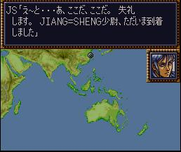

.. meta::
   :description: 当你开始一个新的游戏的时候，你需要创建一个主角。主角具有一些你可以改变的属性，例如诞生日和血型。影响以后获得的精神。头像会影响游戏主角的显示。 因为主角的精神指令可以用生日和血型自定义的原因，主角的选择更多地要注意恋人的精神。性别和主角的性格不仅仅会影响主角的台词，也会影响主角的恋人的人选。主角的恋人会是主角的异性，同

.. _srw4_walkthrough_preclude:

序幕 (第四次超级机器人大战)
=====================================

-------------
恋人的选择
-------------

当你开始一个新的游戏的时候，你需要创建一个主角。主角具有一些你可以改变的属性，例如诞生日和血型。影响以后获得的精神。头像会影响游戏主角的显示。

因为主角的精神指令可以用生日和血型自定义的原因，主角的选择更多地要注意恋人的精神。性别和主角的性格不仅仅会影响主角的台词，也会影响主角的恋人的人选。主角的恋人会是主角的异性，同时性格也是相反的角色，例如真面目で優しい熱血漢	的男主角的恋人会是ミーナ。具体对照表可以参考下面的人物关系表。

因为真实系地图武器入手早，比较适合抢回合数拿古兰森，建议第四次真实系的副主人公有激怒的リン，这意味着主人公用イルム。主人公的精神方面，可以选择比较早出觉醒的金牛座的O型血。第四次S的リン没有什么好的精神，所以有可以选择觉醒或者再动的ウィン作为恋人。这意味着主人公的性别和性格要和イルム或者グレース相同。在速通路线让恋人提前加入会少一台机体，在其他剧情方面没有什么差异。如果对实力有信心，即使需要抢回合数也可以让恋人中盘再加入。

如果不需要节约回合数抢古兰森的话，副主人公的等级很容易用地图武器提得很高，必闪、集中、必中、根性等命中和回避辅助精神并无多大必要。用地图武器刷级别的话，可以考虑的ヘクトール作为恋人，他有再动（第四次）和复活（第四次S）（可以用地图武器培养出大量暴击率高的机师，攻击力并不缺少）。

主人公和副主人公全员都有幸運、熱血和気合，故省略。

.. grid:: 
  :gutter: 0
  :margin: 0
  :padding: 0

  .. grid-item-card:: ジェス
    :columns: auto
    :margin: 0
    :padding: 0

    .. image:: ../pilots/images/srw4_pilot_renanjess.png
    
    | レナンジェス
    | スターロード
    | 7月23日
    | O    
    | まじめで優しい熱血漢
    |
    | ひらめき、集中、根性
    | 
    |
    | 恋人 ミーナ

    .. image:: ../pilots/images/srw4_pilot_mina.png

    | SFC 版：
    | ひらめき、集中、必中
    | PS版：
    | ひらめき、必中、信頼

  .. grid-item-card:: イルム
    :columns: auto
    :margin: 0
    :padding: 0

    .. image:: ../pilots/images/srw4_pilot_irmgard.png

    | ルムガルト
    | カザハラ
    | 11月10日
    | A
    | 理论家だが异性好き
    |
    | 加速、ひらめき、必中
    |
    |
    | 恋人 リン

    .. image:: ../pilots/images/srw4_pilot_lynn.png

    | SFC版：
    | 集中、探索、激怒
    | PS版：
    | ひらめき、集中、必中

  .. grid-item-card:: ヘクトール
    :columns: auto
    :margin: 0
    :padding: 0

    .. image:: ../pilots/images/srw4_pilot_hector.png

    | ヘクトール
    | マディソン
    | 5月4日
    | AB
    | ちょっと変な性格
    | SFC版：
    | 探索、信頼、再動
    | PS版：
    | 必中、ひらめき、復活
    | 恋人 パット

    .. image:: ../pilots/images/srw4_pilot_patorisia.png

    | SFC 版：
    | ひらめき、てかげん、友情
    | PS版：
    | ひらめき、必中、復活

  .. grid-item-card:: ウィン
    :columns: auto
    :margin: 0
    :padding: 0

    .. image:: ../pilots/images/srw4_pilot_erwin.png

    | アーウィン
    | ドースティン
    | 3月1日
    | B
    | クールでニヒル
    | SFC 版：
    | 加速、威圧、覚醒
    | PS版：
    | 加速、必中、再動
    | 恋人 グレース 

    .. image:: ../pilots/images/srw4_pilot_grace.png

    | ひらめき、集中、必中

  .. grid-item-card:: パット
    :columns: auto
    :margin: 0
    :padding: 0

    .. image:: ../pilots/images/srw4_pilot_patorisia.png
    
    | パトリシア
    | ハックマン
    | 2月4日
    | A
    | 真面目で优しい熱血汉
    | SFC 版：
    | ひらめき、てかげん、友情
    | PS版：
    | ひらめき、必中、復活
    | 恋人 ヘクトール

    .. image:: ../pilots/images/srw4_pilot_hector.png

    | SFC版：
    | 探索、信頼、再動
    | PS版：
    | 必中、ひらめき、復活

  .. grid-item-card:: グレース
    :columns: auto
    :margin: 0
    :padding: 0

    .. image:: ../pilots/images/srw4_pilot_grace.png

    | グレース
    | ウリジン
    | 1月31日
    | AB
    | 理论家だが异性好き
    |
    | ひらめき、集中、必中
    |
    |
    | 恋人 ウィン

    .. image:: ../pilots/images/srw4_pilot_erwin.png

    | SFC 版：
    | 加速、威圧、覚醒
    | PS版：
    | 加速、必中、再動

  .. grid-item-card:: ミーナ
    :columns: auto
    :margin: 0
    :padding: 0

    .. image:: ../pilots/images/srw4_pilot_mina.png

    | ミーナ
    | ライクリング
    | 9月21日
    | O
    | ちょっと変な性格
    | SFC版：
    | ひらめき、集中、必中
    | PS版：
    | ひらめき、必中、信頼
    | 恋人 ジェス

    .. image:: ../pilots/images/srw4_pilot_renanjess.png

    | ひらめき、集中、根性

  .. grid-item-card:: リン
    :columns: auto
    :margin: 0
    :padding: 0

    .. image:: ../pilots/images/srw4_pilot_lynn.png

    | リン
    | マオ
    | 4月14日
    | B
    | クールでニヒル
    | SFC版：
    | 集中、探索、激怒
    | PS版：
    | ひらめき、集中、必中
    | 恋人 イルム

    .. image:: ../pilots/images/srw4_pilot_irmgard.png

    | 加速、ひらめき、必中

-------------------------
主角和恋人的精神(第四次)
-------------------------

除了几个特殊的生日和血型之外，主角和恋人的精神是由生日所在的黄道十二宫决定。为简洁起见，恋人的生日并不单独列出。可在上面的主角列表中查到恋人的生日和血型。主角和恋人的精神都是由生日和血型决定。

除了一些特殊的生日和血型之外，其他生日和血型的精神如下：

.. grid:: 
  :gutter: 0
  :margin: 0
  :padding: 0

  .. grid-item-card:: 白羊座O
    :columns: auto
    :margin: 0
    :padding: 0
    
    | 3月21日
    | ~4月19日
    | 幸運 1
    | 熱血 2
    | 気合 8
    | ひらめき 10
    | てかげん 12
    | 集中 21

  .. grid-item-card:: 白羊座A
    :columns: auto
    :margin: 0
    :padding: 0

    | 幸運 1
    | 熱血 2
    | 気合 8
    | ひらめき 10
    | てかげん 12
    | 集中 21

  .. grid-item-card:: 白羊座B
    :columns: auto
    :margin: 0
    :padding: 0

    | 集中 1
    | 幸運 3
    | 探索 9
    | 気合 16
    | 熱血 27
    | 激怒 24
    | リン

  .. grid-item-card:: 白羊座AB
    :columns: auto
    :margin: 0
    :padding: 0

    | 幸運 1
    | 熱血 3
    | ひらめき 4
    | 加速 9
    | 気合 12
    | 必中 22

  .. grid-item-card:: 金牛座O
    :columns: auto
    :margin: 0
    :padding: 0

    | 4月20日
    | ~5月20日
    | 幸運 1
    | 加速 3
    | 覚醒 7
    | ひらめき 9
    | 気合 10
    | 熱血 19

  .. grid-item-card:: 金牛座A
    :columns: auto
    :margin: 0
    :padding: 0

    | 幸運 1
    | 集中 2
    | 熱血 7
    | 気合 9
    | 加速 11
    | 補給 33

  .. grid-item-card:: 金牛座B
    :columns: auto
    :margin: 0
    :padding: 0

    | 幸運 1
    | 気合 7
    | 探索 9
    | ひらめき 11
    | 熱血 14
    | 集中 22

  .. grid-item-card:: 金牛座AB
    :columns: auto
    :margin: 0
    :padding: 0

    | 熱血 1
    | 探索 2
    | 気合 4
    | 幸運 10
    | 信頼 31
    | 再動 40
    | ヘクトール

  .. grid-item-card:: 双子座O
    :columns: auto
    :margin: 0
    :padding: 0

    | 5月21日
    | ~6月21日
    | 気合 1
    | 集中 4
    | 幸運 8
    | 熱血 21
    | 覚醒 27
    | 友情 30

  .. grid-item-card:: 双子座A
    :columns: auto
    :margin: 0
    :padding: 0

    | 幸運 1
    | 熱血 3
    | ひらめき 7
    | 気合 8
    | 威压 28
    | 鉄壁 39

  .. grid-item-card:: 双子座B
    :columns: auto
    :margin: 0
    :padding: 0

    | 幸運 1
    | ひらめき 3
    | 熱血 5
    | 気合 11
    | かく乱 15
    | 集中 20

  .. grid-item-card:: 双子座AB
    :columns: auto
    :margin: 0
    :padding: 0

    | 幸運 1
    | 加速 3
    | 熱血 7
    | 集中 10
    | 気合 18
    | 偵察 22

  .. grid-item-card:: 巨蟹座O
    :columns: auto
    :margin: 0
    :padding: 0

    | 6月22日
    | ~7月22日
    | 幸運 1
    | ひらめき 2
    | 気合 3
    | 熱血 12
    | てかげん 19
    | 愛 41

  .. grid-item-card:: 巨蟹座A
    :columns: auto
    :margin: 0
    :padding: 0

    | 根性 1
    | 気合 2
    | 幸運 4
    | 熱血 6
    | 集中 22
    | 威压 23

  .. grid-item-card:: 巨蟹座B
    :columns: auto
    :margin: 0
    :padding: 0

    | 幸運 1
    | 熱血 2
    | ひらめき 3
    | 再動 9
    | てかげん 17
    | 気合 22

  .. grid-item-card:: 巨蟹座AB
    :columns: auto
    :margin: 0
    :padding: 0

    | 幸運 1
    | 加速 3
    | 熱血 5
    | 鉄壁 15
    | ひらめき 19
    | 気合 21

  .. grid-item-card:: 狮子座O
    :columns: auto
    :margin: 0
    :padding: 0

    | 7月23日
    | ~8月22日
    | 幸運 1
    | 根性 2
    | 集中 3
    | ひらめき 7
    | 熱血 17
    | 気合 20
    | ジェス

  .. grid-item-card:: 狮子座A
    :columns: auto
    :margin: 0
    :padding: 0

    | 幸運 1
    | 加速 2
    | 熱血 4
    | 鉄壁 5
    | 気合 9
    | 集中12

  .. grid-item-card:: 狮子座B
    :columns: auto
    :margin: 0
    :padding: 0

    | 加速 1
    | 気合 2
    | 幸運 6
    | 激励 15
    | 熱血 19
    | ひらめき27

  .. grid-item-card:: 狮子座AB
    :columns: auto
    :margin: 0
    :padding: 0

    | 幸運 1
    | 熱血 1
    | 必中 5
    | ひらめき 12
    | 気合 24
    | てかげん 33

  .. grid-item-card:: 处女座O
    :columns: auto
    :margin: 0
    :padding: 0

    | 8月23日
    | ~9月22日
    | 熱血 1
    | 気合 4
    | 幸運 8
    | ひらめき 12
    | 必中 18
    | 集中 31
    | ミーナ

  .. grid-item-card:: 处女座A
    :columns: auto
    :margin: 0
    :padding: 0

    | 幸運 1
    | 必中 2
    | ひらめき 5
    | 熱血 8
    | 加速 11
    | 気合 14

  .. grid-item-card:: 处女座B
    :columns: auto
    :margin: 0
    :padding: 0

    | 幸運 1
    | 熱血 3
    | 必中 4
    | 探索 8
    | 気合 18
    | ひらめき 24

  .. grid-item-card:: 处女座AB
    :columns: auto
    :margin: 0
    :padding: 0

    | 探索 1
    | 幸運 2
    | 熱血 4
    | てかげん 14
    | 気合 20
    | ひらめき 24

  .. grid-item-card:: 天秤座O
    :columns: auto
    :margin: 0
    :padding: 0

    | 9月23日
    | ~10月22日
    | 集中 1
    | 熱血 2
    | 幸運 3
    | 気合 12
    | てかげん 21
    | 威压 39

  .. grid-item-card:: 天秤座A
    :columns: auto
    :margin: 0
    :padding: 0

    | 幸運 1
    | 集中 3
    | 熱血 6
    | 必中 8
    | 覚醒 10
    | 気合 17

  .. grid-item-card:: 天秤座B
    :columns: auto
    :margin: 0
    :padding: 0

    | 幸運 1
    | 熱血 3
    | 隠れ身 3
    | 集中 8
    | 必中 9
    | 気合 15

  .. grid-item-card:: 天秤座AB
    :columns: auto
    :margin: 0
    :padding: 0

    | 幸運 1
    | 熱血 2
    | 加速 3
    | 気合 4
    | 探索 12
    | ひらめき17

  .. grid-item-card:: 天蝎座O
    :columns: auto
    :margin: 0
    :padding: 0

    | 10月23日
    | ~11月22日
    | 幸運 1
    | 熱血 1
    | ひらめき 9
    | 気合 12
    | 覚醒 27
    | 信頼 33

  .. grid-item-card:: 天蝎座A
    :columns: auto
    :margin: 0
    :padding: 0

    | 幸運 1
    | 熱血 2
    | 必中 4
    | ひらめき 5
    | 加速 8
    | 気合 21
    | イルム

  .. grid-item-card:: 天蝎座B
    :columns: auto
    :margin: 0
    :padding: 0

    | ひらめき 1
    | 幸運 2
    | 根性 4
    | 熱血 8
    | 気合 18
    | 加速 21

  .. grid-item-card:: 天蝎座AB
    :columns: auto
    :margin: 0
    :padding: 0

    | 幸運 1
    | ひらめき 7
    | 熱血 10
    | 隠れ身 14
    | 気合 16
    | 集中 30

  .. grid-item-card:: 射手座O
    :columns: auto
    :margin: 0
    :padding: 0

    | 11月23日
    | ~12月21日
    | 鉄壁 1
    | ひらめき 2
    | 幸運 3
    | 熱血 9
    | 気合 10
    | 復活 45

  .. grid-item-card:: 射手座A
    :columns: auto
    :margin: 0
    :padding: 0

    | 気合 1
    | 幸運 4
    | ひらめき 12
    | 熱血 18
    | てかげん 21
    | 信頼 33

  .. grid-item-card:: 射手座B
    :columns: auto
    :margin: 0
    :padding: 0

    | 幸運 1
    | 集中 3
    | 気合 4
    | 加速 8
    | 熱血 16
    | 友情 36

  .. grid-item-card:: 射手座AB
    :columns: auto
    :margin: 0
    :padding: 0

    | 幸運 1
    | 加速 2
    | 必中 3
    | 熱血 7
    | 補給 18
    | 気合 25

  .. grid-item-card:: 山羊座O
    :columns: auto
    :margin: 0
    :padding: 0

    | 12月22日
    | ~1月19日
    | 熱血 1
    | ひらめき 2
    | 加速 3
    | 幸運 6
    | 集中 11
    | 気合 23

  .. grid-item-card:: 山羊座A
    :columns: auto
    :margin: 0
    :padding: 0

    | 幸運 1
    | 探索 2
    | 加速 3
    | 熱血 4
    | 覚醒 12
    | 気合 20

  .. grid-item-card:: 山羊座B
    :columns: auto
    :margin: 0
    :padding: 0

    | 幸運 1
    | ひらめき 2
    | 鉄壁 3
    | 熱血 9
    | 再動 14
    | 気合 21

  .. grid-item-card:: 山羊座AB
    :columns: auto
    :margin: 0
    :padding: 0

    | 熱血 1
    | 根性 2
    | ひらめき 3
    | 幸運 8
    | 気合 14
    | 友情 31

  .. grid-item-card:: 水瓶座O
    :columns: auto
    :margin: 0
    :padding: 0

    | 1月20日
    | ~2月18日
    | 幸運 1
    | 加速 2
    | 根性 3
    | 熱血 10
    | 気合 10
    | 友情 22

  .. grid-item-card:: 水瓶座A
    :columns: auto
    :margin: 0
    :padding: 0

    | 幸運 1
    | 気合 2
    | 熱血 8
    | ひらめき 15
    | てかげん 29
    | 友情 40
    | パット

  .. grid-item-card:: 水瓶座B
    :columns: auto 
    :margin: 0
    :padding: 0

    | 幸運 1
    | 熱血 2
    | 気合 7
    | 必中 10
    | ド根性 12
    | ひらめき 21

  .. grid-item-card:: 水瓶座AB
    :columns: auto 
    :margin: 0
    :padding: 0

    | 熱血 1
    | 幸運 2
    | ひらめき 7
    | 必中 9
    | 気合 14
    | 集中 18
    | グレース

  .. grid-item-card:: 双鱼座O
    :columns: auto 
    :margin: 0
    :padding: 0

    | 2月19日
    | ~3月20日
    | 幸運 1
    | 加速 2
    | 熱血 4
    | 気合 8
    | てかげん 14
    | 友情 30

  .. grid-item-card:: 双鱼座A
    :columns: auto 
    :margin: 0
    :padding: 0

    | 必中 1
    | 幸運 2
    | 熱血 3
    | てかげん 8
    | 必中 13
    | 気合 20

  .. grid-item-card:: 双鱼座B
    :columns: auto 
    :margin: 0
    :padding: 0

    | 幸運 1
    | 熱血 2
    | 気合 3
    | 加速 4
    | 覚醒 22
    | 威压 30
    | ウィン

  .. grid-item-card:: 双鱼座AB
    :columns: auto 
    :margin: 0
    :padding: 0

    | 熱血 1
    | 幸運 2
    | ひらめき 5
    | 気合 6
    | 愛 24
    | 激励 30

特殊精神

.. grid:: 
  :gutter: 0
  :margin: 0
  :padding: 0

  .. grid-item-card:: 1月29日B
    :columns: auto
    :margin: 0
    :padding: 0

    | 加速 1
    | 根性 3
    | 熱血 9
    | てかげん 16
    | ひらめき 20
    | 奇跡 39

.. csv-table:: 主角和恋人特殊精神   
   :file: protagonist_spirit_special.csv
   :header-rows: 1

--------------------------
主角和恋人的精神(第四次S)
--------------------------

PS的复刻版的精神设定有所变动。大大减少了集中出现的频率。

.. csv-table:: 主角和恋人精神   
   :file: protagonist_spirit_ps.csv
   :header-rows: 1

.. csv-table:: 主角和恋人特殊精神   
   :file: protagonist_spirit_special_ps.csv
   :header-rows: 1

.. rst-class::center
.. flat-table:: 
   :class: text-center, align-items-center

   * - :cspan:`1` \ :ref:`隐藏要素 <srw4_missable>` \：主人公系别选择
   * - .. admonition:: 真实系
          :class: attention
   
          [SRW4S] 第一话会进入\ :doc:`00a_contact_real`\ 

          [SRW4] 第一话会进入\ :doc:`01a_the_beginning_real`\ 

          ガブスレイ（サラ） 1/3

          Sガンダム 1/2

          Ex-Sガンダム 1/4

          クェス 1/2
          
          ヤクト・ドーガ 1/3

          クワサン 1/4

          アシュラテンプル（ギャブレー）1/5

          キュベレイMk-IIx2（プル和プルツー）1/6

          GP-02A追加アトミックバズーカ 1/9

          神宮寺力、明日香麗和桜野マリ选择一个留队 1/2
     - .. admonition:: 超级系
          :class: attention

          [SRW4S] 第一话会进入\ :doc:`01b_the_beginning_super`\ 

          [SRW4] 第一话会进入\ :doc:`00b_contact_super`\ 

          ダイモス追加武器 1/1
